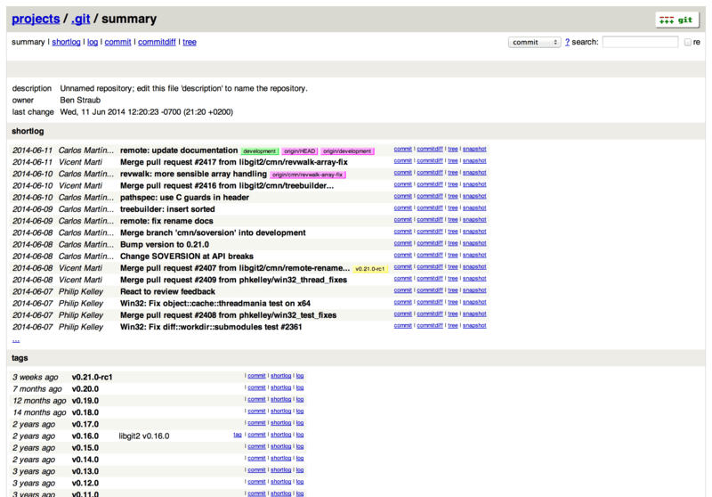

# Git sur le serveur

<!-- toc -->

À présent, vous devriez être capable de réaliser la plupart des tâches
quotidiennes impliquant Git. Néanmoins, pour pouvoir collaborer avec
d’autres personnes au moyen de Git, vous allez devoir disposer d’un
dépôt distant Git. Bien que vous puissiez techniquement tirer et pousser
des modifications depuis et vers des dépôts personnels, cette pratique
est déconseillée parce qu’elle introduit très facilement une confusion
avec votre travail actuel. De plus, vous souhaitez que vos
collaborateurs puissent accéder à votre dépôt de sources, y compris si
vous n’êtes pas connecté — disposer d’un dépôt accessible en permanence
peut s’avérer utile. De ce fait, la méthode canonique pour collaborer
consiste à instancier un dépôt intermédiaire auquel tout le monde a
accès, que ce soit pour pousser ou tirer.

Un serveur Git est simple à lancer. Premièrement, vous devez choisir
quels protocoles seront supportés. La première partie de ce chapitre
traite des protocoles disponibles et de leurs avantages et
inconvénients. La partie suivante explique certaines configurations
typiques de ces protocoles et comment les mettre en œuvre. Enfin, nous
traiterons de quelques types d’hébergement, si vous souhaitez héberger
votre code sur un serveur tiers, sans avoir à installer et maintenir un
serveur par vous-même.

Si vous ne voyez pas d’intérêt à gérer votre propre serveur, vous pouvez
sauter directement à la dernière partie de ce chapitre pour détailler
les options pour mettre en place un compte hébergé, avant de continuer
au chapitre suivant dans lequel les problématiques de développement
distribué sont abordées.

Un dépôt distant est généralement un *dépôt nu* (*bare repository*) : un
dépôt Git qui n’a pas de copie de travail. Comme ce dépôt n’est utilisé
que comme centralisateur de collaboration, il n’y a aucune raison
d’extraire un instantané sur le disque ; seules les données Git sont
nécessaires. Pour simplifier, un dépôt nu est le contenu du répertoire
`.git` sans fioriture.

## Protocoles

Git peut utiliser quatre protocoles réseau majeurs pour transporter des
données : local, HTTP, *Secure Shell* (SSH) et Git. Nous allons voir
leur nature et dans quelles circonstances ils peuvent (ou ne peuvent
pas) être utilisés.

### Protocole local

Le protocole de base est le protocole *local* pour lequel le dépôt
distant est un autre répertoire dans le système de fichiers. Il est
souvent utilisé si tous les membres de l’équipe ont accès à un
répertoire partagé via NFS par exemple ou dans le cas moins probable où
tous les développeurs travaillent sur le même ordinateur. Ce dernier cas
n’est pas optimum car tous les dépôts seraient hébergés de fait sur le
même ordinateur, rendant ainsi toute défaillance catastrophique.

Si vous disposez d’un système de fichiers partagé, vous pouvez cloner,
pousser et tirer avec un dépôt local. Pour cloner un dépôt ou pour
l’utiliser comme dépôt distant d’un projet existant, utilisez le chemin
vers le dépôt comme URL. Par exemple, pour cloner un dépôt local, vous
pouvez lancer ceci :

``` highlight
$ git clone /opt/git/project.git
```

Ou bien cela :

``` highlight
$ git clone file:///opt/git/project.git
```

Git opère légèrement différemment si vous spécifiez explicitement le
protocole `file://` au début de l’URL. Si vous spécifiez simplement le
chemin et si la destination se trouve sur le même système de fichiers,
Git tente d’utiliser des liens physiques pour les fichiers communs. Si
vous spécifiez le protocole `file://`, Git lance un processus d’accès à
travers le réseau, ce qui est généralement moins efficace. La raison
d’utiliser spécifiquement le préfixe `file://` est la volonté d’obtenir
une copie propre du dépôt, sans aucune référence ou aucun objet
supplémentaire qui pourraient résulter d’un import depuis un autre
système de gestion de version ou d’une action similaire (voir chapitre
[Les tripes de Git](#ch10-git-internals) pour les tâches de
maintenance). Nous utiliserons les chemins normaux par la suite car
c’est la méthode la plus efficace.

Pour ajouter un dépôt local à un projet Git existant, lancez ceci :

``` highlight
$ git remote add local_proj /opt/git/project.git
```

Ensuite, vous pouvez pousser vers et tirer depuis ce dépôt distant de la
même manière que vous le feriez pour un dépôt accessible sur le réseau.

#### Avantages

Les avantages des dépôts accessibles sur le système de fichiers sont
qu’ils sont simples et qu’ils utilisent les permissions du système de
fichiers. Si vous avez déjà un montage partagé auquel toute votre équipe
a accès, déployer un dépôt est extrêmement facile. Vous placez la copie
du dépôt nu à un endroit accessible de tous et positionnez correctement
les droits de lecture/écriture de la même manière que pour tout autre
partage. Nous aborderons la méthode pour exporter une copie de dépôt nu
à cette fin dans la section suivante [Installation de Git sur un
serveur](#s_git_on_the_server).

C’est un choix satisfaisant pour partager rapidement le travail. Si vous
et votre coéquipier travaillez sur le même projet et qu’il souhaite
partager son travail, lancer une commande telle que
`git pull /home/john/project` est certainement plus simple que de passer
par un serveur intermédiaire.

#### Inconvénients

Les inconvénients de cette méthode sont qu’il est généralement plus
difficile de rendre disponible un partage réseau depuis de nombreux
endroits que de simplement gérer des accès réseau. Si vous souhaitez
pousser depuis votre portable à la maison, vous devez monter le partage
distant, ce qui peut s’avérer plus difficile et plus lent que d’y
accéder directement via un protocole réseau.

Il faut aussi mentionner que ce n’est pas nécessairement l’option la
plus rapide à l’utilisation si un partage réseau est utilisé. Un dépôt
local n’est rapide que si l’accès aux fichiers est rapide. Un dépôt
accessible sur un montage NFS est souvent plus lent qu’un dépôt
accessible via SSH sur le même serveur qui ferait tourner Git avec un
accès aux disques locaux.

### Protocoles sur HTTP

Git peut communiquer sur HTTP de deux manières. Avant Git 1.6.6, il
n’existait qu’une seule manière qui était très simple et généralement en
lecture seule. Depuis la version 1.6.6, il existe un nouveau protocole
plus intelligent qui nécessite que Git puisse négocier les transferts de
données de manière similaire à ce qu’il fait pour SSH. Ces dernières
années, le nouveau protocole HTTP a gagné en popularité du fait qu’il
est plus simple à utiliser et plus efficace dans ses communications. La
nouvelle version est souvent appelée protocole HTTP « intelligent » et
l’ancienne version protocole HTTP « idiot ». Nous allons voir tout
d’abord le protocole HTTP « intelligent ».

#### HTTP Intelligent

Le protocole HTTP « intelligent » se comporte de manière très similaire
aux protocoles SSH ou Git mais fonctionne par-dessus les ports HTTP/S et
peut utiliser différents mécanismes d’authentification, ce qui le rend
souvent plus facile pour l’utilisateur que SSH, puisque l’on peut
utiliser des méthodes telles que l’authentification par utilisateur/mot
de passe plutôt que de devoir gérer des clés SSH.

C’est devenu probablement le moyen le plus populaire d’utiliser Git, car
il peut être utilisé pour du service anonyme, comme le protocole
`git://` aussi bien que pour pousser avec authentification et
chiffrement, comme le protocole SSH. Au lieu de devoir gérer différentes
URL pour ces usages, vous pouvez maintenant utiliser une URL unique pour
les deux. Si vous essayez de pousser et que le dépôt requiert une
authentification (ce qui est normal), le serveur peut demander un nom
d’utilisateur et un mot de passe. De même pour les accès en lecture.

En fait, pour les services tels que GitHub, l’URL que vous utilisez pour
visualiser le dépôt sur le web (par exemple
`https://github.com/schacon/simplegit[]`) est la même URL utilisable
pour le cloner et, si vous en avez les droits, y pousser.

#### HTTP idiot

Si le serveur ne répond pas avec un service Git HTTP intelligent, le
client Git essayera de se rabattre sur le protocole HTTP « idiot ». Le
protocole idiot consiste à servir le dépôt Git nu comme des fichiers
normaux sur un serveur web. La beauté du protocole idiot réside dans sa
simplicité de mise en place. Tout ce que vous avez à faire, c’est de
copier les fichiers de votre dépôt nu sous la racine de documents HTTP
et de positionner un crochet (**hook**) `post-update` spécifique, et
c’est tout (voir [Crochets Git](#s_git_hooks)). Dès ce moment, tous ceux
qui peuvent accéder au serveur web sur lequel vous avez déposé votre
dépôt peuvent le cloner. Pour permettre un accès en lecture seule à
votre dépôt via HTTP, faites quelque chose comme :

``` highlight
$ cd /var/www/htdocs/
$ git clone --bare /chemin/vers/projet_git projetgit.git
$ cd projetgit.git
$ mv hooks/post-update.sample hooks/post-update
$ chmod a+x hooks/post-update
```

Et voilà ! Le crochet `post-update` livré par défaut avec Git lance la
commande appropriée (`git update-server-info`) pour faire fonctionner
correctement le clonage et la récupération HTTP. Cette commande est
lancée quand vous poussez sur ce dépôt (peut-être sur SSH). Ensuite, les
autres personnes peuvent cloner via quelque chose comme :

``` highlight
$ git clone https://exemple.com/projetgit.git
```

Dans ce cas particulier, nous utilisons le chemin `/var/www/htdocs` qui
est le plus commun pour une configuration Apache, mais vous pouvez
utiliser n’importe quel serveur web statique – placez juste les dépôts
nus dans son chemin. Les données Git sont servies comme de simples
fichiers statiques (voir [Les tripes de Git](#ch10-git-internals) pour
la manière exacte dont elles sont servies).

Généralement, vous choisirez soit de lancer un serveur HTTP intelligent
avec des droits en lecture/écriture ou de fournir simplement les
fichiers en lecture seule par le protocole idiot. Il est rare de
mélanger les deux types de protocoles.

#### Avantages

Nous nous concentrerons sur les avantages de la version intelligente du
protocole sur HTTP.

La simplicité vient de l’utilisation d’une seule URL pour tous les types
d’accès et de la demande d’authentification seulement en cas de besoin.
Ces deux caractéristiques rendent les choses très faciles pour
l’utilisateur final. La possibilité de s’authentifier avec un nom
d’utilisateur et un mot de passe apporte un gros avantage par rapport à
SSH puisque les utilisateurs n’ont plus à générer localement les clés
SSH et à télécharger leur clé publique sur le serveur avant de pouvoir
interagir avec lui. Pour les utilisateurs débutants ou pour des
utilisateurs utilisant des systèmes où SSH est moins commun, c’est un
avantage d’utilisabilité majeur. C’est aussi un protocole très rapide et
efficace, similaire à SSH.

Vous pouvez aussi servir vos dépôts en lecture seule sur HTTPS, ce qui
signifie que vous pouvez chiffrer les communications ; ou vous pouvez
pousser jusqu’à faire utiliser des certificats SSL à vos clients.

Un autre avantage est que HTTP/S sont des protocoles si souvent utilisés
que les pare-feux d’entreprise sont souvent paramétrés pour les laisser
passer.

#### Inconvénients

Configurer Git sur HTTP/S peut être un peu plus difficile que sur SSH
sur certains serveurs. Mis à part cela, les autres protocoles ont peu
d’avantages sur le protocole HTTP intelligent pour servir Git.

Si vous utilisez HTTP pour pousser de manière authentifiée, fournir vos
information d’authentification est parfois plus compliqué qu’utiliser
des clés sur SSH. Il existe cependant des outils de mise en cache
d’informations d’authentification, comme Keychain sur OSX et Credential
Manager sur Windows pour rendre cela indolore. Reportez-vous à [Stockage
des identifiants](#s_credential_caching) pour voir comment configurer la
mise en cache des mots de passe HTTP sur votre système.

### Protocole SSH

SSH est un protocole répandu de transport pour Git en auto-hébergement.
Cela est dû au fait que l’accès SSH est déjà en place à de nombreux
endroits et que si ce n’est pas le cas, cela reste très facile à faire.
Cela est aussi dû au fait que SSH est un protocole authentifié ; et
comme il est très répandu, il est généralement facile à mettre en œuvre
et à utiliser.

Pour cloner un dépôt Git à travers SSH, spécifiez le préfixe `ssh://`
dans l’URL comme ceci :

``` highlight
$ git clone ssh://utilisateur@serveur/projet.git
```

Vous pouvez utiliser aussi la syntaxe scp habituelle avec le protocole
SSH :

``` highlight
$ git clone utilisateur@serveur:projet.git
```

Vous pouvez aussi ne pas spécifier de nom d’utilisateur et Git utilisera
par défaut le nom de login.

#### Avantages

Les avantages liés à l’utilisation de SSH sont nombreux. Premièrement,
SSH est relativement simple à mettre en place, les *daemons* SSH sont
facilement disponibles, les administrateurs réseau sont habitués à les
gérer et de nombreuses distributions de systèmes d’exploitation en
disposent ou proposent des outils pour les gérer. Ensuite, l’accès
distant à travers SSH est sécurisé, toutes les données sont chiffrées et
authentifiées. Enfin, comme les protocoles HTTP/S, Git et local, SSH est
efficace et permet de comprimer autant que possible les données avant de
les transférer.

#### Inconvénients

Le point négatif avec SSH est qu’il est impossible de proposer un accès
anonyme au dépôt. Les accès sont régis par les permissions SSH, même
pour un accès en lecture seule, ce qui s’oppose à une optique open
source. Si vous souhaitez utiliser Git dans un environnement
d’entreprise, SSH peut bien être le seul protocole nécessaire. Si vous
souhaitez proposer de l’accès anonyme en lecture seule à vos projets,
vous aurez besoin de SSH pour vous permettre de pousser mais un autre
protocole sera nécessaire pour permettre à d’autres de tirer.

### Protocole Git

Vient ensuite le protocole Git. Celui-ci est géré par un *daemon*
spécial livré avec Git. Ce *daemon* (démon, processus en arrière-plan)
écoute sur un port dédié (9418) et propose un service similaire au
protocole SSH, mais sans aucune sécurisation. Pour qu’un dépôt soit
publié via le protocole Git, le fichier `git-daemon-export-ok` doit
exister mais mise à part cette condition sans laquelle le *daemon*
refuse de publier un projet, il n’y a aucune sécurité. Soit le dépôt Git
est disponible sans restriction en lecture, soit il n’est pas publié.
Cela signifie qu’il ne permet pas de pousser des modifications. Vous
pouvez activer la capacité à pousser mais étant donné l’absence
d’authentification, n’importe qui sur Internet ayant trouvé l’URL du
projet peut pousser sur le dépôt. Autant dire que ce mode est rarement
recherché.

#### Avantages

Le protocole Git est souvent le protocole avec la vitesse de transfert
la plus rapide. Si vous devez servir un gros trafic pour un projet
public ou un très gros projet qui ne nécessite pas d’authentification en
lecture, il est très probable que vous devriez installer un *daemon*
Git. Il utilise le même mécanisme de transfert de données que SSH, la
surcharge du chiffrement et de l’authentification en moins.

#### Inconvénients

Le défaut du protocole Git est le manque d’authentification. N’utiliser
que le protocole Git pour accéder à un projet n’est généralement pas
suffisant. Il faut le coupler avec un accès SSH ou HTTPS pour quelques
développeurs qui auront le droit de pousser (écrire) et le garder en
accès `git://` pour la lecture seule. C’est aussi le protocole le plus
difficile à mettre en place. Il doit être géré par son propre *daemon*
qui est spécifique. Il nécessite la configuration d’un *daemon* `xinetd`
ou apparenté, ce qui est loin d’être simple. Il nécessite aussi un accès
à travers le pare-feu au port 9418 qui n’est pas un port ouvert en
standard dans les pare-feux professionnels. Derrière les gros pare-feux
professionnels, ce port obscur est tout simplement bloqué.

## Installation de Git sur un serveur

Nous allons à présent traiter de la configuration d’un service Git
gérant ces protocoles sur votre propre serveur.

<table>
<colgroup>
<col style="width: 50%" />
<col style="width: 50%" />
</colgroup>
<tbody>
<tr class="odd">
<td><em></em></td>
<td><div class="paragraph">
<p>Les commandes et étapes décrites ci-après s’appliquent à des installations simplifiées sur un serveur à base de Linux, bien qu’il soit aussi possible de faire fonctionner ces services sur des serveurs Mac ou Windows. La mise en place effective d’un serveur en production au sein d’une infrastructure englobera vraisemblablement des différences dans les mesures de sécurité et les outils système, mais ceci devrait permettre de se faire une idée générale des besoins.</p>
</div></td>
</tr>
</tbody>
</table>

Pour réaliser l’installation initiale d’un serveur Git, il faut exporter
un dépôt existant dans un nouveau dépôt nu — un dépôt qui ne contient
pas de copie de répertoire de travail. C’est généralement simple à
faire. Pour cloner votre dépôt en créant un nouveau dépôt nu, lancez la
commande clone avec l’option `--bare`. Par convention, les répertoires
de dépôt nu finissent en `.git`, de cette manière :

``` highlight
$ git clone --bare mon_project mon_projet.git
Clonage dans le dépôt nu 'mon_projet.git'...
fait.
```

Vous devriez maintenant avoir une copie des données de Git dans votre
répertoire `mon_project.git`.

C’est grossièrement équivalent à :

``` highlight
$ cp -Rf mon_projet/.git mon_projet.git
```

Il y a quelques légères différences dans le fichier de configuration
mais pour l’utilisation envisagée, c’est très proche. La commande
extrait le répertoire Git sans répertoire de travail et crée un
répertoire spécifique pour l’accueillir.

### Copie du dépôt nu sur un serveur

À présent que vous avez une copie nue de votre dépôt, il ne reste plus
qu’à la placer sur un serveur et à régler les protocoles. Supposons que
vous avez mis en place un serveur nommé `git.exemple.com` auquel vous
avez accès par SSH et que vous souhaitez stocker vos dépôts Git dans le
répertoire `/srv/git`. En supposant que `/srv/git` existe, vous pouvez
mettre en place votre dépôt en copiant le dépôt nu :

``` highlight
$ scp -r mon_projet.git utilisateur@git.exemple.com:/srv/git
```

À partir de maintenant, tous les autres utilisateurs disposant d’un
accès SSH au serveur et ayant un accès en lecture seule au répertoire
`/srv/git` peuvent cloner votre dépôt en lançant la commande :

``` highlight
$ git clone utilisateur@git.exemple.com:/srv/git/mon_projet.git
```

Si un utilisateur se connecte via SSH au serveur et a accès en écriture
au répertoire `/srv/git/mon_projet.git`, il aura automatiquement accès
pour pousser.

Git ajoutera automatiquement les droits de groupe en écriture à un dépôt
si vous lancez la commande `git init` avec l’option `--shared`. Notez
qu’en lançant cette commande, vous ne détruirez pas les *commits*,
références, etc. en cours de route.

``` highlight
$ ssh utilisateur@git.exemple.com
$ cd /srv/git/mon_projet.git
$ git init --bare --shared
```

Vous voyez comme il est simple de prendre un dépôt Git, créer une
version nue et la placer sur un serveur auquel vous et vos
collaborateurs avez accès en SSH. Vous voilà prêts à collaborer sur le
même projet.

Il faut noter que c’est littéralement tout ce dont vous avez besoin pour
démarrer un serveur Git utile auquel plusieurs personnes ont accès :
ajoutez simplement des comptes SSH sur un serveur, et collez un dépôt nu
quelque part où tous les utilisateurs ont accès en lecture et écriture.
Vous êtes prêts à travailler, vous n’avez besoin de rien d’autre.

Dans les chapitres à venir, nous traiterons de mises en place plus
sophistiquées. Ces sujets incluront l’élimination du besoin de créer un
compte système pour chaque utilisateur, l’accès public aux dépôts, la
mise en place d’interfaces utilisateur web, etc. Néanmoins, gardez à
l’esprit que pour collaborer avec quelques personnes sur un projet
privé, tout ce qu’il faut, c’est un serveur SSH et un dépôt nu.

### Petites installations

Si vous travaillez dans un petit groupe ou si vous n’êtes qu’en phase
d’essai de Git au sein de votre société avec peu de développeurs, les
choses peuvent rester simples. Un des aspects les plus compliqués de la
mise en place d’un serveur Git est la gestion des utilisateurs. Si vous
souhaitez que certains dépôts ne soient accessibles à certains
utilisateurs qu’en lecture seule et en lecture/écriture pour d’autres,
la gestion des accès et des permissions peut devenir difficile à régler.

#### Accès SSH

Si vous disposez déjà d’un serveur auquel tous vos développeurs ont un
accès SSH, il est généralement plus facile d’y mettre en place votre
premier dépôt car vous n’aurez quasiment aucun réglage supplémentaire à
faire (comme nous l’avons expliqué dans le chapitre précédent). Si vous
souhaitez des permissions d’accès plus complexes, vous pouvez les mettre
en place par le jeu des permissions standards sur le système de fichiers
du système d’exploitation de votre serveur.

Si vous souhaitez placer vos dépôts sur un serveur qui ne dispose pas
déjà de comptes pour chacun des membres de votre équipe qui aurait accès
en écriture, alors vous devrez mettre en place un accès SSH pour eux. En
supposant que pour vos dépôts, vous disposiez déjà d’un serveur SSH
installé et auquel vous avez accès.

Il y a quelques moyens de donner un accès à tout le monde dans l’équipe.
Le premier est de créer des comptes pour tout le monde, ce qui est
logique mais peut s’avérer lourd. Vous ne souhaiteriez sûrement pas
lancer `adduser` et entrer un mot de passe temporaire pour chaque
utilisateur.

Une seconde méthode consiste à créer un seul utilisateur Git sur la
machine, demander à chaque développeur nécessitant un accès en écriture
de vous envoyer une clé publique SSH et d’ajouter la-dite clé au fichier
`~/.ssh/authorized_keys` de votre utilisateur Git. À partir de là, tout
le monde sera capable d’accéder à la machine via l’utilisateur Git. Cela
n’affecte en rien les données de *commit* — les informations de
l’utilisateur SSH par lequel on se connecte n’affectent pas les données
de *commit* enregistrées.

Une dernière méthode consiste à faire une authentification SSH auprès
d’un serveur LDAP ou tout autre système d’authentification centralisé
que vous utiliseriez déjà. Tant que chaque utilisateur peut accéder à un
shell sur la machine, n’importe quel schéma d’authentification SSH
devrait fonctionner.

## Génération des clés publiques SSH

Cela dit, de nombreux serveurs Git utilisent une authentification par
clés publiques SSH. Pour fournir une clé publique, chaque utilisateur de
votre système doit la générer s’il n’en a pas déjà. Le processus est
similaire sur tous les systèmes d’exploitation. Premièrement,
l’utilisateur doit vérifier qu’il n’en a pas déjà une. Par défaut, les
clés SSH d’un utilisateur sont stockées dans le répertoire `~/.ssh` du
compte. Vous pouvez facilement vérifier si vous avez déjà une clé en
listant le contenu de ce répertoire :

``` highlight
$ cd ~/.ssh
$ ls
authorized_keys2  id_dsa       known_hosts
config            id_dsa.pub
```

Recherchez une paire de fichiers appelés *quelquechose* et
*quelquechose*\`.pub\` où le *quelquechose* en question est généralement
`id_dsa` ou `id_rsa`. Le fichier en `.pub` est la clé publique tandis
que l’autre est la clé privée. Si vous ne voyez pas ces fichiers (ou
n’avez même pas de répertoire `.ssh`), vous pouvez les créer en lançant
un programme appelé `ssh-keygen` fourni par le paquet SSH sur les
systèmes Linux/Mac et MSysGit pour Windows :

``` highlight
$ ssh-keygen
Generating public/private rsa key pair.
Enter file in which to save the key (/home/schacon/.ssh/id_rsa):
Created directory '/home/schacon/.ssh'.
Enter passphrase (empty for no passphrase):
Enter same passphrase again:
Your identification has been saved in /home/schacon/.ssh/id_rsa.
Your public key has been saved in /home/schacon/.ssh/id_rsa.pub.
The key fingerprint is:
d0:82:24:8e:d7:f1:bb:9b:33:53:96:93:49:da:9b:e3 schacon@mylaptop.local
```

Premièrement, le programme demande confirmation de l’endroit où vous
souhaitez sauvegarder la clé (`.ssh/id_rsa`) puis il demande deux fois
d’entrer un mot de passe qui peut être laissé vide si vous ne souhaitez
pas devoir le taper quand vous utilisez la clé.

Maintenant, chaque utilisateur ayant suivi ces indications doit envoyer
la clé publique à la personne en charge de l’administration du serveur
Git (en supposant que vous utilisez un serveur SSH réglé pour
l’utilisation de clés publiques). Ils doivent copier le contenu du
fichier `.pub` et l’envoyer par courriel. Les clés publiques ressemblent
à ceci :

``` highlight
$ cat ~/.ssh/id_rsa.pub
ssh-rsa AAAAB3NzaC1yc2EAAAABIwAAAQEAklOUpkDHrfHY17SbrmTIpNLTGK9Tjom/BWDSU
GPl+nafzlHDTYW7hdI4yZ5ew18JH4JW9jbhUFrviQzM7xlELEVf4h9lFX5QVkbPppSwg0cda3
Pbv7kOdJ/MTyBlWXFCR+HAo3FXRitBqxiX1nKhXpHAZsMciLq8V6RjsNAQwdsdMFvSlVK/7XA
t3FaoJoAsncM1Q9x5+3V0Ww68/eIFmb1zuUFljQJKprrX88XypNDvjYNby6vw/Pb0rwert/En
mZ+AW4OZPnTPI89ZPmVMLuayrD2cE86Z/il8b+gw3r3+1nKatmIkjn2so1d01QraTlMqVSsbx
NrRFi9wrf+M7Q== schacon@mylaptop.local
```

Pour un tutoriel plus approfondi sur la création de clé SSH sur
différents systèmes d’exploitation, référez-vous au guide GitHub sur les
clés SSH à
<a href="https://help.github.com/articles/generating-ssh-keys" class="bare">https://help.github.com/articles/generating-ssh-keys</a>.

## Mise en place du serveur

Parcourons les étapes de la mise en place d’un accès SSH côté serveur.
Dans cet exemple, vous utiliserez la méthode des `authorized_keys` pour
authentifier vos utilisateurs. Nous supposerons également que vous
utilisez une distribution Linux standard telle qu’Ubuntu. Premièrement,
créez un utilisateur *git* et un répertoire `.ssh` pour cet utilisateur.

``` highlight
$ sudo adduser git
$ su git
$ cd
$ mkdir .ssh && chmod 700 .ssh
$ touch .ssh/authorized_keys && chmod 600 .ssh/authorized_keys
```

Ensuite, vous devez ajouter la clé publique d’un développeur au fichier
`authorized_keys` de l’utilisateur Git. Supposons que vous avez reçu
quelques clés par courriel et les avez sauvées dans des fichiers
temporaires. Pour rappel, une clé publique ressemble à ceci :

``` highlight
$ cat /tmp/id_rsa.john.pub
ssh-rsa AAAAB3NzaC1yc2EAAAADAQABAAABAQCB007n/ww+ouN4gSLKssMxXnBOvf9LGt4L
ojG6rs6hPB09j9R/T17/x4lhJA0F3FR1rP6kYBRsWj2aThGw6HXLm9/5zytK6Ztg3RPKK+4k
Yjh6541NYsnEAZuXz0jTTyAUfrtU3Z5E003C4oxOj6H0rfIF1kKI9MAQLMdpGW1GYEIgS9Ez
Sdfd8AcCIicTDWbqLAcU4UpkaX8KyGlLwsNuuGztobF8m72ALC/nLF6JLtPofwFBlgc+myiv
O7TCUSBdLQlgMVOFq1I2uPWQOkOWQAHukEOmfjy2jctxSDBQ220ymjaNsHT4kgtZg2AYYgPq
dAv8JggJICUvax2T9va5 gsg-keypair
```

Il suffit de les ajouter au fichier `authorized_keys` de l’utilisateur
`git` dans son répertoire `.ssh` :

``` highlight
$ cat /tmp/id_rsa.john.pub >> ~/.ssh/authorized_keys
$ cat /tmp/id_rsa.josie.pub >> ~/.ssh/authorized_keys
$ cat /tmp/id_rsa.jessica.pub >> ~/.ssh/authorized_keys
```

Maintenant, vous pouvez créer un dépôt vide nu en lançant la commande
`git init` avec l’option `--bare`, ce qui initialise un dépôt sans
répertoire de travail :

``` highlight
$ cd /opt/git
$ mkdir project.git
$ cd project.git
$ git init --bare
Initialized empty Git repository in /opt/git/project.git/
```

Alors, John, Josie ou Jessica peuvent pousser la première version de
leur projet vers ce dépôt en l’ajoutant en tant que dépôt distant et en
lui poussant une branche. Notons que quelqu’un doit se connecter par
shell au serveur et créer un dépôt nu pour chaque ajout de projet.
Supposons que le nom du serveur soit `gitserveur`. Si vous l’hébergez en
interne et avez réglé le DNS pour faire pointer `gitserveur` sur ce
serveur, alors vous pouvez utiliser les commandes suivantes telles
quelles (en supposant que `monprojet` est un projet existant et
comprenant des fichiers) :

``` highlight
# Sur l'ordinateur de John
$ cd monproject
$ git init
$ git add .
$ git commit -m 'première validation'
$ git remote add origin git@gitserveur:/opt/git/projet.git
$ git push origin master
```

À présent, les autres utilisateurs peuvent cloner le dépôt et y pousser
leurs modifications aussi simplement :

``` highlight
$ git clone git@gitserveur:/opt/git/projet.git
$ cd projet
$ vim LISEZMOI
$ git commit -am 'correction du fichier LISEZMOI'
$ git push origin master
```

De cette manière, vous pouvez rapidement mettre en place un serveur Git
en lecture/écriture pour une poignée de développeurs.

Il faut aussi noter que pour l’instant tous ces utilisateurs peuvent
aussi se connecter au serveur et obtenir un shell en tant qu’utilisateur
« git ». Si vous souhaitez restreindre ces droits, il faudra changer le
shell pour quelque chose d’autre dans le fichier `passwd`.

Vous pouvez simplement restreindre l’utilisateur *git* à des actions Git
avec un shell limité appelé `git-shell` qui est fourni avec Git. Si vous
configurez ce shell comme shell de login de l’utilisateur *git*,
l’utilisateur *git* ne peut pas avoir de shell normal sur ce serveur.
Pour utiliser cette fonction, spécifiez `git-shell` en lieu et place de
bash ou csh pour shell de l’utilisateur. Pour faire cela, vous devez
d’abord ajouter `git-shell` à `/etc/shells` s’il n’y est pas déjà :

``` highlight
$ cat /etc/shells   # voir si `git-shell` est déjà déclaré.  Sinon...
$ which git-shell   # s'assurer que git-shell est installé sur le système
$ sudo vim /etc/shells  # et ajouter le chemin complet vers git-shell
```

Maintenant, vous pouvez éditer le shell de l’utilisateur en utilisant
`chsh <utilisateur> -s <shell>` :

``` highlight
$ sudo chsh git -s `which git-shell`
```

À présent, l’utilisateur *git* ne peut plus utiliser la connexion SSH
que pour pousser et tirer sur des dépôts Git, il ne peut plus ouvrir un
shell. Si vous essayez, vous verrez un rejet de login :

``` highlight
$ ssh git@gitserveur
fatal: Interactive git shell is not enabled.
hint: ~/git-shell-commands should exist and have read and execute access.
Connection to gitserveur closed.
```

Maintenant, les commandes réseau Git continueront de fonctionner
correctement mais les utilisateurs ne pourront plus obtenir de shell.
Comme la sortie l’indique, vous pouvez aussi configurer un répertoire
dans le répertoire personnel de l’utilisateur « git » qui va
personnaliser légèrement le `git-shell`. Par exemple, vous pouvez
restreindre les commandes Git que le serveur accepte ou vous pouvez
personnaliser le message que les utilisateurs verront s’ils essaient de
se connecter en SSH comme ci-dessus. Lancer `git help shell` pour plus
d’informations sur la personnalisation du shell.

## Démon (*Daemon*) Git

Dans la suite, nous allons configurer un *daemon* qui servira des dépôts
sur le protocole « Git ». C’est un choix répandu pour permettre un accès
rapide sans authentification à vos données Git. Souvenez-vous que du
fait de l’absence d’authentification, tout ce qui est servi sur ce
protocole est public au sein de son réseau.

Mis en place sur un serveur à l’extérieur de votre pare-feu, il ne
devrait être utilisé que pour des projets qui sont destinés à être
visibles publiquement par le monde entier. Si le serveur est derrière le
pare-feu, il peut être utilisé pour des projets avec accès en lecture
seule pour un grand nombre d’utilisateurs ou des ordinateurs
(intégration continue ou serveur de compilation) pour lesquels vous ne
souhaitez pas avoir à gérer des clés SSH.

En tout cas, le protocole Git est relativement facile à mettre en place.
Grossièrement, il suffit de lancer la commande suivante en tant que
*daemon* :

``` highlight
git daemon --reuseaddr --base-path=/opt/git/ /opt/git/
```

`--reuseaddr` autorise le serveur à redémarrer sans devoir attendre que
les anciennes connexions expirent, l’option `--base-path` autorise les
utilisateurs à cloner des projets sans devoir spécifier le chemin
complet, et le chemin en fin de ligne indique au *daemon* Git l’endroit
où chercher des dépôts à exporter. Si vous utilisez un pare-feu, il sera
nécessaire de rediriger le port 9418 sur la machine hébergeant le
serveur.

Transformer ce processus en *daemon* peut s’effectuer de différentes
manières qui dépendent du système d’exploitation sur lequel il est
lancé. Sur une machine Ubuntu, c’est un script Upstart. Donc dans le
fichier :

``` highlight
/etc/event.d/local-git-daemon
```

mettez le script suivant :

``` highlight
start on startup
stop on shutdown
exec /usr/bin/git daemon \
    --user=git --group=git \
    --reuseaddr \
    --base-path=/opt/git/ \
    /opt/git/
respawn
```

Par sécurité, ce *daemon* devrait être lancé par un utilisateur n’ayant
que des droits de lecture seule sur les dépôts — simplement en créant un
nouvel utilisateur « git-ro » qui servira à lancer le *daemon*. Par
simplicité, nous le lancerons avec le même utilisateur « git » qui est
utilisé par `git-shell`.

Au redémarrage de la machine, votre *daemon* Git démarrera
automatiquement et redémarrera s’il meurt. Pour le lancer sans avoir à
redémarrer, vous pouvez lancer ceci :

``` highlight
initctl start local-git-daemon
```

Sur d’autres systèmes, le choix reste large, allant de `xinetd` à un
script de système `sysvinit` ou à tout autre moyen — tant que le
programme est démonisé et surveillé.

Ensuite, il faut spécifier à Git quels dépôts sont autorisés en accès
non authentifié au moyen du serveur. Dans chaque dépôt concerné, il
suffit de créer un fichier appelé `git-daemon-export-ok`.

``` highlight
$ cd /chemin/au/projet.git
$ touch git-daemon-export-ok
```

La présence de ce fichier indique à Git que ce projet peut être servi
sans authentification.

## HTTP intelligent

Nous avons à présent un accès authentifié par SSH et un accès non
authentifié par `git://`, mais il existe aussi un protocole qui peut
faire les deux à la fois. La configuration d’un HTTP intelligent revient
simplement à activer sur le serveur un script CGI livré avec Git qui
s’appelle `git-http-backend`. Ce CGI va lire le chemin et les entêtes
envoyés par un `git fetch` ou un `git push` à une URL donnée et
déterminer si le client peut communiquer sur HTTP (ce qui est vrai pour
tout client depuis la version 1.6.6). Si le CGI détecte que le client
est intelligent, il va commencer à communiquer par protocole
intelligent, sinon il repassera au comportement du protocole idiot (ce
qui le rend de ce fait compatible avec les vieux clients).

Détaillons une installation de base. Nous la réaliserons sur un serveur
web Apache comme serveur CGI. Si Apache n’est pas installé sur votre PC,
vous pouvez y remédier avec une commande :

``` highlight
$ sudo apt-get install apache2 apache2-utils
$ a2enmod cgi alias env
```

Cela a aussi pour effet d’activer les modules `mod_cgi`, `mod_alias`, et
`mod_env` qui sont nécessaires au fonctionnement du serveur.

Ensuite, nous devons ajouter quelques lignes à la configuration d’Apache
pour qu’il lance `git-http-backend` comme gestionnaire de tous les
chemins du serveur web sous `/git`.

``` highlight
SetEnv GIT_PROJECT_ROOT /opt/git
SetEnv GIT_HTTP_EXPORT_ALL
ScriptAlias /git/ /usr/libexec/git-core/git-http-backend/
```

Si vous ne définissez pas la variable d’environnement
`GIT_HTTP_EXPORT_ALL`, Git ne servira aux utilisateurs non authentifiés
que les dépôts comprenant le fichier `git-daemon-export-ok`, de la même
manière que le *daemon* Git.

Puis, nous allons indiquer à Apache qu’il doit accepter les requêtes sur
ce chemin avec quelque chose comme :

``` highlight
<Directory "/usr/lib/git-core*">
   Options ExecCGI Indexes
   Order allow,deny
   Allow from all
   Require all granted
</Directory>
```

Enfin, il faut forcer l’authentification pour l’écriture, probablement
avec un bloc `Auth` comme celui-ci :

``` highlight
<LocationMatch "^/git/.*/git-receive-pack$">
    AuthType Basic
    AuthName "Git Access"
    AuthUserFile /opt/git/.htpasswd
    Require valid-user
</LocationMatch>
```

Il faudra donc créer un fichier `.htaccess` contenant les mots de passe
de tous les utilisateurs valides. Voici un exemple d’ajout d’un
utilisateur `schacon` au fichier :

``` highlight
$ htdigest -c /opt/git/.htpasswd "Git Access" schacon
```

Il existe des milliers de façons d’authentifier des utilisateurs avec
Apache, il suffira d’en choisir une et de la mettre en place. L’exemple
ci-dessus n’est que le plus simple. Vous désirerez sûrement gérer tout
ceci sous SSL pour que vos données soient chiffrées.

Nous ne souhaitons pas nous appesantir spécifiquement sur la
configuration d’Apache, car on peut utiliser un serveur différent ou
avoir besoin d’une authentification différente. L’idée générale reste
que Git est livré avec un CGI appelé `git-http-backend` qui, après
authentification, va gérer toute la négociation pour envoyer et recevoir
les données sur HTTP. Il ne gère pas l’authentification par lui-même,
mais peut être facilement contrôlé à la couche serveur web qui
l’invoque. Cela peut être réalisé avec n’importe quel serveur web gérant
le CGI, donc celui que vous connaissez le mieux.

<table>
<colgroup>
<col style="width: 50%" />
<col style="width: 50%" />
</colgroup>
<tbody>
<tr class="odd">
<td><em></em></td>
<td><div class="paragraph">
<p>Pour plus d’informations sur la configuration de l’authentification dans Apache, référez-vous à la documentation d’Apache : <a href="http://httpd.apache.org/docs/current/howto/auth.html" class="bare">http://httpd.apache.org/docs/current/howto/auth.html</a></p>
</div></td>
</tr>
</tbody>
</table>

## GitWeb

Après avoir réglé les accès de base en lecture/écriture et en lecture
seule pour vos projets, vous souhaiterez peut-être mettre en place une
interface web simple de visualisation. Git fournit un script CGI appelé
GitWeb qui est souvent utilisé à cette fin.



Figure 49. L’interface web de visualisation Gitweb.

Si vous souhaitez vérifier à quoi GitWeb ressemblerait pour votre
projet, Git fournit une commande pour démarrer une instance temporaire
de serveur si vous avez un serveur léger tel que `lighttpd` ou `webrick`
sur votre système. Sur les machines Linux, `lighttpd` est souvent
pré-installé et vous devriez pouvoir le démarrer en tapant
`git instaweb` dans votre répertoire de travail. Si vous utilisez un
Mac, Ruby est installé de base avec Léopard, donc `webrick` est une
meilleure option. Pour démarrer `instaweb` avec un gestionnaire autre
que `lighttpd`, vous pouvez le lancer avec l’option `--httpd`.

``` highlight
$ git instaweb --httpd=webrick
[2009-02-21 10:02:21] INFO  WEBrick 1.3.1
[2009-02-21 10:02:21] INFO  ruby 1.8.6 (2008-03-03) [universal-darwin9.0]
```

Cette commande démarre un serveur HTTP sur le port 1234 et lance
automatiquement un navigateur Internet qui ouvre la page d’accueil.
C’est vraiment très simple. Pour arrêter le serveur, il suffit de lancer
la même commande, mais avec l’option `--stop` :

``` highlight
$ git instaweb --httpd=webrick --stop
```

Si vous souhaitez fournir l’interface web en permanence sur le serveur
pour votre équipe ou pour un projet opensource que vous hébergez, il
sera nécessaire d’installer le script CGI pour qu’il soit appelé par
votre serveur web. Quelques distributions Linux ont un package `gitweb`
qu’il suffira d’installer via `apt` ou `dnf`, ce qui est une
possibilité. Nous détaillerons tout de même rapidement l’installation
manuelle de GitWeb. Premièrement, le code source de Git qui fournit
GitWeb est nécessaire pour pouvoir générer un script CGI personnalisé :

``` highlight
$ git clone git://git.kernel.org/pub/scm/git/git.git
$ cd git/
$ make GITWEB_PROJECTROOT="/opt/git" prefix=/usr gitweb
    SUBDIR gitweb
    SUBDIR ../
make[2]: `GIT-VERSION-FILE' is up to date.
    GEN gitweb.cgi
    GEN static/gitweb.js
$ sudo cp -Rf gitweb /var/www/
```

Notez que vous devez indiquer où trouver les dépôts Git au moyen de la
variable `GITWEB_PROJECTROOT`. Maintenant, il faut paramétrer dans
Apache l’utilisation de CGI pour ce script, en spécifiant un nouveau
VirtualHost :

``` highlight
<VirtualHost *:80>
    ServerName gitserver
    DocumentRoot /var/www/gitweb
    <Directory /var/www/gitweb>
        Options ExecCGI +FollowSymLinks +SymLinksIfOwnerMatch
        AllowOverride All
        order allow,deny
        Allow from all
        AddHandler cgi-script cgi
        DirectoryIndex gitweb.cgi
    </Directory>
</VirtualHost>
```

Une fois de plus, GitWeb peut être géré par tout serveur web capable de
prendre en charge CGI ou Perl. La mise en place ne devrait pas être plus
difficile avec un autre serveur. Après redémarrage du serveur, vous
devriez être capable de visiter `http://gitserveur/` pour visualiser vos
dépôts en ligne.

## GitLab

GitWeb reste tout de même simpliste. Si vous cherchez un serveur Git
plus moderne et complet, il existe quelques solutions libres
pertinentes. Comme GitLab est un des plus populaires, nous allons
prendre son installation et son utilisation comme exemple. Cette
solution est plus complexe que l’option GitWeb et demandera
indubitablement plus de maintenance, mais elle est aussi plus complète.

### Installation

GitLab est une application web reposant sur une base de données, ce qui
rend son installation un peu plus lourde que certains autres serveurs
Git. Celle-ci est heureusement très bien documentée et supportée.

GitLab peut s’installer de différentes manières. Pour obtenir rapidement
quelque chose qui tourne, vous pouvez télécharger une image de machine
virtuelle ou un installateur rapide depuis
<a href="https://bitnami.com/stack/gitlab" class="bare">https://bitnami.com/stack/gitlab</a>,
puis configurer plus finement selon vos besoins. Une touche particulière
incluse par Bitnami concerne l’écran d’identification (accessible via
`alt + →`) qui vous indique l’adresse IP, l’utilisateur et le mot de
passe par défaut de l’instance GitLab installée.


Figure 50. L’écran d’identification de la machine virtuelle du GitLab de
Bitnami.

Pour toute autre méthode, suivez les instructions du readme du *GitLab
Community Edition*, qui est consultable à
<a href="https://gitlab.com/gitlab-org/gitlab-ce/tree/master" class="bare">https://gitlab.com/gitlab-org/gitlab-ce/tree/master</a>.
Vous y trouverez une aide pour installer GitLab en utilisant une recette
Chef, une machine virtuelle sur Digital Ocean, ou encore via RPM ou DEB
(qui, au moment de la rédaction du présent livre sont en bêta). Il
existe aussi des guides « non-officiels » pour faire fonctionner GitLab
avec des systèmes d’exploitation ou de base données non standards, un
script d’installation totalement manuel et d’autres guides couvrant
d’autres sujets.

### Administration

L’interface d’administration de GitLab passe par le web. Pointez
simplement votre navigateur sur le nom d’hôte ou l’adresse IP où GitLab
est hébergé et identifiez-vous comme administrateur. L’utilisateur par
défaut est `admin@local.host` et le mot de passe par défaut est
`5iveL!fe` (qu’il vous sera demandé de changer dès la première
connexion). Une fois identifié, cliquez sur l’icône « Admin area » dans
le menu en haut à droite.


Figure 51. L’entrée « Admin area » dans le menu GitLab.

#### Utilisateurs

Les utilisateurs dans GitLab sont des comptes qui correspondent à des
personnes. Les comptes utilisateurs ne sont pas très complexes ; ce sont
principalement des collections d’informations personnelles rattachées à
chaque information d’identification. Chaque compte utilisateur fournit
un **espace de nommage**, qui est un rassemblement logique des projets
appartenant à cet utilisateur. Si l’utilisateur `jane` a un projet
appelé `projet`, l’URL du projet est `http://serveur/jane/projet`.


Figure 52. L’écran d’administration des utilisateurs GitLab.

Il existe deux manières de supprimer un utilisateur. Bloquer
(`Blocking`) un utilisateur l’empêche de s’identifier sur l’instance
Gitlab, mais toutes les données sous l’espace de nom de cet utilisateur
sont préservées, et les commits signés avec l’adresse courriel de cet
utilisateur renverront à son profil.

Détruire (`Destroying`) un utilisateur, par contre, l’efface
complètement de la base de données et du système de fichiers. Tous les
projets et les données situées dans son espace de nom sont effacés et
tous les groupes qui lui appartiennent sont aussi effacés. Il s’agit
clairement d’une action plus destructive et permanente, et son usage est
assez rare.

#### Groupes

Un groupe GitLab est un assemblage de projets, accompagné des
informations de droits d’accès à ces projets. Chaque groupe a un espace
de nom de projet (de la même manière que les utilisateurs), donc si le
groupe `formation` a un projet `matériel`, son URL sera
`http://serveur/formation/matériel`.


Figure 53. L’écran d’administration des groupes GitLab.

Chaque groupe est associé à des utilisateurs, dont chacun dispose d’un
niveau de permissions sur les projets du groupe et sur le groupe
lui-même. Ces niveaux s’échelonnent de *invité* : `Guest` (tickets et
discussions seulement) à *propriétaire* : `Owner` (contrôle complet du
groupe, ses membres et ses projets). Les types de permissions sont trop
nombreux pour être énumérés ici, mais GitLab fournit un lien très utile
sur son écran d’administration.

#### Projets

Un projet GitLab correspond grossièrement à un dépôt Git unique. Tous
les projets appartiennent à un espace de nom unique, que ce soit un
utilisateur ou un groupe. Si le projet appartient à un utilisateur, le
propriétaire du projet contrôle directement les droits d’accès au
projet ; si le projet appartient à un groupe, le niveau de permission de
l’utilisateur pour le groupe est aussi pris en compte.

Tous les projets ont un niveau de visibilité qui permet de contrôler qui
a accès en lecture aux pages et au dépôt de ce projet. Si un projet est
privé (*Private*), l’accès au projet doit être explicitement accordé par
le propriétaire du projet à chaque utilisateur. Un projet interne
(*Internal*) est visible par tout utilisateur identifié, et un projet
public (*Public*) est un projet visible par tout le monde. Notez que ces
droits contrôlent aussi bien les accès pour git `fetch` que les accès à
l’interface utilisateur web du projet.

#### Crochets (*Hooks*)

GitLab inclut le support pour les crochets, tant au niveau projet que
système. Pour ces deux niveaux, le serveur GitLab lance des requêtes
HTTP POST contenant un JSON de description lorsque certains événements
précis arrivent. C’est une excellent moyen de connecter vos dépôts Git
et votre instance GitLab avec le reste de vos automatisations de
développement, telles que serveurs d’intégration continue, forum de
discussion et outils de déploiement.

### Usage de base

La première chose à faire avec GitLab est de créer un nouveau projet.
Pour cela, il suffit de cliquer sur l’icône `+` sur la barre d’outils.
On vous demande le nom du projet, à quel espace de nom il appartient, et
son niveau de visibilité. La plupart des configurations demandées ici ne
sont pas permanentes et peuvent être réajustées plus tard grâce à
l’interface de paramétrage. Cliquez sur `Create Project` pour achever la
création.

Une fois le projet créé, on peut le connecter à un dépôt Git local.
Chaque projet est accessible sur HTTPS ou SSH, qui peuvent donc être
utilisés pour un dépôt distant. Les URLs sont visibles en haut de la
page du projet. Pour un dépôt local existant, cette commande crée un
dépôt distant nommé `gitlab` pointant vers l’hébergement distant :

``` highlight
$ git remote add gitlab https://serveur/espace_de_nom/projet.git
```

Si vous n’avez pas de copie locale du dépôt, vous pouvez simplement
taper ceci :

``` highlight
$ git clone https://serveur/espace_de_nom/projet.git
```

L’interface utilisateur web donne accès à différentes vues utiles du
dépôt lui-même. La page d’accueil de chaque projet montre l’activité
récente et des liens alignés en haut vous mènent aux fichiers du projet
et au journal des *commits*.

### Coopérer

Le moyen le plus simple de coopérer sur un projet GitLab consiste à
donner à un autre utilisateur un accès direct en écriture sur le dépôt
Git. Vous pouvez ajouter un utilisateur à un projet en sélectionnant la
section `Members` des paramètres du projet et en associant le nouvel
utilisateur à un niveau d’accès (les différents niveaux d’accès sont
abordés dans [Groupes](#s_gitlab_groups_section)). En donnant un niveau
d’accès `Developer` ou plus à un utilisateur, cet utilisateur peut
pousser des *commits* et des branches directement sur le dépôt sans
restriction.

Un autre moyen plus découplé de collaborer est d’utiliser des requêtes
de tirage (*pull request*). Cette fonction permet à n’importe quel
utilisateur qui peut voir le projet d’y contribuer de manière contrôlée.
Les utilisateurs avec un accès direct peuvent simplement créer une
branche, pousser des *commits* dessus et ouvrir une requête de tirage
depuis leur branche vers `master` ou toute autre branche. Les
utilisateurs qui n’ont pas la permission de pousser sur un dépôt peuvent
en faire un *fork* (créer leur propre copie), pousser des *commits* sur
cette copie et ouvrir une requête de tirage depuis leur *fork* vers le
projet principal. Ce modèle permet au propriétaire de garder le contrôle
total sur ce qui entre dans le dépôt et quand, tout en autorisant les
contributions des utilisateurs non fiables.

Les requêtes de fusion (*merge requests*) et les problèmes (*issues*)
sont les principaux moyens pour mener des discussions au long cours dans
GitLab. Chaque requête de fusion permet une discussion ligne par ligne
sur les modifications proposées (qui permettent un sorte de revue de
code légère), ainsi qu’un fil de discussion général. Requêtes de fusion
et problèmes peuvent être assignés à des utilisateurs ou assemblés en
jalons (*milestones*).

Cette section se concentre principalement sur les parties de GitLab
dédiées à Git, mais c’est un système assez mature qui fournit beaucoup
d’autres fonctions qui peuvent aider votre équipe à coopérer. Parmi
celles-ci figurent les wikis, les murs de discussion et des outils de
maintenance du système. Un des bénéfices de GitLab est que, une fois le
serveur paramétré et en marche, vous n’aurez pas besoin de bricoler un
fichier de configuration ou d’accéder au serveur via SSH ; la plupart
des tâches générales ou d’administration peuvent se réaliser à travers
l’interface web.

## Git hébergé

Si vous ne vous ne voulez pas vous investir dans la mise en place de
votre propre serveur Git, il reste quelques options pour héberger vos
projets Git sur un site externe dédié à l’hébergement. Cette méthode
offre de nombreux avantages : un site en hébergement est généralement
rapide à créer et facilite le démarrage de projets, et n’implique pas de
maintenance et de surveillance de serveur. Même si vous montez et faites
fonctionner votre serveur en interne, vous souhaiterez sûrement utiliser
un site d’hébergement public pour votre code open source — cela rend
généralement plus facile l’accès et l’aide par la communauté.

Aujourd’hui, vous avez à disposition un nombre impressionnant d’options
d’hébergement, chacune avec différents avantages et inconvénients. Pour
une liste à jour, référez-vous à la page GitHosting sur le wiki
principal de Git :
<a href="https://git.wiki.kernel.org/index.php/GitHosting" class="bare">https://git.wiki.kernel.org/index.php/GitHosting</a>.

Nous traiterons de l’utilisation de GitHub en détail dans
[GitHub](#ch06-github) du fait que c’est le plus gros hébergement de Git
sur Internet et que vous pourriez avoir besoin d’y interagir pour des
projets hébergés à un moment, mais il existe aussi d’autres
plates-formes d’hébergement si vous ne souhaitez pas mettre en place
votre propre serveur Git.

## Résumé

Vous disposez de plusieurs moyens de mettre en place un dépôt Git
distant pour pouvoir collaborer avec d’autres et partager votre travail.

Gérer votre propre serveur vous donne une grande maîtrise et vous permet
de l’installer derrière un pare-feu, mais un tel serveur nécessite
généralement une certaine quantité de travail pour l’installation et la
maintenance. Si vous placez vos données sur un serveur hébergé, c’est
très simple à installer et maintenir. Cependant vous devez pouvoir
héberger votre code sur des serveurs tiers et certaines politiques
d’organisation ne le permettent pas.

Choisir la meilleure solution ou combinaison de solutions pour votre cas
ou celui de votre société ne devrait pas poser de problème.
