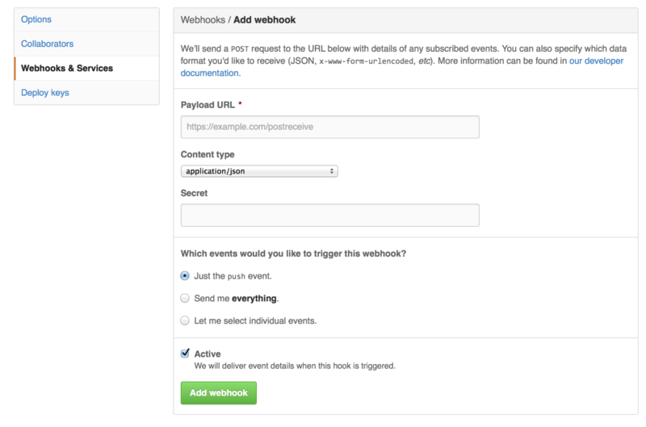

# GitHub

<!-- toc -->

GitHub est l’un des plus grands hébergeurs de dépôts Git et constitue le
point central pour la collaboration de millions de développeurs et de
projets. Une grande partie des dépôts Git publics sont hébergés sur
GitHub et de nombreux projets open-source l’utilisent pour l’hébergement
Git, le suivi des erreurs, la revue de code et d’autres choses. Donc,
bien que ce ne soit pas un sous-ensemble direct du projet open source
Git, il est très probable que vous souhaiterez ou aurez besoin
d’interagir avec GitHub à un moment ou à un autre dans votre utilisation
professionnelle de Git.

Ce chapitre présente la façon d’utiliser GitHub de manière efficace.
Nous traiterons la création et la gestion d’un compte utilisateur, la
création et l’utilisation de dépôts Git, les processus courants pour
contribuer aux projets ou pour accepter des contributions, l’interface
de programmation de GitHub ainsi qu’un grand nombre d’astuces pour vous
simplifier la vie.

Si vous n’êtes pas intéressé par l’utilisation de GitHub pour héberger
vos projets personnels ou pour collaborer à d’autres projets hébergés
sur GitHub, vous pouvez sans problème passer directement à [Utilitaires
Git](#ch07-git-tools).

<table>
<colgroup>
<col style="width: 50%" />
<col style="width: 50%" />
</colgroup>
<tbody>
<tr class="odd">
<td><em></em></td>
<td><div class="title">
Modification de l’interface
</div>
<div class="paragraph">
<p>À l’instar de nombreux sites Web actifs, GitHub changera tôt ou tard les éléments de l’interface utilisateur par rapport aux captures d’écran présentées ici. Heureusement, l’idée générale de l’objectif des actions reste valable, mais si vous souhaitez voir des versions plus à jour de ces captures, les versions en ligne de ce livre peuvent présenter des captures plus récentes.</p>
</div></td>
</tr>
</tbody>
</table>

## Configuration et paramétrage d’un compte

La première chose à faire consiste à créer un compte utilisateur
gratuit. Allez tout simplement sur
<a href="https://github.com" class="bare">https://github.com</a>,
choisissez un nom d’utilisateur qui n’est pas déjà pris et saisissez une
adresse électronique et un mot de passe, puis cliquez sur le gros bouton
vert « Sign up for GitHub » (S’inscrire sur GitHub).


Figure 82. Le formulaire d’inscription de GitHub.

La deuxième chose que vous verrez est la page des tarifs pour des
projets améliorés mais il vaut mieux ignorer cela pour l’instant. GitHub
vous envoie un courriel pour vérifier l’adresse fournie. Suivez les
instructions mentionnées, c’est très important (comme nous allons le
voir plus tard).

<table>
<colgroup>
<col style="width: 50%" />
<col style="width: 50%" />
</colgroup>
<tbody>
<tr class="odd">
<td><em></em></td>
<td><div class="paragraph">
<p>Vous avez accès à toutes les fonctionnalités de GitHub avec un compte gratuit, à la condition que tous vos projets soient entièrement publics (tout le monde peut y accéder en lecture). Les projets payant de GitHub comprennent la possibilité de créer des projets privés mais nous ne parlerons pas de cela dans ce livre.</p>
</div></td>
</tr>
</tbody>
</table>

En cliquant sur le logo Octocat (logo en forme de chat) dans le coin
supérieur gauche de l’écran, vous accéderez à votre tableau de bord.
Vous êtes maintenant prêt à utiliser GitHub.

### Accès par SSH

Pour l’instant, vous avez la possibilité de vous connecter à des dépôts
Git en utilisant le protocole `https://` et de vous identifier au moyen
de votre nom d’utilisateur et de votre mot de passe. Cependant, pour
simplement cloner des projets publics, il n’est même pas nécessaire de
créer un compte ‑ le compte que nous venons de créer devient utile pour
commencer à dupliquer (*fork*) un projet ou pour pousser sur ces dépôts
plus tard.

Si vous préférez utiliser des serveurs distants en SSH, vous aurez
besoin de renseigner votre clé publique. Si vous n’en possédez pas déjà
une, référez-vous à [Génération des clés publiques
SSH](#s_generate_ssh_key). Accédez aux paramètres de votre compte en
utilisant le lien en haut à droite de la fenêtre :


Figure 83. Lien vers « Account settings » (paramètres du compte).

Sélectionnez ensuite la section « SSH keys » (clés SSH) sur le côté
gauche.


Figure 84. Lien vers « SSH keys » (clés SSH).

Ensuite, cliquez sur le bouton « `Add an SSH key` » (ajouter une clé
SSH), donnez un nom à votre clé, copiez le contenu du fichier de clé
publique `~/.ssh/id_rsa.pub` (ou autre si vous l’avez appelé
différemment) dans la zone de texte et cliquez sur « Add key » (ajouter
la clé).

<table>
<colgroup>
<col style="width: 50%" />
<col style="width: 50%" />
</colgroup>
<tbody>
<tr class="odd">
<td><em></em></td>
<td><div class="paragraph">
<p>Assurez-vous de choisir un nom facile à retenir pour votre clé SSH. Vous pouvez donner un nom à chacune de vos clés (par ex. : « mon portable » ou « compte travail ») de façon à la retrouver facilement si vous devez la révoquer plus tard.</p>
</div></td>
</tr>
</tbody>
</table>

### Votre Avatar

Ensuite, si vous le souhaitez, vous pouvez remplacer l’avatar généré
pour vous par une image de votre choix. Sélectionnez la section «
Profile » (profil) (au dessus de la section « SSH Keys ») et cliquez sur
« Upload new picture » (télécharger une nouvelle image).


Figure 85. Lien vers « Profile » (profil).

Après avoir sélectionné une image sur votre disque dur, il vous est
possible de la recadrer.


Figure 86. Recadrage de l’avatar

À présent, toutes vos interventions sur le site seront agrémentées de
votre avatar au côté de votre nom d’utilisateur.

S’il se trouve que vous avez déposé un avatar sur le service populaire
Gravatar (souvent utilisé pour les comptes Wordpress), cet avatar sera
utilisé par défaut et vous n’avez pas à exécuter cette étape.

### Vos adresses électroniques

Github utilise les adresses électroniques pour faire correspondre les
*commits* Git aux utilisateurs. Si vous utilisez plusieurs adresses
électroniques dans vos *commits* et que vous souhaitez que GitHub les
relie correctement, vous devez ajouter toutes les adresses que vous avez
utilisées dans la section « Emails » (adresses électroniques) de la
section d’administration.


Figure 87. Ajout d’adresses électroniques

Sur [Ajout d’adresses électroniques](#s_add_email_addresses) nous
pouvons voir certains états possibles. L’adresse du haut est vérifiée et
définie comme adresse principale, c’est-à-dire que ce sera l’adresse
utilisée pour vous envoyer toutes les notifications. La seconde adresse
est vérifiée et peut donc aussi être définie comme adresse principale si
on l’échange avec la première. La dernière adresse est non vérifiée, ce
qui signifie que vous ne pouvez pas en faire votre adresse principale.
Si GitHub détecte une de ces adresses dans des messages de validation
dans n’importe quel dépôt du site, il les reliera à votre compte
utilisateur.

### Authentification à deux facteurs

Enfin, pour plus de sécurité, vous devriez assurément paramétrer une
authentification à deux facteurs ou « 2FA » (*2 Factor Authentication*).
L’authentification à deux facteurs est un mécanisme d’authentification
qui est devenu très populaire récemment pour réduire les risques de
corruption de votre compte si votre mot de passe est dérobé. Une fois
activée, GitHub vous demandera deux méthodes différentes
d’authentification, de sorte que si l’une devait être compromise, un
attaquant ne pourrait tout de même pas accéder à votre compte.

Vous pouvez trouver les réglages de l’authentification à deux facteurs
dans la section « Security » (Sécurité) de la section d’administration.


Figure 88. 2FA dans la section « Security » (Sécurité)

Si vous cliquez sur le bouton « Set up two-factor authentication »
(paramétrage de l’authentification à deux facteurs), vous serez redirigé
vers une page de configuration sur laquelle vous pourrez choisir
d’utiliser une application de téléphone mobile pour générer votre code
secondaire (un « mot de passe à usage unique basé sur la date ») ou bien
de vous faire envoyer un code GitHub par SMS chaque fois que vous avez
besoin de vous identifier.

Après avoir choisi votre méthode préférée et suivi les instructions pour
activer 2FA, votre compte sera un peu plus sécurisé et vous devrez
fournir un code supplémentaire en plus de votre mot de passe quand vous
vous identifierez sur GitHub.

## Contribution à un projet

Après avoir configuré votre compte, examinons comment contribuer à un
projet existant.

### Duplication des projets

Si vous souhaitez contribuer à un projet existant sur lequel vous n’avez
pas le droit de pousser, vous pouvez dupliquer (*fork*) ce projet. Cela
signifie que GitHub va faire pour vous une copie personnelle du projet.
Elle se situe dans votre espace de nom et vous pouvez pousser dessus.

<table>
<colgroup>
<col style="width: 50%" />
<col style="width: 50%" />
</colgroup>
<tbody>
<tr class="odd">
<td><em></em></td>
<td><div class="paragraph">
<p>Historiquement, le terme « <em>fork</em> » transmet une idée négative, qui s’apparente à l’idée que quelqu’un mène un projet open-source vers une direction différente, créant un projet concurrent de l’original et divisant les forces de contributions. Au sein de GitHub, un « <em>fork</em> » constitue une simple copie d’un projet au sein de votre espace de nom personnel, ce qui vous permet d’y apporter publiquement des modifications, c’est donc tout simplement un moyen de contribuer de manière plus ouverte.</p>
</div></td>
</tr>
</tbody>
</table>

Ainsi, les gestionnaires de projets n’ont pas à se soucier de devoir
ajouter des utilisateurs comme collaborateurs pour leur accorder un
accès en poussée. Les personnes peuvent dupliquer un projet eux-mêmes,
pousser sur leur copie personnelle et fournir leur contribution au dépôt
originel en créant une requête de tirage (*Pull Request*), concept qui
sera abordé par la suite. Ceci ouvre un fil de discussion avec
possibilité de revue de code, pour que le propriétaire et le
contributeur puissent discuter et modifier le code proposé jusqu’à ce
que le propriétaire soit satisfait du résultat et le fusionne dans son
dépôt.

Pour dupliquer un projet, visitez la page du projet et cliquez sur le
bouton « *Fork* » en haut à droite de la page.


Figure 89. Le bouton « *Fork* ».

Quelques secondes plus tard, vous serez redirigé vers la page de votre
nouveau projet, contenant votre copie modifiable du code.

### Processus GitHub

GitHub est construit autour d’une certaine organisation de la
collaboration, centrée autour des requêtes de tirage (*Pull Request*).

Ce processus de travail fonctionne aussi bien avec une petite équipe
soudée collaborant sur un dépôt unique partagé qu’avec une société
éclatée à travers le monde ou un réseau d’inconnus contribuant sur un
projet au moyen de dizaines de projets dupliqués. Il est centré sur le
processus de travail par branches thématiques (voir [Les branches
thématiques](#s_topic_branch) traité dans le [Les branches avec
Git](#ch03-git-branching)).

Le principe général est le suivant :

1.  création d’une branche thématique à partir de la branche `master`,

2.  validation de quelques améliorations (*commit*),

3.  poussée de la branche thématique sur votre projet GitHub (*push*),

4.  ouverture d’une requête de tirage sur GitHub (*Pull Request*),

5.  discussion et éventuellement possibilité de nouvelles validations
    (*commit*).

6.  Le propriétaire du projet fusionne (*merge*) ou ferme (*close*) la
    requête de tirage.

C’est essentiellement le processus de gestion par gestionnaire
d’intégration traité dans [Mode du gestionnaire
d’intégration](#s_integration_manager), mais au lieu d’utiliser des
courriels pour communiquer et faire une revue des modifications, les
équipes utilisent les outils Web de GitHub.

Détaillons un exemple illustrant une proposition de modification à un
projet open-source hébergé sur GitHub.

#### Création d’une requête de tirage

Tony recherche un programme à faire tourner sur son micro-contrôleur
Arduino et a trouvé un programme génial sur GitHub à
<a href="https://github.com/schacon/blink" class="bare">https://github.com/schacon/blink</a>.


Figure 90. Le projet auquel nous souhaitons contribuer.

Le seul problème est que le clignotement est trop rapide, nous pensons
qu’il serait mieux d’attendre 3 secondes au lieu d’une entre chaque
changement d’état. Améliorons donc le programme et soumettons cette
amélioration au projet initial.

Premièrement, nous cliquons sur le bouton « Fork » comme mentionné
ci-dessus pour obtenir une copie du projet. Notre nom d’utilisateur ici
est « tonychacon » donc notre copie de ce projet est à
`https://github.com/tonychacon/blink` et c’est ici que nous pouvons la
modifier. Nous pouvons aussi la cloner localement, créer une branche
thématique, modifier le code et pousser finalement cette modification
sur GitHub.

``` highlight
$ git clone https://github.com/tonychacon/blink (1)
Clonage dans 'blink'...

$ cd blink
$ git checkout -b slow-blink (2)
Switched to a new branch 'slow-blink'

$ sed -i '' 's/1000/3000/' blink.ino # (MacOSX) (3)
# Si vous êtes sur un système Linux, faites plutôt ceci :
# $ sed -i 's/1000/3000/' blink.ino (3)

$ git diff --word-diff (4)
diff --git a/blink.ino b/blink.ino
index 15b9911..a6cc5a5 100644
--- a/blink.ino
+++ b/blink.ino
@@ -18,7 +18,7 @@ void setup() {
// the loop routine runs over and over again forever:
void loop() {
  digitalWrite(led, HIGH);   // turn the LED on (HIGH is the voltage level)
  [-delay(1000);-]{+delay(3000);+}               // wait for a second
  digitalWrite(led, LOW);    // turn the LED off by making the voltage LOW
  [-delay(1000);-]{+delay(3000);+}               // wait for a second
}

$ git commit -a -m 'three seconds is better' (5)
[master 5ca509d] three seconds is better
 1 file changed, 2 insertions(+), 2 deletions(-)

$ git push origin slow-blink (6)
Username for 'https://github.com': tonychacon
Password for 'https://tonychacon@github.com':
Counting objects: 5, done.
Delta compression using up to 8 threads.
Compressing objects: 100% (3/3), done.
Writing objects: 100% (3/3), 340 bytes | 0 bytes/s, done.
Total 3 (delta 1), reused 0 (delta 0)
To https://github.com/tonychacon/blink
 * [new branch]      slow-blink -> slow-blink
```

|       |                                                                 |
|-------|-----------------------------------------------------------------|
| **1** | Clone notre copie du projet localement                          |
| **2** | Crée un branche thématique avec un nom descriptif               |
| **3** | Modifie le code                                                 |
| **4** | Vérifie si la modification est bonne                            |
| **5** | Valide les modifications dans la branche thématique             |
| **6** | Pousse notre branche thématique sur notre dépôt dupliqué GitHub |

Maintenant, si nous allons sur notre projet dupliqué sur GitHub, nous
pouvons voir que GitHub a remarqué que nous avons poussé une nouvelle
branche thématique et affiche un gros bouton vert pour vérifier nos
modifications et ouvrir une requête de tirage sur le projet original.

Vous pouvez aussi vous rendre à la page « Branches » à
`https://github.com/<utilisateur>/<projet>/branches` pour trouver votre
branche et ouvrir une requête de tirage à partir de là.


Figure 91. Le bouton Pull Request (requête de tirage)

Si nous cliquons sur le bouton vert, une fenêtre nous permet de créer un
titre et une description de la modification que nous souhaitons faire
intégrer pour que le propriétaire du projet trouve une bonne raison de
la prendre en considération. C’est généralement une bonne idée de passer
un peu de temps à écrire une description aussi argumentée que possible
pour que le propriétaire sache pourquoi la modification est proposée et
en quoi elle apporterait une amélioration au projet.

Nous voyons aussi une liste de soumissions (*commits*) dans notre
branche thématique qui sont « en avance » (*ahead*) par rapport à la
branche `master` (ici, un seul uniquement) et une visualisation unifiée
de toutes les modifications (*unified diff*) qui seraient intégrées en
cas de fusion.


Figure 92. Page de création d’une requête de tirage

Quand vous cliquez sur le bouton « Create pull request » sur cet écran,
le propriétaire du projet que vous avez dupliqué reçoit une notification
lui indiquant que quelqu’un suggère une modification et qui renvoie à la
page contenant toutes les informations correspondantes.

<table>
<colgroup>
<col style="width: 50%" />
<col style="width: 50%" />
</colgroup>
<tbody>
<tr class="odd">
<td><em></em></td>
<td><div class="paragraph">
<p>Bien que les requêtes de tirage soient souvent utilisées de cette façon pour des projets publics quand un contributeur propose une modification complète, elles sont aussi souvent utilisées dans les projets internes <em>au début</em> d’un cycle de développement. Comme on peut continuer à pousser sur la branche thématique même <strong>après</strong> l’ouverture de la requête de tirage, on ouvre une requête de tirage très tôt et cela permet de travailler en équipe dans un contexte, plutôt que de l’ouvrir à la toute fin du processus.</p>
</div></td>
</tr>
</tbody>
</table>

#### Itérations sur une requête de tirage

À présent, le propriétaire du projet peut regarder les modifications
suggérées et les fusionner ou les rejeter ou encore les commenter.
Supposons qu’il apprécie l’idée mais préférerait un temps d’extinction
de la lumière légèrement plus long que le temps d’allumage.

Alors que cette conversation a lieu par échange de courriel dans les
flux de travail présentés dans [Git distribué](#ch05-distributed-git),
ici elle a lieu en ligne sur GitHub. Le propriétaire du projet peut
faire une revue des différences en vue unifiées et laisser un
commentaire en cliquant sur une des lignes.


Figure 93. Commentaire sur une ligne spécifique de code de la requête de
tirage

Une fois que le mainteneur a commenté, la personne qui a ouvert la
requête de tirage (et en fait toute personne surveillant le dépôt)
recevra une notification. Nous verrons comment personnaliser ce
comportement plus tard, mais si la notification par courriel est
activée, Tony recevra un courriel comme celui-ci :


Figure 94. Commentaires notifiés par courriel

N’importe qui peut aussi laisser un commentaire global sur la requête de
tirage. Sur [Page de discussion d’une requête de
tirage](#s_pr_discussion), nous pouvons voir un exemple où le
propriétaire du projet commente une ligne de code puis laisse un
commentaire général dans la section de discussion. Vous pouvez voir que
les commentaires de code sont aussi publiés dans la conversation.


Figure 95. Page de discussion d’une requête de tirage

Maintenant, le contributeur sait ce qu’il doit faire pour que ses
modifications soient intégrées. Heureusement, ici c’est une chose facile
à faire. Alors que par courriel, il faudrait retravailler les séries de
commit et les soumettre à nouveau à la liste de diffusion, avec GitHub
il suffit de soumettre les correctifs sur la branche thématique et de la
repousser.

Le propriétaire du projet sera notifié à nouveau des modifications du
contributeur et pourra voir que les problèmes ont été réglés quand il
visitera la page de la requête de tirage. En fait, comme la ligne de
code initialement commentée a été modifiée entre temps, GitHub le
remarque et fait disparaître la différence obsolète.


Figure 96. Requête de tirage finale

Un point intéressant à noter est que si vous cliquez sur l’onglet
« Files Changed » (fichiers modifiés), vous obtenez la différence sous
forme unifiée — c’est-à-dire la différence totalement agrégée qui serait
introduite dans votre branche principale si cette branche thématique
était fusionnée. En équivalent `git diff`, cela montre automatiquement
la même chose que la commande `git diff master...<branche>` pour la
branche sur laquelle vous avez ouvert la requête de tirage. Référez-vous
à [Déterminer les modifications introduites](#s_what_is_introduced) pour
plus d’informations sur ce type de différence.

L’autre point à noter est que GitHub vérifie si la requête de tirage
peut être fusionnée proprement et fournit un bouton pour réaliser la
fusion sur le serveur. Ce bouton n’apparaît que si vous avez accès en
écriture au dépôt et si une fusion peut s’effectuer simplement. Si vous
cliquez dessus, GitHub réalise une fusion sans avance rapide
(non-fast-forward), ce qui signifie que même si la fusion *pouvait* se
faire en avance rapide (fast-forward), il va tout de même créer une
soumission de fusion (merge *commit*).

Si vous préférez, vous pouvez simplement tirer la branche et la
fusionner localement. Si vous fusionnez cette branche dans `master` et
poussez le tout sur GitHub, la requête de tirage sera fermée
automatiquement.

C’est le processus de travail de base que la plupart des projets GitHub
utilisent. Des branches thématiques sont créées, des requêtes de tirage
sont ouvertes dessus, une discussion s’engage, du travail additionnel
peut être ajouté sur la branche et à la fin, la requête est soit fermée,
soit fusionnée.

<table>
<colgroup>
<col style="width: 50%" />
<col style="width: 50%" />
</colgroup>
<tbody>
<tr class="odd">
<td><em></em></td>
<td><div class="title">
Pas seulement avec des dépôts dupliqués
</div>
<div class="paragraph">
<p>Il est important de noter que vous pouvez aussi ouvrir une requête de tirage entre deux branches du même dépôt. Si vous travaillez sur une fonctionnalité avec quelqu’un et que vous avez tous deux accès en écriture au projet, vous pouvez pousser une branche thématique sur le dépôt et ouvrir une requête de tirage dessus vers la branche <code>master</code> de ce même projet pour démarrer une revue de code et une discussion. Aucune duplication n’est nécessaire.</p>
</div></td>
</tr>
</tbody>
</table>

### Requêtes de tirage avancées

Après avoir présenté les bases de la contribution à un projet sur
GitHub, voyons quelques trucs et astuces concernant les requêtes de
tirage afin d’améliorer votre efficacité .

#### Requêtes de tirage comme patchs

Il est important de comprendre que pour de nombreux projets, les
requêtes de tirage ne sont pas vues comme des files d’attente de patchs
parfaits qui doivent s’appliquer correctement dans l’ordre, comme le
conçoivent la plupart des projets basés sur des listes de diffusion qui
fonctionnent par série de patchs envoyés par courriel. La plupart des
projets GitHub voient les branches de requête de tirage comme des
conversations itératives autour d’une modification proposée, aboutissant
à une différence unifiée qui est appliquée par fusion.

C’est une distinction importante, car généralement la modification est
soumise à revue avant que le code ne soit considéré comme parfait, ce
qui est bien plus rare avec les contributions par série de patchs
envoyées sur une liste de diffusion. Cela permet une conversation
précoce avec les mainteneurs de sorte que l’on atteint une solution
correcte par un travail plus collectif. Quand du code est proposé par
requête de tirage et que les mainteneurs ou la communauté suggèrent une
modification, la série de patchs n’est généralement pas régénérée mais
la différence est poussée comme nouvelle soumission (*commit*) à la
branche, permettant ainsi d’avancer dans la discussion, tout en
conservant intact le contexte du travail passé.

Par exemple, si vous regardez à nouveau la figure [Requête de tirage
finale](#s_pr_final), vous noterez que le contributeur n’a pas rebasé sa
soumission et envoyé une nouvelle requête de tirage. Au lieu de cela, il
a ajouté de nouvelles soumissions (*commit*) et les a poussé dans la
branche existante. De cette manière, si on examine cette requête de
tirage dans le futur, on peut aisément retrouver la totalité du contexte
qui a amené aux décisions prises. L’utilisation du bouton « *Merge* »
sur le site crée à dessein un « commit de fusion » (*merge*) qui
référence la requête de tirage pour qu’il reste facile de revenir sur
celle-ci et d’y rechercher la discussion originale si nécessaire.

#### Se maintenir à jour avec le développement amont

Si votre requête de tirage devient obsolète ou ne peut plus être
fusionnée proprement, vous voudrez la corriger pour que le mainteneur
puisse la fusionner facilement. GitHub testera cela pour vous et vous
indique à la fin de la requête de tirage si la fusion automatique est
possible ou non.


Figure 97. La requête de tirage ne peut pas être fusionnée proprement

Si vous voyez quelque chose comme sur la figure [La requête de tirage ne
peut pas être fusionnée proprement](#s_pr_fail), vous voudrez corriger
votre branche pour qu’elle ait un statut vert et que le mainteneur n’ait
pas à fournir de travail supplémentaire.

Vous avez deux options. Vous pouvez soit rebaser votre branche sur le
sommet de la branche cible (normalement, la branche `master` du dépôt
que vous avez dupliqué), soit fusionner la branche cible dans votre
branche.

La plupart des développeurs sur GitHub choisiront cette dernière option,
pour la même raison que celle citée à la section précédente. Ce qui
importe est l’historique et la fusion finale, donc le rebasage n’apporte
pas beaucoup plus qu’un historique légèrement plus propre avec en prime
une plus grande difficulté d’application et l’introduction possible
d’erreurs.

Si vous voulez fusionner la branche cible pour rendre votre requête de
tirage fusionnable, vous ajouterez le dépôt original comme nouveau dépôt
distant, récupérerez la branche cible que vous fusionnerez dans votre
branche thématique, corrigerez les erreurs et finalement pousserez la
branche thématique sur la même branche thématique pour laquelle vous
avez ouvert la requête de tirage.

Par exemple, considérons que dans l’exemple « tonychacon » que nous
avons utilisé, l’auteur original a fait des modifications qui créent un
conflit dans la requête de tirage. Examinons ces étapes.

``` highlight
$ git remote add upstream https://github.com/schacon/blink (1)

$ git fetch upstream (2)
remote: Counting objects: 3, done.
remote: Compressing objects: 100% (3/3), done.
Unpacking objects: 100% (3/3), done.
remote: Total 3 (delta 0), reused 0 (delta 0)
From https://github.com/schacon/blink
 * [new branch]      master     -> upstream/master

$ git merge upstream/master (3)
Auto-merging blink.ino
CONFLICT (content): Merge conflict in blink.ino
Automatic merge failed; fix conflicts and then commit the result.

$ vim blink.ino (4)
$ git add blink.ino
$ git commit
[slow-blink 3c8d735] Merge remote-tracking branch 'upstream/master' \
    into slower-blink

$ git push origin slow-blink (5)
Counting objects: 6, done.
Delta compression using up to 8 threads.
Compressing objects: 100% (6/6), done.
Writing objects: 100% (6/6), 682 bytes | 0 bytes/s, done.
Total 6 (delta 2), reused 0 (delta 0)
To https://github.com/tonychacon/blink
   ef4725c..3c8d735  slower-blink -> slow-blink
```

|       |                                                                        |
|-------|------------------------------------------------------------------------|
| **1** | Ajoute le dépôt original comme dépôt distant sous le nom « upstream ». |
| **2** | Récupère les derniers travaux depuis ce dépôt distant.                 |
| **3** | Fusionne la branche principale dans la branche thématique.             |
| **4** | Corrige le conflit créé.                                               |
| **5** | Pousse sur la même branche thématique.                                 |

Quand vous faites cela, la requête de tirage est automatiquement mise à
jour et un nouveau contrôle est effectué pour vérifier la possibilité de
fusion.


Figure 98. La requête de tirage se fusionne proprement maintenant

Une des grandes forces de Git est que vous pouvez faire ceci
régulièrement. Si vous avez un projet à très long terme, vous pouvez
facilement fusionner depuis la branche cible de nombreuses fois et
n’avoir à gérer que les conflits apparus depuis la dernière fusion,
rendant ainsi le processus réalisable.

Si vous souhaitez absolument rebaser la branche pour la nettoyer, vous
pouvez toujours le faire, mais il vaut mieux ne pas pousser en forçant
sur la branche sur laquelle la requête de tirage est déjà ouverte. Si
d’autres personnes l’ont déjà tirée et ont travaillé dessus, vous vous
exposez aux problèmes décrits dans [Les dangers du
rebasage](#s_rebase_peril). À la place, poussez cette branche rebasée
vers une nouvelle branche sur GitHub et ouvrez une nouvelle requête de
tirage qui référence l’ancienne requête, puis fermez l’originale.

#### Références

Votre prochaine question pourrait être : « Comment faire pour référencer
l’ancienne requête de tirage ? ». En fait, il y a de très très
nombreuses manières de faire référence à d’autres choses dans GitHub
depuis à peu près toutes les zones textuelles.

Commençons par la manière de faire référence à une autre requête de
tirage ou à une anomalie (Issue). Toutes les requêtes de tirage et
toutes les anomalies sont identifiées par des numéros qui sont uniques
au sein d’un projet. Par exemple, vous ne pouvez avoir une requête de
tirage numéro 3 et une anomalie numéro 3. Si vous voulez faire référence
à n’importe quelle requête de tirage ou anomalie depuis l’une ou l’autre
du même projet, il vous suffit d’insérer `#<numéro>` dans n’importe quel
commentaire ou n’importe quelle description. Vous pouvez aussi
référencer une requête ou une anomalie d’un autre dépôt dupliqué du
dépôt actuel en utilisant la syntaxe `<utilisateur>#<numéro>`, ou même
un autre dépôt indépendant avec la syntaxe
`<utilisateur>/<dépôt>#<numéro>`.

Voyons cela sur un exemple. Disons que nous avons rebasé la branche de
l’exemple précédent, créé une nouvelle requête de tirage et nous
souhaitons maintenant faire référence à l’ancienne requête de tirage
depuis la nouvelle. Nous souhaitons aussi faire référence à une anomalie
dans un dépôt dupliqué de celui-ci et à une anomalie soumise dans un
projet complètement différent. Nous pouvons saisir une description comme
sur la figure [Références croisées dans une requête de
tirage.](#s_pr_references).


Figure 99. Références croisées dans une requête de tirage.

Quand nous soumettons cette requête de tirage, nous voyons tout ceci mis
en forme comme sur la figure [Références croisées mises en forme dans
une requête de tirage.](#s_pr_references_render).


Figure 100. Références croisées mises en forme dans une requête de
tirage.

Notez bien que l’URL GitHub complète que nous avons indiquée a été
raccourcie pour ne contenir que l’information nécessaire.

À présent, si Tony retourne sur la requête de tirage originale et la
ferme, nous pouvons voir que du fait de son référencement dans la
nouvelle, GitHub a créé automatiquement un événement de suivi dans le
journal de la nouvelle requête de tirage. Cela signifie qu’une personne
qui visitera cette requête de tirage et verra qu’elle est fermée, pourra
facilement se rendre sur celle qui l’a remplacée. Le lien ressemblera à
quelque chose comme sur la figure [Références croisée dans une requête
de tirage fermée.](#s_pr_closed).


Figure 101. Références croisée dans une requête de tirage fermée.

En plus des numéros d’anomalies, vous pouvez aussi faire référence à une
soumission (commit) spécifique par son SHA-1. Vous devez spécifier la
totalité des 40 caractères du SHA-1, mais si GitHub rencontre cette
chaîne, il créera un lien direct vers la soumission. Vous pouvez aussi
faire référence à des soumissions dans des dépôts dupliqués ou d’autres
dépôts de la même manière que nous l’avons fait pour les anomalies.

### Markdown

Faire des liens vers les autres anomalies n’est que le début des choses
intéressantes que vous pouvez faire dans presque toutes les boîtes de
saisie dans GitHub. Dans les descriptions d’anomalies et de requêtes de
tirage, les commentaires, les commentaires de code et plus, vous pouvez
utiliser ce qu’on appelle le « Markdown, saveur GitHub » (*GitHub
Flavored Markdown*). Markdown, c’est comme écrire du texte simple mais
celui-ci est rendu plus richement.

Référez-vous à l’exemple sur la figure [Un exemple de Markdown écrit et
rendu.](#s_example_markdown) pour savoir comment les commentaires ou le
texte peuvent être écrits puis rendus en utilisant Markdown.


Figure 102. Un exemple de Markdown écrit et rendu.

#### Markdown, saveur GitHub

La saveur GitHub de Markdown permet de réaliser encore plus de choses
au-delà de la syntaxe Markdown basique. Celles-ci peuvent être vraiment
utiles pour la création de requêtes de tirage, de commentaires
d’anomalies ou de descriptions.

##### Listes de tâches

La première spécificité vraiment utile du Markdown de GitHub,
particulièrement dans le cadre de requêtes de tirage, est la création de
listes de tâches. Une liste de tâches est une liste de cases à cocher
pour chaque action à accomplir. Dans une anomalie ou une requête de
tirage, cela indique les choses qui doit être faites avant de pouvoir
considérer l’élément comme fermé.

Vous pouvez créer une liste de tâches comme ceci :

``` highlight
- [X] Écrire le code
- [ ] Écrire tous les tests
- [ ] Documenter le code
```

Si nous incluons ceci dans la description de notre requête de tirage ou
de notre anomalie, nous le verrons rendu comme sur la figure [Rendu
d’une liste de tâches dans un commentaire Markdown.](#s_task_lists)


Figure 103. Rendu d’une liste de tâches dans un commentaire Markdown.

C’est très utilisé dans les requêtes de tirage pour indiquer tout ce que
vous souhaitez voir accompli sur la branche avant que la requête de
tirage ne soit prête à être fusionnée. Le truc vraiment cool est que
vous pouvez simplement cliquer sur les cases à cocher pour mettre à jour
le commentaire — il est inutile de modifier directement le Markdown pour
cocher les cases.

De plus, GitHub surveille la présence de listes de tâches dans vos
anomalies et vos requêtes de tirage et les affiche comme métadonnées sur
les pages qui en donnent la liste. Par exemple, si vous avez une requête
de tirage contenant des tâches et que vous regardez la page de résumé de
toutes les requêtes de tirage, vous pouvez y voir l’état d’avancement.
Cela aide les gens à découper les requêtes de tirage en sous-tâches et
aide les autres personnes à suivre le progrès sur la branche. Vous
pouvez voir un exemple de cette fonctionnalité sur la figure [Résumé de
listes de tâches dans la liste des requêtes de
tirage.](#s_task_list_progress).


Figure 104. Résumé de listes de tâches dans la liste des requêtes de
tirage.

C’est incroyablement utile quand vous ouvrez tôt une requête de tirage
et les utilisez pour suivre votre progrès au cours du développement de
la fonctionnalité.

##### Extraits de code

Vous pouvez aussi ajouter des extraits de code dans les commentaires.
C’est particulièrement utile si vous souhaitez montrer quelque chose que
vous *pourriez* essayer de faire avant de les développer réellement dans
votre branche sous la forme d’une soumission. C’est aussi souvent
utilisé pour ajouter un exemple de code de ce qui ne fonctionne pas ou
de ce que cette requête de tirage pourrait mettre en œuvre.

Pour ajouter un extrait de code, vous devez le délimiter par des
guillemets simples inversés.

```` highlight
```java
for(int i=0 ; i < 5 ; i++)
{
   System.out.println("i is : " + i);
}
```
````

Si de plus vous ajoutez un nom de langage comme nous l’avons fait avec
*java*, GitHub essaye de colorer syntaxiquement l’extrait. Dans le cas
ci-dessus, cela donnerait le rendu sur la figure [Exemple de rendu d’un
code délimité](#s_md_code).


Figure 105. Exemple de rendu d’un code délimité

##### Citation

Si vous répondez à une petite partie d’un long commentaire, vous pouvez
citer la partie concernée de l’autre commentaire de manière sélective en
faisant précéder chaque ligne par le caractère `>`. En réalité, c’est
même tellement courant et utile qu’il existe un raccourci clavier pour
cela. Si vous sélectionnez un texte dans un commentaire auquel vous
voulez directement répondre et que vous appuyez sur la touche `r`, ce
texte sera automatiquement cité pour vous dans votre boîte de
commentaire.

Les citations ressemblent à quelque chose comme ça :

``` highlight
> Whether 'tis Nobler in the mind to suffer
> The Slings and Arrows of outrageous Fortune,

How big are these slings and in particular, these arrows?
```

Une fois rendu, le commentaire ressemble à quelque chose comme sur la
figure [Exemple de rendu de citation.](#s_md_quote).


Figure 106. Exemple de rendu de citation.

##### Émoticône (Emoji)

Enfin, vous pouvez également utiliser des émoticônes dans vos
commentaires. C’est en réalité utilisé assez largement dans les
commentaires que vous pouvez voir pour de nombreuses anomalies et
requêtes de tirage GitHub. Il existe même un assistant pour émoticônes
dans GitHub. Lorsque vous saisissez un commentaire et que vous commencez
à saisir le caractère `:`, un outil pour l’auto-complétion vous aide à
trouver ce que vous recherchez.


Figure 107. Auto-complétion d’émoticônes en action.

Les émoticônes apparaissent sous la forme `:<nom>:` n’importe où dans le
commentaire. Par exemple, vous pourriez écrire quelque chose comme
cela :

``` highlight
I :eyes: that :bug: and I :cold_sweat:.

:trophy: for :microscope: it.

:+1: and :sparkles: on this :ship:, it's :fire::poop:!

:clap::tada::panda_face:
```

Une fois rendu, cela ressemblerait à quelque chose comme sur la figure
[Commentaire très chargé en émoticônes.](#s_md_emoji).


Figure 108. Commentaire très chargé en émoticônes.

Bien que cela ne soit pas indispensable, cela ajoute une touche d’humour
et d’émotion à un moyen de communication avec lequel il est difficile de
transmettre des émotions.

<table>
<colgroup>
<col style="width: 50%" />
<col style="width: 50%" />
</colgroup>
<tbody>
<tr class="odd">
<td><em></em></td>
<td><div class="paragraph">
<p>Il y a en fait un assez grand nombre de services Web qui emploient maintenant des émoticônes. Un formidable aide mémoire de référence pour trouver des émoticônes qui expriment ce que vous souhaitez dire peut être trouvé ici :</p>
</div>
<div class="paragraph">
<p><a href="http://www.emoji-cheat-sheet.com" class="bare">http://www.emoji-cheat-sheet.com</a></p>
</div></td>
</tr>
</tbody>
</table>

##### Images

Ce n’est pas à proprement parler du Markdown, saveur GitHub, mais c’est
incroyablement utile. En plus de l’ajout de liens images aux
commentaires (dont il peut être difficile de trouver et d’intégrer les
URL), GitHub vous permet de faire un glisser-déposer de vos images sur
les zones de texte pour les intégrer.


Figure 109. Glisser-déposer d’images pour les télécharger et les
intégrer.

Si vous regardez à nouveau l’image [Références croisées dans une requête
de tirage.](#s_pr_references), vous y verrez une petite indication
“Parsed as Markdown” (Traitement Markdown) en haut de la zone de texte.
En cliquant dessus, vous serez redirigé vers une page (en anglais)
affichant un aide-mémoire de référence vous résumant tout ce que vous
pouvez faire avec Markdown sur GitHub.

## Maintenance d’un projet

Maintenant que vous êtes à l’aise sur les aspects contribution à un
projet, regardons maintenant l’autre côté : la création, la maintenance
et l’administration de vos propres projets.

### Création d’un nouveau dépôt

Créons un nouveau dépôt pour permettre le partage du code de notre
projet avec d’autres. Commencez par cliquer sur le bouton « New
repository » (nouveau dépôt) sur le côté droit de votre tableau de bord
ou sur le bouton `+` dans la barre d’outils du haut à côté de votre nom
d’utilisateur comme sur la figure [La liste déroulante « New
repository » (nouveau dépôt)](#s_new_repo_dropdown).


Figure 110. La zone « Your repositories » (vos dépôts)


Figure 111. La liste déroulante « New repository » (nouveau dépôt)

Vous êtes redirigé vers le formulaire pour la création de nouveau
dépôt :


Figure 112. Le formulaire « new repository » (nouveau dépôt).

Tout ce que vous avez à faire, c’est de fournir un nom de projet, les
autres champs sont facultatifs. Pour l’instant, cliquez juste sur le
bouton « Create Repository » (créer un dépôt) et paf, vous obtenez un
nouveau dépôt sur GitHub nommé `<utilisateur>/<nom_du_projet>`.

Puisque vous n’avez pas encore de code, GitHub vous affiche des
instructions sur la façon de créer un tout nouveau dépôt Git ou de se
connecter à un projet Git existant. Nous ne détaillerons pas cela ici ;
si vous avez besoin d’un rappel, vérifiez [Les bases de
Git](#ch02-git-basics).

Maintenant que votre projet est hébergé sur GitHub, vous pouvez donner
l’URL à toutes les personnes avec lesquelles vous voulez partager votre
projet. Chaque projet est accessible via HTTP par
`https://github.com/<utilisateur>/<nom_du_projet>` et via SSH par
`git@github.com:<utilisateur>/<nom_du_projet>`. Git peut récupérer et
pousser en utilisant les deux URL mais l’accès est contrôlé sur la base
des paramètres d’authentification de l’utilisateur qui s’y connecte.

<table>
<colgroup>
<col style="width: 50%" />
<col style="width: 50%" />
</colgroup>
<tbody>
<tr class="odd">
<td><em></em></td>
<td><div class="paragraph">
<p>Il est souvent mieux de partager l’URL basé sur HTTP pour un projet public puisque l’utilisateur n’a pas besoin d’avoir un compte GitHub pour y accéder et pour le cloner. Les utilisateurs devront posséder un compte et avoir déposé une clé SSH pour accéder à votre projet si vous leur donnez l’URL SSH. L’URL HTTP est également exactement le même que celui que vous colleriez dans votre navigateur pour y afficher le projet.</p>
</div></td>
</tr>
</tbody>
</table>

### Ajout de collaborateurs

Si vous travaillez avec d’autres personnes à qui vous voulez donner
l’accès en poussée, vous devez les ajouter en tant que
« collaborateurs ». Si Ben, Jeff et Louise possèdent tous un compte
GitHub et que vous voulez qu’ils puissent pousser sur votre dépôt, vous
pouvez les ajouter à votre projet. En faisant cela, vous leur donnez un
accès en poussée ce qui signifie qu’ils possèdent un accès en lecture et
en écriture au projet et au dépôt Git.

Cliquez sur le lien « Settings » (paramètres) en bas de la barre
latérale de droite.


Figure 113. Le lien des paramètres (Settings) du dépôt.

Ensuite sélectionnez « Collaborators » dans le menu de gauche, saisissez
un nom d’utilisateur dans la boîte et cliquez sur « Add collaborator »
(ajouter un collaborateur). Vous pouvez répéter cette action autant de
fois que vous le voulez pour permettre l’accès à toutes les personnes
que vous souhaitez. Si vous devez révoquer leur accès, il suffit de
cliquer sur le « X » à droite de leur nom.


Figure 114. Les collaborateurs du dépôt.

### Gestion des requêtes de tirage

Maintenant que vous possédez un projet contenant un peu de code et
peut-être même quelques collaborateurs qui possèdent un accès en
poussée, voyons ce que vous devez faire lorsque vous recevez vous-même
une requête de tirage.

Les requêtes de tirage peuvent provenir soit d’une branche d’un clone de
votre dépôt ou d’une autre branche du même dépôt. La seule différence
est que celles d’un clone proviennent souvent de personnes vers
lesquelles vous ne pouvez pas pousser sur leurs branches et qui ne
peuvent pas pousser vers les vôtres alors qu’avec des requêtes de tirage
internes, les deux parties peuvent généralement accéder à la branche.

Pour ces exemples, supposons que vous êtes « tonychacon » et que vous
avez créé un nouveau projet de code Arduino qui s’appelle « fade ».

#### Notifications par courriel

Quelqu’un se connecte et fait une modification à votre programme et vous
envoie une requête de tirage. Vous devriez recevoir un courriel vous
informant de cette nouvelle requête de tirage et ressemblant à celui sur
la figure [Notification par courriel d’une nouvelle requête de
tirage.](#s_email_pr).


Figure 115. Notification par courriel d’une nouvelle requête de tirage.

Faisons quelques remarques à propos de ce courriel. Celui-ci vous
fournit quelques statistiques : une liste de fichiers modifiés par la
requête de tirage et le nombre de modifications. Il vous donne un lien
vers la requête de tirage sur GitHub et il vous fournit également
quelques URL que vous pouvez utiliser en ligne de commande.

Remarquez la ligne `git pull <url> patch-1`, il s’agit d’une manière
simple de fusionner une branche distante sans avoir à ajouter un dépôt
distant. Nous avons déjà vu rapidement cela dans [Vérification des
branches distantes](#s_checking_out_remotes). Si vous voulez, vous
pouvez créer une branche thématique et basculer vers celle-ci puis
lancer cette commande pour fusionner les modifications de cette requête
de tirage.

Les autres URL intéressantes sont les URL `.diff` et `.patch`, qui,
comme vous l’avez certainement deviné, vous fournissent des versions au
format différence unifiée et patch de la requête de tirage. Vous
pourriez techniquement fusionner le travail contenu dans la requête de
tirage de la manière suivante :

``` highlight
$ curl http://github.com/tonychacon/fade/pull/1.patch | git am
```

#### Collaboration à une requête de tirage

Comme déjà traité dans la section [Processus GitHub](#s_github_flow),
vous pouvez maintenant commencer une conversation avec la personne qui a
ouvert la requête de tirage. Vous pouvez commenter certaines lignes de
code, commenter des soumissions complètes ou commenter la requête de
tirage elle-même en utilisant les outils Markdown, saveur GitHub un peu
partout.

À chaque fois que quelqu’un d’autre commente la requête de tirage, vous
recevrez des notifications par courriel afin d’être au courant de chaque
activité. Celles-ci possèdent un lien vers la requête de tirage dans
laquelle l’activité s’est produite et vous pouvez également répondre
directement au courriel pour commenter le fil de discussion de la
requête de tirage.


Figure 116. Les réponses aux courriels sont incorporées dans le fil de
discussion.

Une fois que le code est dans un état satisfaisant et que vous voulez le
fusionner, vous pouvez soit tirer le code et le fusionner localement,
soit utiliser la syntaxe décrite précédemment `git pull <url> <branch>`,
soit ajouter le clone comme dépôt distant, le récupérer et le fusionner.

Si la fusion est triviale, vous pouvez également cliquer sur le bouton
« Merge » (fusionner) sur le site GitHub. Une fusion sans avance rapide
(non-fast-forward) sera réalisée ce qui créera une soumission de fusion
(*merge commit*) même si une fusion en avance rapide (fast-forward)
était possible. Cela signifie que dans tous les cas, à chaque fois que
vous cliquez sur le bouton « Merge », un commit de fusion est créé.
Comme vous pouvez le voir sur [Bouton « Merge » et instructions pour la
fusion manuelle d’une requête de tirage.](#s_merge_button), GitHub vous
donne toutes ces informations si vous cliquez sur le lien descriptif.


Figure 117. Bouton « Merge » et instructions pour la fusion manuelle
d’une requête de tirage.

Si vous décidez que vous ne voulez pas fusionner, vous pouvez tout
simplement fermer la requête de tirage et la personne qui l’a créée en
sera informée.

#### Références aux requêtes de tirage

Si vous gérez **beaucoup** de requêtes de tirage et que vous ne voulez
pas ajouter une série de dépôts distants ou faire des tirages isolés à
chaque fois, GitHub vous permet une astuce. C’est toutefois une astuce
avancée et nous irons un peu plus dans les détails à la section [La
*refspec*](#s_refspec) mais cela peut être assez utile dès maintenant.

GitHub traite en réalité les branches de requête de tirage d’un dépôt
comme une sorte de pseudo-branches sur le serveur. Par défaut, vous ne
les obtenez pas lorsque vous clonez mais elles sont présentes de façon
cachée et vous pouvez y accéder assez facilement.

Pour le montrer, nous allons utiliser une commande bas niveau (souvent
appelée commande de « plomberie » dont nous parlerons un peu plus dans
la section [Plomberie et porcelaine](#s_plumbing_porcelain)) qui
s’appelle `ls-remote`. Cette commande n’est en général pas utilisée dans
les opérations quotidiennes mais elle est utile pour afficher les
références présentes sur le serveur.

Si nous lançons cette commande sur le dépôt « blink » que nous
utilisions tout à l’heure, nous obtenons la liste de toutes les branches
et étiquettes ainsi que d’autres références dans le dépôt.

``` highlight
$ git ls-remote https://github.com/schacon/blink
10d539600d86723087810ec636870a504f4fee4d    HEAD
10d539600d86723087810ec636870a504f4fee4d    refs/heads/master
6a83107c62950be9453aac297bb0193fd743cd6e    refs/pull/1/head
afe83c2d1a70674c9505cc1d8b7d380d5e076ed3    refs/pull/1/merge
3c8d735ee16296c242be7a9742ebfbc2665adec1    refs/pull/2/head
15c9f4f80973a2758462ab2066b6ad9fe8dcf03d    refs/pull/2/merge
a5a7751a33b7e86c5e9bb07b26001bb17d775d1a    refs/pull/4/head
31a45fc257e8433c8d8804e3e848cf61c9d3166c    refs/pull/4/merge
```

Bien sûr, si vous êtes dans votre dépôt et que vous lancez la commande
`git ls-remote origin` (ou avec un autre dépôt distant), quelque chose
de similaire s’affiche.

Si le dépôt se trouve sur GitHub et que des requêtes de tirage ont été
ouvertes, vous obtiendrez leurs références préfixées par `refs/pull/`.
Ce sont simplement des branches mais comme elles ne sont pas sous
`refs/heads/`, vous ne les obtenez généralement pas lorsque vous clonez
ou récupérez à partir d’un serveur — le processus de récupération les
ignore normalement.

Il y a deux références par requête de tirage - l’une se termine par
`/head` et pointe vers la même soumission que la dernière soumission
dans la branche de requête de tirage. Donc si quelqu’un ouvre une
requête de tirage sur notre dépôt, que leur branche s’appelle `bug-fix`
et qu’elle pointe sur la soumission `a5a775`, alors dans **notre** dépôt
nous n’aurons pas de branche `bug-fix` (puisqu’elle se trouve dans leur
clone) mais nous *aurons* une référence `pull/<pr#>/head` qui pointe
vers `a5a775`. Cela signifie que vous pouvez assez facilement tirer
toute branche de requête de tirage d’un coup sans avoir à ajouter tout
un tas de dépôts distants.

Vous pouvez désormais récupérer la référence directement.

``` highlight
$ git fetch origin refs/pull/958/head
From https://github.com/libgit2/libgit2
 * branch            refs/pull/958/head -> FETCH_HEAD
```

Cela dit à Git, « Connecte-toi au dépôt distant `origin` et télécharge
la référence appelée `refs/pull/958/head` ». Git obéit joyeusement et
télécharge tout ce dont vous avez besoin pour construire cette référence
et positionne un pointeur vers la soumission souhaitée sous
`.git/FETCH_HEAD`. Vous pouvez continuer en faisant
`git merge FETCH_HEAD` dans une branche dans laquelle vous voulez la
tester mais ce message de fusion (*merge commit*) semble un peu bizarre.
De plus, si vous passez en revue **beaucoup** de requêtes de tirage,
cela devient fastidieux.

Il existe également une façon de récupérer *toutes* les requêtes de
tirage et de les maintenir à jour à chaque fois que vous vous connectez
au dépôt distant. Ouvrez le fichier `.git/config` dans votre éditeur
favori et cherchez le dépôt `origin`. Cela devrait ressembler à cela :

    [remote "origin"]
        url = https://github.com/libgit2/libgit2
        fetch = +refs/heads/*:refs/remotes/origin/*

La ligne qui commence par `fetch =` est une spécification de références
(refspec). C’est une façon de faire correspondre des noms sur un dépôt
distant à des noms dans votre dossier `.git` local. Celle-ci en
particulier dit à Git, « les choses sur le dépôt distant qui se trouvent
sous `refs/heads` doivent aller dans mon dépôt local sous
`refs/remotes/origin` ». Vous pouvez modifier cette section pour ajouter
une autre spécification de références :

    [remote "origin"]
        url = https://github.com/libgit2/libgit2.git
        fetch = +refs/heads/*:refs/remotes/origin/*
        fetch = +refs/pull/*/head:refs/remotes/origin/pr/*

Cette dernière ligne dit à Git, « Toutes les références du type
`refs/pull/123/head` doivent être enregistrées localement comme
`refs/remotes/origin/pr/123` ». Maintenant, si vous enregistrez ce
fichier et faites une récupération (`git fetch`) :

``` highlight
$ git fetch
# …
 * [new ref]         refs/pull/1/head -> origin/pr/1
 * [new ref]         refs/pull/2/head -> origin/pr/2
 * [new ref]         refs/pull/4/head -> origin/pr/4
# …
```

Maintenant toutes les requêtes de tirage distantes sont représentées
localement par des références qui agissent un peu comme des branches de
suivi : elles sont en lecture seule et elles se mettent à jour lorsque
vous faites un tirage. Il est ainsi super facile d’essayer le code d’une
requête de tirage localement :

``` highlight
$ git checkout pr/2
Checking out files: 100% (3769/3769), done.
Branch pr/2 set up to track remote branch pr/2 from origin.
Switched to a new branch 'pr/2'
```

Les Sherlock Holmes en herbe parmi vous auront remarqué le terme `head`
à la fin de la partie distante de la spécification de références. Il y a
également une référence `refs/pull/#/merge` du côté de GitHub qui
représente la soumission qui serait obtenue si vous cliquiez sur le
bouton « Fusionner » sur le site. Cela peut vous permettre de tester la
fusion avant même de cliquer sur le bouton.

#### Requêtes de tirage sur des requêtes de tirage

Non seulement vous pouvez ouvrir des requêtes de tirage qui ciblent la
branche principale ou `master`, mais vous pouvez en fait ouvrir une
requête de tirage ciblant n’importe quelle branche du réseau. En
réalité, vous pouvez même cibler une autre requête de tirage.

Si vous remarquez une requête de tirage qui va dans la bonne direction
et que vous avez une idée de modifications qui dépendent de celle-ci, ou
vous n’êtes pas sûr que c’est une bonne idée, ou vous n’avez tout
simplement pas accès en poussée vers la branche cible, vous pouvez
ouvrir une requête de tirage directement sur elle.

Lorsque vous ouvrez une requête de tirage, une boîte en haut de la page
vous indique vers quelle branche vous voulez pousser et à partir de
quelle branche vous allez tirer. Si vous cliquez sur le bouton « Edit »
(modifier) à droite de cette boîte, vous pouvez modifier non seulement
les branches mais aussi le clone.


Figure 118. Modification manuelle du clone cible et de la branche de la
requête de tirage.

Vous pouvez à cet instant très facilement indiquer de fusionner votre
nouvelle branche sur une autre requête de tirage ou un autre clone du
projet.

### Mentions et notifications

GitHub dispose également d’un système de notifications intégré assez
sympa qui peut devenir utile lorsque vous avez des questions et besoin
du retour de certaines personnes ou d’équipes.

Dans tous les commentaires, si vous saisissez le caractère `@`, cela
commence à proposer des noms et des noms d’utilisateur de personnes qui
collaborent ou contribuent au projet.


Figure 119. Saisissez @ pour faire référence à quelqu’un.

Vous pouvez aussi faire référence à un utilisateur qui n’apparaît pas
dans cette liste, mais souvent l’auto-complétion accélère les choses.

Une fois que vous avez posté un commentaire contenant une référence à un
utilisateur, ce dernier reçoit une notification. Cela signifie que c’est
une manière très pratique de faire entrer des gens dans une conversation
plutôt que de leur demander. Très souvent dans des requêtes de tirage
sur GitHub, les gens vont attirer d’autres personnes dans leurs équipes
ou dans leur société pour vérifier une anomalie ou une requête de
tirage.

Si quelqu’un est cité dans une requête de tirage ou une anomalie, il est
« inscrit » à celle-ci et continue à recevoir des notifications dès
qu’une activité se produit. Vous êtes également inscrit à quelque chose
si vous l’ouvrez, si vous observez (*watch*) un dépôt ou si vous faites
un commentaire sur quelque chose. Si vous ne souhaitez plus recevoir de
notifications, cliquez sur le bouton « Unsubscribe » (se désinscrire) de
la page pour arrêter de recevoir les mises à jour.


Figure 120. Désinscription d’une anomalie ou d’une requête de tirage.

#### La page des notifications

Lorsque nous parlons de « notifications » ici, par rapport à GitHub,
nous voulons parler de la manière spécifique par laquelle GitHub essaye
de vous joindre lorsque des événements se produisent et il existe
différentes façons de la configurer. Si vous allez dans l’onglet
« Notification center » (centre de notification) dans la page des
paramètres, vous pouvez voir les différentes options disponibles.


Figure 121. Options du centre de notification.

Vous pouvez recevoir des notifications soit par « courriel », soit par
le « Web » et vous pouvez sélectionner une, aucune ou les deux méthodes
si vous voulez participer de manière très active ou pour une activité
particulière dans les dépôts que vous surveillez.

##### Notifications Web

Les notifications Web n’existent que sur GitHub et vous ne pouvez les
visionner que sur GitHub. Si vous avez sélectionné cette option dans vos
préférences et qu’une notification vous est envoyée, un petit point bleu
apparaît sur votre icône des notifications en haut de l’écran comme sur
la figure [Centre de notification.](#s_not_center).


Figure 122. Centre de notification.

Si vous cliquez dessus, la liste de tous les éléments pour lesquels vous
avez été notifié apparaît, regroupés par projet. Vous pouvez filtrer les
notifications d’un projet particulier en cliquant sur son nom dans la
barre latérale gauche. Vous pouvez aussi accepter la notification en
cochant l’icône à côté de celle-ci ou accepter *toutes* les
notifications d’un projet en cochant la case en haut du groupe. Il y a
aussi un bouton « muet » à côté de chaque case que vous pouvez cliquer
afin de ne plus recevoir de notifications sur cet élément.

Tous ces outils sont très utiles pour gérer un grand nombre de
notifications. Beaucoup d’utilisateurs de GitHub très actifs arrêtent
tout simplement complètement les notifications par courriel et gèrent
toutes leurs notifications à partir de cette fenêtre.

##### Notifications par courriel

Les notifications par courriel sont l’autre façon de gérer les
notifications provenant de GitHub. Si vous les avez activées, vous
recevrez des courriels pour chaque notification. Nous avons vu des
exemples concernant cela sur les figures [Commentaires notifiés par
courriel](#s_email_notification) et [Notification par courriel d’une
nouvelle requête de tirage.](#s_email_pr). Ces courriels peuvent être
également suivis correctement ce qui est bien agréable si vous utilisez
un client de messagerie qui suit les fils de discussion.

Un assez grand nombre de métadonnées sont incluses dans les entêtes des
courriels que GitHub vous envoie ce qui peut vraiment vous aider à
configurer des filtres et des règles personnalisés.

Par exemple si nous observons les entêtes complets du courriel envoyé à
Tony dans le courriel de la figure [Notification par courriel d’une
nouvelle requête de tirage.](#s_email_pr), nous voyons que les
informations suivantes sont envoyées :

``` highlight
To: tonychacon/fade <fade@noreply.github.com>
Message-ID: <tonychacon/fade/pull/1@github.com>
Subject: [fade] Wait longer to see the dimming effect better (#1)
X-GitHub-Recipient: tonychacon
List-ID: tonychacon/fade <fade.tonychacon.github.com>
List-Archive: https://github.com/tonychacon/fade
List-Post: <mailto:reply+i-4XXX@reply.github.com>
List-Unsubscribe: <mailto:unsub+i-XXX@reply.github.com>,...
X-GitHub-Recipient-Address: tchacon@example.com
```

Il y a quelques petites choses intéressantes ici. Si vous voulez mettre
en valeur ou rediriger les courriels de ce projet ou d’une requête en
tirage en particulier, l’information du champ `Message-ID` vous fournit
toutes les données au format `<utilisateur>/<projet>/<type>/<id>`. Si
c’était une anomalie, le champ `<type>` aurait été « issues » à la place
de « pull ».

Les champs `List-Post` et `List-Unsubscribe` signifient que si votre
client de messagerie les prend en compte, vous pouvez facilement écrire
(*post*) à la liste ou vous désinscrire (*unsubscribe*) du fil de
discussion. Cela correspond à cliquer sur la case « muet » sur la
version Web de la notification ou sur « Unsubscribe » sur la page
personnelle de l’anomalie ou de la requête de tirage.

Il est aussi intéressant de noter que si les notifications par courriel
et par Web sont toutes deux activées et que vous lisez la version
courriel de la notification, la version Web sera également marquée comme
lue si vous avez autorisé l’affichage des images dans votre client de
messagerie.

### Fichiers spéciaux

Quelques fichiers spéciaux attirent l’attention de GitHub s’ils existent
dans votre dépôt.

### README

Le premier est le fichier `README` (LISEZ-MOI) qui peut être écrit sous
n’importe quel format textuel reconnu par GitHub. Par exemple, cela
pourrait être `README`, `README.md`, `README.asciidoc`, etc. Si GitHub
trouve un fichier README dans vos sources, celui-ci sera rendu sur la
page d’accueil du projet.

Pour beaucoup d’équipes, ce fichier contient toutes les informations
importantes du projet pour quelqu’un qui serait nouveau dans le dépôt ou
le projet. Il contient habituellement des choses comme :

-   À quoi sert le projet.

-   Comment le configurer et l’installer.

-   Un exemple d’utilisation et comment le lancer.

-   La licence sous laquelle le projet est proposé.

-   Comment y contribuer.

Puisque GitHub va afficher à l’écran ce fichier, vous pouvez y
incorporer des images ou des liens pour faciliter la compréhension.

### CONTRIBUTING

L’autre fichier spécial que GitHub reconnaît est le fichier
`CONTRIBUTING`. Si vous possédez un fichier nommé `CONTRIBUTING`, peu
importe son extension, GitHub affichera la figure [Ouverture d’une
requête de tirage si un fichier CONTRIBUTING existe.](#s_contrib_file)
lorsque quelqu’un commence à ouvrir une requête de tirage.


Figure 123. Ouverture d’une requête de tirage si un fichier CONTRIBUTING
existe.

L’idée ici est d’expliquer les choses particulières que vous voulez ou
ne voulez pas voir soumises dans une requête de tirage envoyée vers
votre projet. De cette façon, les gens peuvent vraiment lire les
recommandations avant d’ouvrir la requête de tirage.

### Administration du projet

Il n’y a généralement pas beaucoup de tâches administratives à faire si
vous avez un seul projet, mais ces quelques points peuvent vous
intéresser.

#### Modification de la branche par défaut

Si vous utilisez une autre branche que « master » comme branche par
défaut et que vous voulez que les gens ouvrent les requêtes de tirage
dessus ou la voient par défaut, vous pouvez modifier cela dans la page
des paramètres de votre dépôt dans l’onglet « Options ».


Figure 124. Modification de la branche par défaut pour un projet.

Modifiez tout simplement la branche par défaut dans la liste déroulante
et celle-ci sera la branche par défaut pour toutes les opérations
principales à partir de maintenant, y compris la branche qui sera
extraite par défaut lorsque quelqu’un clone le dépôt.

#### Transfert de projet

Si vous voulez transférer un projet à un autre utilisateur ou une
organisation dans GitHub, une option « Transfer ownership » (transférer
la propriété) en bas du même onglet « Options » de la page des
paramètres de votre dépôt vous permet cela.


Figure 125. Transfert d’un projet vers un autre utilisateur GitHub ou
une organisation.

C’est bien pratique si vous abandonnez un projet et que quelqu’un
souhaite le récupérer ou si votre projet devient plus gros et que vous
voulez le déplacer vers une organisation.

Non seulement, cela déplace le dépôt ainsi que tous ses observateurs et
étoiles vers un autre endroit, mais cela met également en place une
redirection de votre URL vers le nouvel emplacement. Cela redirige
également les clones et les tirages à partir de Git et pas seulement les
requêtes Web.

## Gestion d’un regroupement

En plus d’avoir des comptes par utilisateur, GitHub propose également ce
qui s’appelle des « Organizations » (regroupements). Tout comme les
comptes personnels, les comptes de regroupements possèdent un espace
nommé où se trouvent tous les projets mais de nombreuses autres choses
sont différentes. Ces comptes représentent un groupe de personnes qui
partagent la propriété de projets et de nombreux outils de gestion de
sous-groupes parmi ces personnes sont proposés. Normalement ces comptes
sont utilisés pour des groupes open-source (tels que « perl » ou
« rail ») ou des sociétés (comme « google » ou « twitter »).

### Les bases d’un regroupement

Un regroupement est très facile à créer, il suffit de cliquer sur
l’icône « + » située dans le coin supérieur droit de n’importe quelle
page GitHub et de sélectionner « *New Organization* » (nouveau
regroupement) dans le menu.


Figure 126. L’élément de menu « New organization ».

Vous devrez d’abord donner un nom à votre regroupement et fournir une
adresse électronique comme principal point de contact du groupe. Ensuite
vous pouvez, si vous voulez, inviter d’autres utilisateurs à devenir
co-propriétaires du compte.

En suivant ces étapes, vous devenez le propriétaire d’un tout nouveau
regroupement. Tout comme les comptes personnels, les regroupements sont
gratuits si tout ce que vous envisagez d’enregistrer est open source.

En tant que propriétaire d’un regroupement, lorsque vous dupliquez un
dépôt, vous aurez la possibilité de le dupliquer vers l’espace de nom de
votre regroupement. Lorsque vous créez un dépôt, vous pouvez le faire
soit dans votre compte personnel, soit dans l’un des regroupements dont
vous êtes propriétaire. Vous pouvez aussi automatiquement suivre
(*watch*) n’importe quel nouveau dépôt créé sous ce regroupement.

Tout comme dans [Votre Avatar](#s_personal_avatar), vous pouvez
télécharger un avatar pour votre regroupement pour le personnaliser un
peu. Et tout comme pour les comptes personnels, vous possédez une page
d’accueil pour le regroupement qui énumère tous vos dépôts et qui peut
être vue par tout le monde.

Maintenant, passons aux éléments qui sont un peu différents pour un
compte de regroupement.

### Équipes

Les regroupements sont associés à des individus au travers d’équipes
(*teams*) qui sont tout simplement un groupe de comptes utilisateur
individuels et de dépôts au sein du regroupement et qui définissent le
type d’accès que possèdent ces personnes vers ces dépôts.

Par exemple, supposons que votre société possède trois dépôts :
`frontend`, `backend` et `deployscripts`. Vous aimeriez que vos
développeurs HTML/CSS/Javascript aient accès à `frontend` et peut-être
`backend` et que les responsables opérationnels aient accès à `backend`
et `deployscripts`. Les équipes vous facilitent la vie, sans avoir à
gérer les collaborateurs pour chaque dépôt spécifiquement.

La page du regroupement vous affiche un tableau de bord très simple de
tous les dépôts, utilisateurs et équipes dans ce regroupement.


Figure 127. La page du regroupement.

Pour gérer vos équipes, vous pouvez cliquer sur la barre latérale
« Teams » sur le côté droit de la page sur la figure [La page du
regroupement.](#s_org_page). Cela vous redirige vers une page qui vous
permet d’ajouter des membres ou des dépôts dans l’équipe et de gérer les
paramètres et les niveaux de contrôle pour l’équipe. Chaque équipe peut
avoir un accès en lecture seule, en lecture/écriture ou en
administration (*administrative*) aux dépôts. Vous pouvez modifier ce
niveau en cliquant sur le bouton « *Settings* » de la figure [La page
équipe.](#s_team_page).


Figure 128. La page équipe.

Lorsque vous invitez quelqu’un dans une équipe, celui-ci reçoit un
courriel lui indiquant qu’il a été invité.

De plus, les `@mentions` d’équipes (telle que `@acmecorp/frontend`)
fonctionnent de la même façon que pour les utilisateurs individuels sauf
que **tous** les membres de l’équipe sont alors inscrits pour suivre le
fil de discussion. C’est utile si vous voulez attirer l’attention de
quelqu’un dans une équipe mais vous ne savez pas exactement à qui vous
adresser.

Un utilisateur peut appartenir à un grand nombre d’équipes donc ne vous
limitez pas seulement à voir les équipes comme des groupes de contrôle
d’accès. Des équipes par centre d’intérêt comme `ux`, `css` ou
`refactoring` sont utiles pour certains types de points et d’autres
comme `legal` et `colorblind` pour tout autre chose.

### Journal d’audit

Les regroupements donnent aussi accès aux propriétaires à toute
information concernant les activités au sein du regroupement. Dans
l’onglet « Audit Log » (journal d’audit), vous pouvez voir les
événements qui ont eu lieu d’un point de vue organisationnel, qui y a
participé et où elles ont eu lieu dans le monde.


Figure 129. Journal d’audit.

Vous pouvez aussi filtrer par type d’événement, par lieu ou par
personne.

## Écriture de scripts pour GitHub

Nous avons pour l’instant traité de toutes les principales
fonctionnalités et des cycles de travail de GitHub mais tous les grands
groupes ou projets ont des personnalisations qu’ils souhaiteront
intégrer ou des services externes qu’ils voudront intégrer.

Heureusement pour nous, il est facile de « bidouiller » GitHub de
différentes façons. Dans cette section nous traiterons de la façon
d’utiliser le système de crochets (*hooks*) de GitHub et son interface
de programmation (*API*) afin que GitHub fonctionne de la façon que nous
souhaitons.

### Crochets (*Hooks*)

La section « Hooks & Services » (crochets et services) de
l’administration de dépôt GitHub est la façon la plus facile de faire
interagir GitHub avec des systèmes externes.

#### Services

Intéressons-nous d’abord aux services. Les intégrations de services et
de crochets se trouvent tous les deux dans la section Settings
(paramètres) de votre dépôt où nous avions précédemment ajouté des
collaborateurs et modifié la branche par défaut de votre projet. La
figure [Section configuration des crochets et
services.](#s_services_hooks) vous montre ce que vous verrez en cliquant
sur l’onglet « Webhooks and Services ».


Figure 130. Section configuration des crochets et services.

Vous pouvez choisir parmi des dizaines de services, la plupart sont des
intégrations vers d’autres systèmes commerciaux et open source. Certains
sont des services d’intégration continue, des analyseurs de bogues et
d’anomalies, des systèmes de salon de discussion et des systèmes de
documentation. Nous examinerons le paramétrage de l’un d’eux, le crochet
Email (courriel). Si vous sélectionnez « email » dans la liste
déroulante « Add Service », vous verrez un écran de configuration comme
[Configuration du service Email.](#s_service_config).


Figure 131. Configuration du service Email.

Dans ce cas, si vous cliquez sur le bouton « Add service » (Ajouter le
service), un courriel est envoyé à l’adresse électronique que vous avez
indiquée à chaque fois que quelqu’un pousse vers le dépôt. Les services
peuvent écouter un grand nombre d’événements de différents types mais la
plupart n’écoutent que les événements de poussée puis font quelque chose
avec ces données.

Si vous utilisez un système et souhaitez l’intégrer avec GitHub, vous
devriez vérifier ici s’il existe déjà un service d’intégration
disponible. Par exemple, si vous utilisez Jenkins pour lancer des tests
sur votre code, vous pouvez activer l’intégration du service intégré
Jenkins pour lancer une série de tests à chaque fois que quelqu’un
pousse vers votre dépôt.

#### Crochets (*Hooks*)

Si vous avez besoin de quelque chose de plus spécifique ou que vous
voulez intégrer un service ou un site qui n’est pas dans la liste, vous
pouvez utiliser à la place le système plus général des crochets. Les
crochets de dépôt GitHub sont assez simples. Vous indiquez un URL et
GitHub envoie (*post*) des informations par HTTP (*payload*) vers cet
URL pour n’importe quel événement que vous souhaitez.

En général, la façon dont cela fonctionne est que vous configurez un
petit service Web qui écoute des informations de crochet GitHub puis
font quelque chose avec les données reçues.

Pour activer un crochet, vous cliquez sur le bouton « Add webhook »
(Ajouter un crochet Web) de la figure [Section configuration des
crochets et services.](#s_services_hooks). Cela vous redirige vers une
page qui ressemble à [Configuration d’un crochet Web.](#s_web_hook).



Figure 132. Configuration d’un crochet Web.

La configuration d’un crochet Web est assez simple. Dans la plupart des
cas, vous saisissez simplement un URL et une clé secrète puis cliquez
sur « Add webhook ». Il existe quelques options pour choisir l’événement
pour lequel GitHub envoie des informations — par défaut seul l’événement
`push` envoie des informations lorsque quelqu’un pousse un nouveau code
vers une branche de votre dépôt.

Examinons un petit exemple de service Web que vous pourriez configurer
pour gérer un crochet Web. Nous utiliserons l’architecture Web Ruby
appelée Sinatra car c’est assez concis et vous devriez être capable de
voir facilement ce que nous faisons.

Disons que vous voulez recevoir un courriel si une personne précise
pousse vers une branche spécifique de notre projet un fichier
particulier. Nous pourrions faire facilement cela avec le code suivant :

``` highlight
require 'sinatra'
require 'json'
require 'mail'

post '/payload' do
  push = JSON.parse(request.body.read) # parse the JSON

  # gather the data we're looking for
  pusher = push["pusher"]["name"]
  branch = push["ref"]

  # get a list of all the files touched
  files = push["commits"].map do |commit|
    commit['added'] + commit['modified'] + commit['removed']
  end
  files = files.flatten.uniq

  # check for our criteria
  if pusher == 'schacon' &&
     branch == 'ref/heads/special-branch' &&
     files.include?('special-file.txt')

    Mail.deliver do
      from     'tchacon@example.com'
      to       'tchacon@example.com'
      subject  'Scott Changed the File'
      body     "ALARM"
    end
  end
end
```

Ici nous récupérons les informations JSON que GitHub nous délivre et
cherchons qui les a poussées, vers quelle branche et quels fichiers ont
été touchés dans tous les *commits* qui ont été poussés. Puis nous
comparons cela à nos critères et envoyons un courriel si cela
correspond.

Afin de développer et tester quelque chose comme cela, il existe une
console développeur sympa sur la même fenêtre que celle où vous avez
activé le crochet. Vous pouvez afficher les quelques dernières
livraisons que GitHub a essayé de faire pour ce crochet Web. Pour chaque
crochet, vous pouvez afficher plus d’informations pour savoir quand il
s’est exécuté, s’il a réussi et pour connaître les en-têtes et le corps
de la requête et de la réponse. Ceci rend incroyablement facile de
tester et débugger vos crochets.


Figure 133. informations de debuggage du crochet web

L’autre fonctionnalité intéressante est que vous pouvez redéclencher la
livraison de n’importe quel message pour tester votre service.

Pour plus d’information sur l’écriture de crochets web et tous les
différents types d’événement que vous pouvez écouter, rendez-vous à la
documentation du Developpeur GitHub à l’adresse
<a href="https://developer.github.com/webhooks/" class="bare">https://developer.github.com/webhooks/</a>.

### L’interface de programmation (*API*) GitHub

Les services et les crochets vous fournissent un moyen de recevoir des
notifications de poussée sur des événements qui arrivent sur vos dépôts,
mais que faire si vous avez besoin de plus d’informations sur ces
événements ? Que faire si vous avez besoin d’automatiser quelque chose
comme ajouter des collaborateurs ou étiqueter des problèmes (*issues*) ?

C’est là que l’Interface de Programmation (*API*) GitHub s’avère utile.
GitHub a des tas de points d’entrée sur l’interface d’application pour
faire presque tout ce que vous pouvez faire sur le site web de façon
automatisée. Dans cette section, nous apprendrons comment s’authentifier
et se connecter à l’interface de programmation, comment commenter un
problème et comment changer le statut d’une requête de tirage (*pull
request*) à travers l’interface de programmation.

### Utilisation Basique

La chose la plus basique que vous pouvez faire est une simple requête
GET sur une entrée qui ne requiert pas d’authentification. Cela peut
être un utilisateur ou une information en lecture seule sur un projet
open source. Par exemple, si nous voulons en savoir plus sur un
utilisateur appelé « schacon », nous pouvons lancer quelque chose comme
ceci :

``` highlight
$ curl https://api.github.com/users/schacon
{
  "login": "schacon",
  "id": 70,
  "avatar_url": "https://avatars.githubusercontent.com/u/70",
# …
  "name": "Scott Chacon",
  "company": "GitHub",
  "following": 19,
  "created_at": "2008-01-27T17:19:28Z",
  "updated_at": "2014-06-10T02:37:23Z"
}
```

Il y a des tas de points d’entrée comme celui-ci pour obtenir des
informations sur des regroupements, projets, problèmes, *commits* — en
fait tout ce que vous pouvez voir sur le site de GitHub. Vous pouvez
même utiliser l’interface de programmation pour écrire du texte en
Markdown ou trouver un modèle `.gitignore`.

``` highlight
$ curl https://api.github.com/gitignore/templates/Java
{
  "name": "Java",
  "source": "*.class

# Mobile Tools for Java (J2ME)
.mtj.tmp/

# Package Files #
*.jar
*.war
*.ear

# virtual machine crash logs, see http://www.java.com/en/download/help/error_hotspot.xml
hs_err_pid*
"
}
```

### Commenter un problème

Cependant, si vous voulez faire une action sur le site web comme
commenter un problème ou une requête de tirage ou si vous voulez voir ou
interagir avec du contenu privé, vous aurez besoin de vous authentifier.

Il y a plusieurs moyens de s’authentifier. Vous pouvez utiliser
l’authentification basique avec seulement votre nom d’utilisateur et
votre mot de passe, mais en général c’est mieux d’utiliser un jeton
d’accès personnel. Vous pouvez en générer depuis l’onglet
« Applications » de votre page de paramètres.


Figure 134. Générez votre jeton d’accès depuis l’onglet « Applications »
de votre page de paramètres.

On vous demandera le périmètre applicatif que vous voulez pour ce jeton
ainsi qu’une description. Assurez-vous d’utiliser une bonne description
pour être certain de supprimer le bon jeton quand votre script ou
application ne sera plus utilisé.

GitHub ne vous montrera le jeton qu’une seule fois, alors assurez-vous
de le copier. Vous pouvez maintenant l’utiliser pour vous authentifier
dans votre script au lieu d’utiliser un nom d’utilisateur et un mot de
passe. C’est agréable parce que vous pouvez limiter la portée de ce que
vous voulez faire et le jeton est révocable.

Ceci a l’avantage supplémentaire d’augmenter votre limite horaire du
nombre d’accès. Sans authentification, vous serez limité à 60 requêtes
par heure. Avec authentification, vous pouvez faire jusqu’à 5 000
requêtes par heure.

Maintenant utilisons-le pour faire un commentaire sur un de nos
problèmes. Disons que nous voulons laisser un commentaire sur un
problème en particulier, le problème n°6. Pour faire cela, nous devons
faire une requête HTTP POST à
`repos/<utilisateur>/<dépôt>/issues/<num>/comments` avec le jeton que
nous venons de générer en tant qu’en-tête "Authorization".

``` highlight
$ curl -H "Content-Type: application/json" \
       -H "Authorization: token TOKEN" \
       --data '{"body":"A new comment, :+1:"}' \
       https://api.github.com/repos/schacon/blink/issues/6/comments
{
  "id": 58322100,
  "html_url": "https://github.com/schacon/blink/issues/6#issuecomment-58322100",
  ...
  "user": {
    "login": "tonychacon",
    "id": 7874698,
    "avatar_url": "https://avatars.githubusercontent.com/u/7874698?v=2",
    "type": "User",
  },
  "created_at": "2014-10-08T07:48:19Z",
  "updated_at": "2014-10-08T07:48:19Z",
  "body": "A new comment, :+1:"
}
```

Maintenant si vous allez à ce problème, vous pouvez voir le commentaire
que nous avons posté avec succès comme dans [Un commentaire posté depuis
l’interface de programmation GitHub](#s_api_comment).


Figure 135. Un commentaire posté depuis l’interface de programmation
GitHub

Vous pouvez utiliser l’interface de programmation pour faire à peu près
tout ce que vous pouvez faire sur le site web — créer et définir des
jalons, assigner des gens à des problèmes ou à des requêtes de tirage,
créer et changer des étiquettes, accéder à des données de *commit*,
créer de nouveaux *commits* et des branches, ouvrir, fermer ou fusionner
des requêtes de tirage, créer et éditer des équipes, commenter des
lignes de code dans une requête de tirage, chercher dans le site et bien
plus encore.

### Changer le statut d’une requête de tirage

Nous allons voir un dernier exemple très utile si vous travaillez avec
des requêtes de tirage. Chaque *commit* peut avoir un ou plusieurs
statuts associés et il y a une interface de programmation pour ajouter
et demander ce statut.

La plupart des services d’Intégration Continue et de test utilisent
cette interface de programmation pour réagir aux poussées en testant le
code qui a été poussé, et en signalant si ce commit a passé tous les
tests. Vous pourriez aussi utiliser ceci pour vérifier que le message de
validation est formaté proprement, si l’auteur a suivi les
recommandations de contribution, si la signature du *commit* est
valide — vous pouvez faire autant de choses que vous le souhaitez.

Supposons que vous souhaitez définir un crochet web sur votre dépôt qui
atteint un petit service web qui vérifie que le message de validation
contient la chaîne `Signed-off-by`.

``` highlight
require 'httparty'
require 'sinatra'
require 'json'

post '/payload' do
  push = JSON.parse(request.body.read) # parse the JSON
  repo_name = push['repository']['full_name']

  # examine chaque message de validation
  push["commits"].each do |commit|

    # cherche la chaîne "Signed-off-by"
    if /Signed-off-by/.match commit['message']
      state = 'success'
      description = 'Successfully signed off!'
    else
      state = 'failure'
      description = 'No signoff found.'
    end

    # envoie le statut à GitHub
    sha = commit["id"]
    status_url = "https://api.github.com/repos/#{repo_name}/statuses/#{sha}"

    status = {
      "state"       => state,
      "description" => description,
      "target_url"  => "http://example.com/how-to-signoff",
      "context"     => "validate/signoff"
    }
    HTTParty.post(status_url,
      :body => status.to_json,
      :headers => {
        'Content-Type'  => 'application/json',
        'User-Agent'    => 'tonychacon/signoff',
        'Authorization' => "token #{ENV['TOKEN']}" }
    )
  end
end
```

Ça devrait être simple à suivre. Dans ce crochet web, nous examinons
chaque *commit* qui vient d’être poussé, nous cherchons la chaîne
"Signed-off-by" dans le message de validation et enfin nous faisons un
POST via HTTP au point d’entrée applicatif
`/repos/<utilisateur>/<dépôt>/statuses/<commit_sha>` avec le statut.

Dans ce cas, vous pouvez envoyer un état ("success", "failure",
"error"), une description de ce qui s’est passé, un URL cible où
l’utilisateur peut aller pour plus d’informations et un « contexte »
dans le cas où il y a de multiples statuts pour un seul *commit*. Par
exemple, un service de test peut fournir un statut et un service de
validation comme celui-ci peut aussi fournir un statut — le champ
« contexte » permet de les différencier.

Si quelqu’un ouvre une nouvelle requête de tirage sur GitHub et que ce
crochet est opérationnel, vous pouvez voir quelque chose comme [Statut
de *commit* via l’interface de programmation.](#s_commit_status).


Figure 136. Statut de *commit* via l’interface de programmation.

Vous pouvez voir maintenant une petite coche verte près du *commit* qui
contient la chaîne « Signed-off-by » dans le message et une croix rouge
pour celui que l’auteur à oublié de signer. Vous pouvez aussi voir que
la requête de tirage prend le statut du dernier *commit* de la branche
et avertit si c’est un échec. C’est très utile si vous utilisez cette
interface de programmation pour des résultats de test pour que vous ne
fusionniez pas accidentellement quelque chose où le dernier *commit*
échoue aux tests.

### Octokit

Bien que nous ayons presque tout fait à travers `curl` et de simples
requêtes HTTP dans ces exemples, il existe plusieurs bibliothèques open
source qui rendent cette interface de programmation plus idiomatique. Au
moment de la rédaction de ce document, les langages supportés incluent
Python, Go, Objective-C, Ruby et .NET. Consultez
<a href="http://github.com/octokit" class="bare">http://github.com/octokit</a>
pour plus d’informations à ce propos, puisqu’ils gèrent une bonne partie
de HTTP pour vous.

Heureusement ces outils devraient vous aider à personnaliser et modifier
GitHub pour travailler mieux suivant vos méthodes de travail
spécifiques. Pour une documentation complète de l’ensemble de
l’interface de programmation ainsi que pour des guides pour les tâches
habituelles, consultez
<a href="https://developer.github.com" class="bare">https://developer.github.com</a>.

## Résumé

Vous êtes maintenant un utilisateur de GitHub. Vous savez comment créer
un compte, gérer une organisation, créer des dépôts et pousser dessus,
contribuer aux projets d’autres utilisateurs et accepter les
contributions sur les vôtres. Dans le chapitre suivant, vous découvrirez
d’autres puissants outils et des astuces pour faire face à des
situations complexes. Vous deviendrez un expert en Git.
