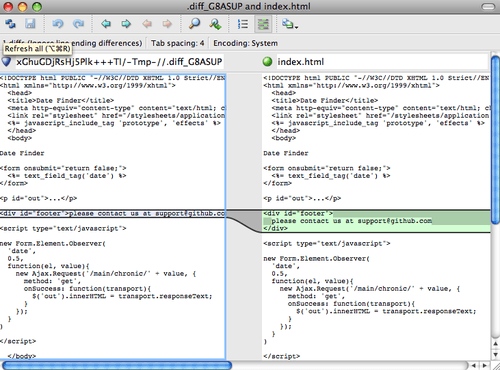

# Personnalisation de Git

<!-- toc -->

Jusqu’ici, nous avons traité les bases du fonctionnement et de
l’utilisation de Git et introduit un certain nombre d’outils fournis par
Git pour travailler plus facilement et plus efficacement. Dans ce
chapitre, nous aborderons quelques opérations permettant d’utiliser Git
de manière plus personnalisée en vous présentant quelques paramètres de
configuration importants et le système d’interceptions. Grâce à ces
outils, il devient enfantin de faire fonctionner Git exactement comme
vous, votre société ou votre communauté en avez besoin.

## Configuration de Git

Comme vous avez pu l’entrevoir dans [Démarrage
rapide](#ch01-introduction), vous pouvez spécifier les paramètres de
configuration de Git avec la commande `git config`. Une des premières
choses que vous avez faites a été de paramétrer votre nom et votre
adresse de courriel :

``` highlight
$ git config --global user.name "John Doe"
$ git config --global user.email johndoe@example.com
```

À présent, vous allez apprendre quelques-unes des options similaires les
plus intéressantes pour paramétrer votre usage de Git.

Vous avez vu des détails de configuration simple de Git au premier
chapitre, mais nous allons les réviser. Git utilise une série de
fichiers de configuration pour déterminer son comportement selon votre
personnalisation. Le premier endroit que Git visite est le fichier
`/etc/gitconfig` qui contient des valeurs pour tous les utilisateurs du
système et tous leurs dépôts. Si vous passez l’option `--system` à
`git config`, il lit et écrit ce fichier.

L’endroit suivant visité par Git est le fichier `~/.gitconfig` qui est
spécifique à chaque utilisateur. Vous pouvez faire lire et écrire Git
dans ce fichier au moyen de l’option `--global`.

Enfin, Git recherche des valeurs de configuration dans le fichier de
configuration du répertoire Git (`.git/config`) du dépôt en cours
d’utilisation. Ces valeurs sont spécifiques à un unique dépôt.

Chaque niveau surcharge le niveau précédent, ce qui signifie que les
valeurs dans `.git/config` écrasent celles dans `/etc/gitconfig`.

<table>
<colgroup>
<col style="width: 50%" />
<col style="width: 50%" />
</colgroup>
<tbody>
<tr class="odd">
<td><em></em></td>
<td><div class="paragraph">
<p>Ces fichiers de configuration Git sont des fichiers texte, donc vous pouvez positionner ces valeurs manuellement en éditant le fichier et en utilisant la syntaxe correcte, mais il reste généralement plus facile de lancer la commande <code>git config</code>.</p>
</div></td>
</tr>
</tbody>
</table>

### Configuration de base d’un client

Les options de configuration reconnues par Git tombent dans deux
catégories : côté client et côté serveur. La grande majorité se situe
côté client pour coller à vos préférences personnelles de travail. Parmi
les tonnes d’options disponibles, seules les plus communes ou affectant
significativement la manière de travailler seront couvertes. De
nombreuses options ne s’avèrent utiles qu’en de rares cas et ne seront
pas traitées. Pour voir la liste de toutes les options que votre version
de Git reconnaît, vous pouvez lancer :

``` highlight
$ man git-config
```

Cette commande affiche toutes les options disponibles avec quelques
détails. Vous pouvez aussi trouver des informations de référence sur
<a href="http://git-scm.com/docs/git-config.html" class="bare">http://git-scm.com/docs/git-config.html</a>.

#### `core.editor`

Par défaut, Git utilise votre éditeur par défaut (`$VISUAL` ou
`$EDITOR`) ou se replie sur l’éditeur Vi pour la création et l’édition
des messages de validation et d’étiquetage. Pour modifier ce programme
par défaut pour un autre, vous pouvez utiliser le paramètre
`core.editor` :

``` highlight
$ git config --global core.editor emacs
```

Maintenant, quel que soit votre éditeur par défaut, Git démarrera Emacs
pour éditer les messages.

#### `commit.template`

Si vous réglez ceci sur le chemin d’un fichier sur votre système, Git
utilisera ce fichier comme message par défaut quand vous validez. Par
exemple, supposons que vous créiez un fichier modèle dans
`$HOME/.gitmessage.txt` qui ressemble à ceci :

``` highlight
ligne de sujet

description

[ticket: X]
```

Pour indiquer à Git de l’utiliser pour le message par défaut qui
apparaîtra dans votre éditeur quand vous lancerez `git commit`, réglez
le paramètre de configuration `commit.template` :

``` highlight
$ git config --global commit.template ~/.gitmessage.txt
$ git commit
```

Ainsi, votre éditeur ouvrira quelque chose ressemblant à ceci comme
modèle de message de validation :

``` highlight
ligne de sujet

description

[ticket: X]
# Please enter the commit message for your changes. Lines starting
# with '#' will be ignored, and an empty message aborts the commit.
# On branch master
# Changes to be committed:
#   (use "git reset HEAD <file>..." to unstage)
#
# modified:   lib/test.rb
#
~
~
".git/COMMIT_EDITMSG" 14L, 297C
```

Si vous avez une règle de messages de validation, placez un modèle de
cette règle sur votre système et configurez Git pour qu’il l’utilise par
défaut, cela améliorera les chances que cette règle soit effectivement
suivie.

#### `core.pager`

Le paramètre `core.pager` détermine quel *pager* est utilisé lorsque des
pages de Git sont émises, par exemple lors d’un `log` ou d’un `diff`.
Vous pouvez le fixer à `more` ou à votre *pager* favori (par défaut, il
vaut `less`) ou vous pouvez le désactiver en fixant sa valeur à une
chaîne vide :

``` highlight
$ git config --global core.pager ''
```

Si vous lancez cela, Git affichera la totalité du résultat de toutes les
commandes d’une traite, quelle que soit sa longueur.

#### `user.signingkey`

Si vous faites des étiquettes annotées signées (comme décrit dans
[Signer votre travail](#s_signing)), simplifiez-vous la vie en
définissant votre clé GPG de signature en paramètre de configuration.
Définissez votre ID de clé ainsi :

``` highlight
$ git config --global user.signingkey <gpg-key-id>
```

Maintenant, vous pouvez signer vos étiquettes sans devoir spécifier
votre clé à chaque fois que vous utilisez la commande `git tag` :

``` highlight
$ git tag -s <nom-étiquette>
```

#### `core.excludesfile`

Comme décrit dans [Ignorer des fichiers](#s_ignoring), vous pouvez
ajouter des patrons dans le fichier `.gitignore` de votre projet pour
indiquer à Git de ne pas considérer certains fichiers comme non suivis
ou pour éviter de les indexer lorsque vous lancez `git add` sur eux.

Mais vous pouvez souhaiter dans quelques cas ignorer certains fichiers
dans tous vos dépôts. Si votre ordinateur utilise Mac OS X, vous
connaissez certainement les fichiers `.DS_Store`. Si votre éditeur
préféré est Emacs ou Vim, vous connaissez sûrement aussi les fichiers
qui se terminent par `~` ou `.swp`.

Cette option vous permet d’écrire un fichier `.gitignore` global. Si
vous créez un fichier `~/.gitignore_global` contenant ceci :

``` highlight
*~
.*.swp
.DS_Store
```

et que vous lancez
`git config --global core.excludesfile ~/.gitignore_global`, Git ne vous
importunera plus avec ces fichiers.

#### `help.autocorrect`

Si vous avez fait une faute de frappe en tapant une commande Git, il
vous affiche quelque chose comme :

``` highlight
$ git chekcout master
git : 'chekcout' n'est pas une commande git. Voir 'git --help'.

Vouliez-vous dire cela ?
        checkout
```

Git essaie de deviner ce que vous avez voulu dire, mais continue de
refuser de le faire. Si vous positionnez le paramètre `help.autocorrect`
à 1, Git va réellement lancer cette commande à votre place :

``` highlight
$ git chekcout master
ATTENTION : vous avez invoqué une commande Git nommée 'chekcout' qui n'existe pas.
Continuons en supposant que vous avez voulu dire 'checkout'
dans 0.1 secondes automatiquement...
```

Notez l’histoire des « 0.1 secondes ». `help.autocorrect` est un fait un
entier qui représente des dixièmes de seconde. Ainsi, si vous le réglez
à 50, Git vous laissera 5 secondes pour changer d’avis avant de lancer
la commande qu’il aura devinée.

### Couleurs dans Git

Git sait coloriser ses affichages dans votre terminal, ce qui peut
faciliter le parcours visuel des résultats. Un certain nombre d’options
peuvent vous aider à régler la colorisation à votre goût.

#### `color.ui`

Git colorise automatiquement la plupart de ses affichages mais il existe
une option globale pour désactiver ce comportement. Pour désactiver
toute la colorisation par défaut, lancez ceci :

``` highlight
$ git config --global color.ui false
```

La valeur par défaut est `auto`, ce qui colorise la sortie lorsque
celle-ci est destinée à un terminal, mais élimine les codes de contrôle
de couleur quand la sortie est redirigée dans un fichier ou l’entrée
d’une autre commande.

Vous pouvez aussi la régler à `always` (toujours) pour activer la
colorisation en permanence. C’est une option rarement utile. Dans la
plupart des cas, si vous tenez vraiment à coloriser vos sorties
redirigées, vous pourrez passer le drapeau `--color` à la commande Git
pour la forcer à utiliser les codes de couleur. Le réglage par défaut
est donc le plus utilisé.

#### `color.*`

Si vous souhaitez être plus spécifique concernant les commandes
colorisées, Git propose des paramètres de colorisation par action.
Chacun peut être fixé à `true`, `false` ou `always`.

``` highlight
color.branch
color.diff
color.interactive
color.status
```

De plus, chacun d’entre eux dispose d’un sous-ensemble de paramètres qui
permettent de surcharger les couleurs pour des parties des affichages.
Par exemple, pour régler les couleurs de méta-informations du diff avec
une écriture en bleu gras (*bold* en anglais) sur fond noir :

``` highlight
$ git config --global color.diff.meta "blue black bold"
```

La couleur peut prendre les valeurs suivantes : *normal*, *black*,
*red*, *green*, *yellow*, *blue*, *magenta*, *cyan* ou *white*. Si vous
souhaitez ajouter un attribut de casse, les valeurs disponibles sont
*bold* (gras), *dim* (léger), *ul* (*underlined*, souligné), *blink*
(clignotant) et *reverse* (inversé).

### Outils externes de fusion et de différence

Bien que Git ait une implémentation interne de diff que vous avez déjà
utilisée, vous pouvez sélectionner à la place un outil externe. Vous
pouvez aussi sélectionner un outil graphique pour la fusion et la
résolution de conflit au lieu de devoir résoudre les conflits
manuellement. Je démontrerai le paramétrage avec Perforce Merge Tool
(P4Merge) pour visualiser vos différences et résoudre vos fusions parce
que c’est un outil graphique agréable et gratuit.

Si vous voulez l’essayer, P4Merge fonctionne sur tous les principaux
systèmes d’exploitation. Dans cet exemple, je vais utiliser la forme des
chemins usitée sur Mac et Linux. Pour Windows, vous devrez changer
`/usr/local/bin` en un chemin d’exécution d’un programme de votre
environnement.

Pour commencer, téléchargez P4Merge depuis
<a href="http://www.perforce.com/downloads/Perforce/" class="bare">http://www.perforce.com/downloads/Perforce/</a>.
Ensuite, il faudra mettre en place un script d’enrobage pour lancer les
commandes. Je vais utiliser le chemin Mac pour l’exécutable ; dans
d’autres systèmes, il résidera où votre binaire `p4merge` a été
installé. Créez un script enveloppe nommé `extMerge` qui appelle votre
binaire avec tous les arguments fournis :

``` highlight
$ cat /usr/local/bin/extMerge
#!/bin/sh
/Applications/p4merge.app/Contents/MacOS/p4merge $*
```

L’enveloppe diff s’assure que sept arguments ont été fournis et en passe
deux à votre script de fusion. Par défaut, Git passe au programme de
diff les arguments suivants :

``` highlight
chemin ancien-fichier ancien-hex ancien-mode nouveau-fichier nouveau-hex nouveau-mode
```

Comme seuls les arguments `ancien-fichier` et `nouveau-fichier` sont
nécessaires, vous utilisez le script d’enveloppe pour passer ceux dont
vous avez besoin.

``` highlight
$ cat /usr/local/bin/extDiff
#!/bin/sh
[ $# -eq 7 ] && /usr/local/bin/extMerge "$2" "$5"
```

Vous devez aussi vous assurer que ces fichiers sont exécutables :

``` highlight
$ sudo chmod +x /usr/local/bin/extMerge
$ sudo chmod +x /usr/local/bin/extDiff
```

À présent, vous pouvez régler votre fichier de configuration pour
utiliser vos outils personnalisés de résolution de fusion et de
différence. Pour cela, il faut un certain nombre de personnalisations :
`merge.tool` pour indiquer à Git quelle stratégie utiliser,
`mergetool.<tool>.cmd` pour spécifier comment lancer cette commande,
`mergetool.<tool>.trustExitCode` pour indiquer à Git si le code de
sortie du programme indique une résolution de fusion réussie ou non et
`diff.external` pour indiquer à Git quelle commande lancer pour les
différences. Ainsi, vous pouvez lancer les quatre commandes :

``` highlight
$ git config --global merge.tool extMerge
$ git config --global mergetool.extMerge.cmd \
  'extMerge "$BASE" "$LOCAL" "$REMOTE" "$MERGED"'
$ git config --global mergetool.trustExitCode false
$ git config --global diff.external extDiff
```

ou vous pouvez éditer votre fichier `~/.gitconfig` pour y ajouter ces
lignes :

``` highlight
[merge]
  tool = extMerge
[mergetool "extMerge"]
  cmd = extMerge "$BASE" "$LOCAL" "$REMOTE" "$MERGED"
  trustExitCode = false
[diff]
  external = extDiff
```

Après avoir réglé tout ceci, si vous lancez des commandes de diff telles
que celle-ci :

``` highlight
$ git diff 32d1776b1^ 32d1776b1
```

Au lieu d’obtenir la sortie du diff dans le terminal, Git lance P4Merge,
ce qui ressemble à ceci :



Figure 143. P4Merge.

Si vous essayez de fusionner deux branches et créez des conflits de
fusion, vous pouvez lancer la commande `git mergetool` qui démarrera
P4Merge pour vous laisser résoudre les conflits au moyen d’un outil
graphique.

Le point agréable avec cette méthode d’enveloppe est que vous pouvez
changer facilement d’outils de diff et de fusion. Par exemple, pour
changer vos outils `extDiff` et `extMerge` pour une utilisation de
l’outil KDiff3, il vous suffit d’éditer le fichier `extMerge` :

``` highlight
$ cat /usr/local/bin/extMerge
#!/bin/sh
/Applications/kdiff3.app/Contents/MacOS/kdiff3 $*
```

À présent, Git va utiliser l’outil KDiff3 pour visualiser les
différences et résoudre les conflits de fusion.

Git est livré préréglé avec un certain nombre d’autres outils de
résolution de fusion pour vous éviter d’avoir à gérer la configuration
`cmd`. Pour obtenir une liste des outils qu’il supporte, essayez ceci :

``` highlight
$ git mergetool --tool-help
'git mergetool --tool=<tool>' may be set to one of the following:
        emerge
        gvimdiff
        gvimdiff2
        opendiff
        p4merge
        vimdiff
        vimdiff2

The following tools are valid, but not currently available:
        araxis
        bc3
        codecompare
        deltawalker
        diffmerge
        diffuse
        ecmerge
        kdiff3
        meld
        tkdiff
        tortoisemerge
        xxdiff

Some of the tools listed above only work in a windowed
environment. If run in a terminal-only session, they will fail.
```

Si KDiff3 ne vous intéresse pas pour gérer les différences mais
seulement pour la résolution de fusion et qu’il est présent dans votre
chemin d’exécution, vous pouvez lancer :

``` highlight
$ git config --global merge.tool kdiff3
```

Si vous lancez ceci au lieu de modifier les fichiers `extMerge` ou
`extDiff`, Git utilisera KDiff3 pour les résolutions de fusion et
l’outil diff normal de Git pour les différences.

### Formatage et espaces blancs

Les problèmes de formatage et de blancs sont parmi les plus subtils et
frustrants que les développeurs rencontrent lorsqu’ils collaborent,
spécifiquement d’une plate-forme à l’autre. Il est très facile
d’introduire des modifications subtiles de blancs lors de soumission de
patchs ou d’autres modes de collaboration, car les éditeurs de texte les
insèrent silencieusement ou les programmeurs Windows ajoutent des
retours chariot à la fin des lignes qu’ils modifient. Git dispose de
quelques options de configuration pour traiter ces problèmes.

#### `core.autocrlf`

Si vous programmez vous-même sous Windows ou si vous utilisez un autre
système d’exploitation mais devez travailler avec des personnes
travaillant sous Windows, vous rencontrerez à un moment ou à un autre
des problèmes de caractères de fin de ligne. Ceci est dû au fait que
Windows utilise pour marquer les fins de ligne dans ses fichiers un
caractère « retour chariot » (*carriage return*, CR) suivi d’un
caractère « saut de ligne » (*line feed*, LF), tandis que Mac et Linux
utilisent seulement le caractère « saut de ligne ». C’est un cas subtil
mais incroyablement ennuyeux de problème généré par la collaboration
inter plate-forme.

Git peut gérer ce cas en convertissant automatiquement les fins de ligne
CRLF en LF lorsque vous validez, et inversement lorsqu’il extrait des
fichiers sur votre système. Vous pouvez activer cette fonctionnalité au
moyen du paramètre `core.autocrlf`. Si vous avez une machine Windows,
positionnez-le à `true`. Git convertira les fins de ligne de LF en CRLF
lorsque vous extrairez votre code :

``` highlight
$ git config --global core.autocrlf true
```

Si vous utilisez un système Linux ou Mac qui utilise les fins de ligne
LF, vous ne souhaitez sûrement pas que Git les convertisse
automatiquement lorsque vous extrayez des fichiers. Cependant, si un
fichier contenant des CRLF est accidentellement introduit en version,
vous souhaitez que Git le corrige. Vous pouvez indiquer à Git de
convertir CRLF en LF lors de la validation mais pas dans l’autre sens en
fixant `core.autocrlf` à `input` :

``` highlight
$ git config --global core.autocrlf input
```

Ce réglage devrait donner des fins de ligne en CRLF lors d’extraction
sous Windows mais en LF sous Mac et Linux et dans le dépôt.

Si vous êtes un programmeur Windows gérant un projet spécifique à
Windows, vous pouvez désactiver cette fonctionnalité et forcer
l’enregistrement des « retour chariot » dans le dépôt en réglant la
valeur du paramètre à `false` :

``` highlight
$ git config --global core.autocrlf false
```

#### `core.whitespace`

Git est paramétré par défaut pour détecter et corriger certains
problèmes de blancs. Il peut rechercher six problèmes de blancs de base.
La correction de trois problèmes est activée par défaut et peut être
désactivée et celle des trois autres n’est pas activée par défaut mais
peut être activée.

Les trois activées par défaut sont `blank-at-eol` qui détecte les
espaces en fin de ligne, `blank-at-eof` qui détecte les espaces en fin
de fichier et `space-before-tab` qui recherche les espaces avant les
tabulations au début d’une ligne.

Les trois autres qui sont désactivées par défaut mais peuvent être
activées sont `indent-with-non-tab` qui recherche des lignes qui
commencent par des espaces au lieu de tabulations (contrôlé par l’option
`tabwidth`), `tab-in-indent` qui recherche les tabulations dans la
portion d’indentation d’une ligne et `cr-at-eol` qui indique à Git que
les « retour chariot » en fin de ligne sont acceptés.

Vous pouvez indiquer à Git quelle correction vous voulez activer en
fixant `core.whitespace` avec les valeurs que vous voulez ou non,
séparées par des virgules. Vous pouvez désactiver des réglages en les
éliminant de la chaîne de paramétrage ou en les préfixant avec un `-`.
Par exemple, si vous souhaitez activer tout sauf `cr-at-eol`, vous
pouvez lancer ceci :

``` highlight
$ git config --global core.whitespace \
    trailing-space,space-before-tab,indent-with-non-tab
```

Git va détecter ces problèmes quand vous lancez une commande `git diff`
et essayer de les coloriser pour vous permettre de les régler avant de
valider.

Il utilisera aussi ces paramètres pour vous aider quand vous appliquerez
des patchs avec `git apply`.

Quand vous appliquez des patchs, vous pouvez paramétrer Git pour qu’il
vous avertisse s’il doit appliquer des patchs qui présentent les défauts
de blancs :

``` highlight
$ git apply --whitespace=warn <patch>
```

Ou vous pouvez indiquer à Git d’essayer de corriger automatiquement le
problème avant d’appliquer le patch :

``` highlight
$ git apply --whitespace=fix <patch>
```

Ces options s’appliquent aussi à `git rebase`. Si vous avez validé avec
des problèmes de blancs mais n’avez pas encore poussé en amont, vous
pouvez lancer un `rebase` avec l’option `--whitespace=fix` pour faire
corriger à Git les erreurs de blancs pendant qu’il réécrit les patchs.

### Configuration du serveur

Il n’y a pas autant d’options de configuration de Git côté serveur, mais
en voici quelques unes intéressantes dont il est utile de prendre note.

#### `receive.fsckObjects`

Git est capable de vérifier que tous les objets reçus pendant une
poussée correspondent à leur somme de contrôle SHA-1 et qu’ils pointent
sur des objets valides. Cependant, il ne le fait pas par défaut sur
chaque poussée. C’est une opération relativement lourde qui peut
énormément allonger les poussées selon la taille du dépôt ou de la
poussée. Si vous voulez que Git vérifie la cohérence des objets à chaque
poussée, vous pouvez le forcer en fixant le paramètre
`receive.fsckObjects` à `true` :

``` highlight
$ git config --system receive.fsckObjects true
```

Maintenant, Git va vérifier l’intégrité de votre dépôt avant que chaque
poussée ne soit acceptée pour s’assurer que des clients défectueux (ou
malicieux) n’introduisent pas des données corrompues.

#### `receive.denyNonFastForwards`

Si vous rebasez des *commits* que vous avez déjà poussés, puis essayez
de pousser à nouveau, ou inversement, si vous essayez de pousser un
*commit* sur une branche distante qui ne contient pas le *commit* sur
lequel la branche distante pointe, votre essai échouera. C’est
généralement une bonne politique, mais dans le cas d’un rebasage, vous
pouvez décider que vous savez ce que vous faites et forcer la mise à
jour de la branche distante en ajoutant l’option `-f` à votre commande.

Pour désactiver la possibilité de forcer la mise à jour des branches
distantes autres qu’en avance rapide, réglez
`receive.denyNonFastForwards` :

``` highlight
$ git config --system receive.denyNonFastForwards true
```

Un autre moyen de faire consiste à utiliser des crochets côté-serveur,
point qui sera abordé plus loin. Cette autre approche permet de réaliser
des traitements plus complexes comme de refuser l’avance rapide
seulement à un certain groupe d’utilisateurs.

#### `receive.denyDeletes`

Un des contournements possible à la politique `denyNonFastForwards`
consiste à simplement effacer la branche distante et à la repousser avec
les nouvelles références. Pour interdire ceci, réglez
`receive.denyDeletes` à `true` :

``` highlight
$ git config --system receive.denyDeletes true
```

Ceci interdit la suppression de branches ou d’étiquettes. Aucun
utilisateur n’en a le droit. Pour pouvoir effacer des branches
distantes, vous devez effacer manuellement les fichiers de référence sur
le serveur. Il existe aussi des moyens plus intéressants de gérer cette
politique utilisateur par utilisateur au moyen des listes de contrôle
d’accès, point qui sera abordé dans [Exemple de politique gérée par
Git](#s_an_example_git_enforced_policy).

## Attributs Git

Certains de ces réglages peuvent aussi s’appliquer sur un chemin, de
telle sorte que Git ne les applique que sur un sous-répertoire ou un
sous-ensemble de fichiers. Ces réglages par chemin sont appelés
attributs Git et sont définis soit dans un fichier `.gitattributes` dans
un répertoire (normalement la racine du projet), soit dans un fichier
`.git/info/attributes` si vous ne souhaitez pas que le fichier de
description des attributs fasse partie du projet.

Les attributs permettent de spécifier des stratégies de fusion
différentes pour certains fichiers ou répertoires dans votre projet,
d’indiquer à Git la manière de calculer les différences pour certains
fichiers non-texte, ou de faire filtrer à Git le contenu avant qu’il ne
soit validé ou extrait. Dans ce chapitre, nous traiterons certains
attributs applicables aux chemins et détaillerons quelques exemples de
leur utilisation en pratique.

### Fichiers binaires

Les attributs Git permettent des trucs cool comme d’indiquer à Git quels
fichiers sont binaires (dans les cas où il ne pourrait pas le deviner
par lui-même) et de lui donner les instructions spécifiques pour les
traiter. Par exemple, certains fichiers peuvent être générés par machine
et impossible à traiter par diff, tandis que pour certains autres
fichiers binaires, les différences peuvent être calculées. Nous
détaillerons comment indiquer à Git l’un et l’autre.

#### Identification des fichiers binaires

Certains fichiers ressemblent à des fichiers texte mais doivent en tout
état de cause être traités comme des fichiers binaires. Par exemple, les
projets Xcode sous Mac contiennent un fichier finissant en `.pbxproj`,
qui est en fait un jeu de données JSON (format de données en texte
JavaScript) enregistré par l’application EDI pour y sauver les réglages
entre autres de compilation. Bien que ce soit techniquement un fichier
texte en ASCII, il n’y a aucun intérêt à le gérer comme tel parce que
c’est en fait une mini base de données. Il est impossible de fusionner
les contenus si deux utilisateurs le modifient et les calculs de
différence par défaut sont inutiles. Ce fichier n’est destiné qu’à être
manipulé par un programme. En résumé, ce fichier doit être considéré
comme un fichier binaire opaque.

Pour indiquer à Git de traiter tous les fichiers `pbxproj` comme
binaires, ajoutez la ligne suivante à votre fichier `.gitattributes` :

``` highlight
*.pbxproj binary
```

À présent, Git n’essaiera pas de convertir ou de corriger les problèmes
des CRLF, ni de calculer ou d’afficher les différences pour ces fichiers
quand vous lancez `git show` ou `git diff` sur votre projet.

#### Comparaison de fichiers binaires

Dans Git, vous pouvez utiliser la fonctionnalité des attributs pour
comparer efficacement les fichiers binaires. Pour ce faire, indiquez à
Git comment convertir vos données binaires en format texte qui peut être
comparé via un diff normal.

Comme c’est une fonctionnalité vraiment utile et peu connue, nous allons
détailler certains exemples. Premièrement, nous utiliserons cette
technique pour résoudre un des problèmes les plus ennuyeux de
l’humanité : gérer en contrôle de version les documents Word. Tout le
monde convient que Word est l’éditeur de texte le plus horrible qui
existe, mais bizarrement, tout le monde persiste à l’utiliser. Si vous
voulez gérer en version des documents Word, vous pouvez les coller dans
un dépôt Git et les valider de temps à autre. Mais qu’est-ce que ça vous
apporte ? Si vous lancez `git diff` normalement, vous verrez quelque
chose comme :

``` highlight
$ git diff
diff --git a/chapter1.docx b/chapter1.docx
index 88839c4..4afcb7c 100644
Binary files a/chapter1.docx and b/chapter1.docx differ
```

Vous ne pouvez pas comparer directement les versions à moins de les
extraire et de les parcourir manuellement. En fait, vous pouvez faire la
même chose plutôt bien en utilisant les attributs Git. Ajoutez la ligne
suivante dans votre fichier `.gitattributes` :

``` highlight
*.docx diff=word
```

Cette ligne indique à Git que tout fichier correspondant au patron
(`.docx`) doit utiliser le filtre `word` pour visualiser le diff des
modifications. Qu’est-ce que le filtre « word » ? Nous devons le
définir. Vous allez indiquer à Git d’utiliser le programme `docx2txt`
qui a été écrit spécifiquement pour extraire le texte d’un document MS
Word, qu’il pourra comparer correctement.

Installez déjà `docx2text`. Vous pouvez le télécharger depuis
<a href="http://docx2txt.sourceforge.net" class="bare">http://docx2txt.sourceforge.net</a>.
Suivez les instruction dans le fichier `INSTALL` pour le placer à un
endroit où votre shell peut le trouver. Ensuite, écrivons un script qui
convertit la sortie dans le format que Git comprend. Créez un fichier
dans votre chemin d’exécution appelé `docx2txt` et ajoutez ce contenu :

``` highlight
#!/bin/bash
docx2txt.pl $1 -
```

N’oubliez pas de faire un `chmod a+x` sur ce fichier. Finalement, vous
pouvez configurer Git pour qu’il utilise ce script :

``` highlight
$ git config diff.word.textconv docx2txt
```

À présent, Git sait que s’il essaie de faire un diff entre deux
instantanés et qu’un des fichiers finit en `.docx`, il devrait faire
passer ces fichiers par le filtre `word` défini comme le programme
`docx2txt`. Cette méthode fait effectivement des jolies versions texte
de vos fichiers Word avant d’essayer de les comparer.

Voici un exemple. J’ai mis le chapitre 1 de ce livre dans Git, ajouté du
texte à un paragraphe et sauvegardé le document. Puis, j’ai lancé
`git diff` pour visualiser ce qui a changé :

``` highlight
$ git diff
diff --git a/chapter1.docx b/chapter1.docx
index 0b013ca..ba25db5 100644
--- a/chapter1.docx
+++ b/chapter1.docx
@@ -2,6 +2,7 @@
 This chapter will be about getting started with Git. We will begin at the beginning by explaining some background on version control tools, then move on to how to get Git running on your system and finally how to get it setup to start working with. At the end of this chapter you should understand why Git is around, why you should use it and you should be all setup to do so.
 1.1. About Version Control
 What is "version control", and why should you care? Version control is a system that records changes to a file or set of files over time so that you can recall specific versions later. For the examples in this book you will use software source code as the files being version controlled, though in reality you can do this with nearly any type of file on a computer.
+Testing: 1, 2, 3.
 If you are a graphic or web designer and want to keep every version of an image or layout (which you would most certainly want to), a Version Control System (VCS) is a very wise thing to use. It allows you to revert files back to a previous state, revert the entire project back to a previous state, compare changes over time, see who last modified something that might be causing a problem, who introduced an issue and when, and more. Using a VCS also generally means that if you screw things up or lose files, you can easily recover. In addition, you get all this for very little overhead.
 1.1.1. Local Version Control Systems
 Many people's version-control method of choice is to copy files into another directory (perhaps a time-stamped directory, if they're clever). This approach is very common because it is so simple, but it is also incredibly error prone. It is easy to forget which directory you're in and accidentally write to the wrong file or copy over files you don't mean to.
```

Git m’indique succinctement que j’ai ajouté la chaîne « Testing: 1, 2,
3. », ce qui est correct. Ce n’est pas parfait – les modifications de
formatage n’apparaissent pas – mais c’est efficace.

Un autre problème intéressant concerne la comparaison de fichiers
d’images. Une méthode consiste à faire passer les fichiers image à
travers un filtre qui extrait les données EXIF, les méta-données
enregistrées avec la plupart des formats d’image. Si vous téléchargez et
installez le programme `exiftool`, vous pouvez l’utiliser pour convertir
vos images en texte de méta-données de manière que le diff puisse au
moins montrer une représentation textuelle des modifications pratiquées.
Mettez la ligne suivante dans votre fichier `.gitattributes` :

``` highlight
*.png diff=exif
```

Configurez Git pour utiliser cet outil :

``` highlight
$ git config diff.exif.textconv exiftool
```

Si vous remplacez une image dans votre projet et lancez `git diff`, vous
verrez ceci :

``` highlight
diff --git a/image.png b/image.png
index 88839c4..4afcb7c 100644
--- a/image.png
+++ b/image.png
@@ -1,12 +1,12 @@
 ExifTool Version Number         : 7.74
-File Size                       : 70 kB
-File Modification Date/Time     : 2009:04:21 07:02:45-07:00
+File Size                       : 94 kB
+File Modification Date/Time     : 2009:04:21 07:02:43-07:00
 File Type                       : PNG
 MIME Type                       : image/png
-Image Width                     : 1058
-Image Height                    : 889
+Image Width                     : 1056
+Image Height                    : 827
 Bit Depth                       : 8
 Color Type                      : RGB with Alpha
```

Vous pouvez réaliser rapidement que la taille du fichier et les
dimensions des images ont changé.

### Expansion des mots-clés

L’expansion de mots-clés dans le style de CVS ou de SVN est souvent une
fonctionnalité demandée par les développeurs qui y sont habitués. Le
problème principal de ce système avec Git est que vous ne pouvez pas
modifier un fichier avec l’information concernant le *commit* après la
validation parce que Git calcule justement la somme de contrôle sur son
contenu. Cependant, vous pouvez injecter des informations textuelles
dans un fichier au moment où il est extrait et les retirer avant qu’il
ne soit ajouté à un *commit*. Les attributs Git vous fournissent deux
manières de le faire.

Premièrement, vous pouvez injecter automatiquement la somme de contrôle
SHA-1 d’un blob dans un champ `$Id$` d’un fichier. Si vous positionnez
cet attribut pour un fichier ou un ensemble de fichiers, la prochaine
fois que vous extrairez cette branche, Git remplacera chaque champ avec
le SHA-1 du blob. Il est à noter que ce n’est pas le SHA du *commit*
mais celui du blob lui-même.

Mettez la ligne suivante dans votre fichier `.gitattributes` :

``` highlight
*.txt ident
```

Ajoutez une référence `$Id$` à un fichier de test :

``` highlight
$ echo '$Id$' > test.txt
```

À la prochaine extraction de ce fichier, Git injecte le SHA du blob :

``` highlight
$ rm test.txt
$ git checkout -- test.txt
$ cat test.txt
$Id: 42812b7653c7b88933f8a9d6cad0ca16714b9bb3 $
```

Néanmoins, ce résultat n’a que peu d’intérêt. Si vous avez utilisé la
substitution avec CVS ou Subversion, il est possible d’inclure la date.
Le code SHA n’est pas des plus utiles car il ressemble à une valeur
aléatoire et ne vous permet pas de distinguer si tel SHA est plus récent
ou plus ancien que tel autre.

Il apparaît que vous pouvez écrire vos propres filtres pour réaliser des
substitutions dans les fichiers lors des validations/extractions. Ces
filtres s’appellent « *clean* » et « *smudge* ». Dans le fichier
`.gitattributes`, vous pouvez indiquer un filtre pour des chemins
particuliers puis créer des scripts qui traiteront ces fichiers avant
qu’ils soient extraits (« *smudge* », voir [Le filtre « *smudge* » est
lancé lors d’une extraction.](#filters_a)) et juste avant qu’ils soient
validés (« *clean* », voir [Le filtre « *clean* » est lancé lorsque les
fichiers sont indexés.](#filters_b)). Ces filtres peuvent servir à faire
toutes sortes de choses attrayantes.


Figure 144. Le filtre « *smudge* » est lancé lors d’une extraction.


Figure 145. Le filtre « *clean* » est lancé lorsque les fichiers sont
indexés.

Le message de validation d’origine pour cette fonctionnalité donne un
exemple simple permettant de passer tout votre code C par le programme
`indent` avant de valider. Vous pouvez le faire en réglant l’attribut
`filter` dans votre fichier `.gitattributes` pour filtrer les fichiers
`*.c` avec le filtre « indent » :

``` highlight
*.c filter=indent
```

Ensuite, indiquez à Git ce que le filtre « indent » fait sur *smudge* et
*clean* :

``` highlight
$ git config --global filter.indent.clean indent
$ git config --global filter.indent.smudge cat
```

Dans ce cas, quand vous validez des fichiers qui correspondent à `*.c`,
Git les fera passer par le programme `indent` avant de les valider et
les fera passer par le programme `cat` avant de les extraire sur votre
disque. Le programme `cat` ne fait rien : il se contente de régurgiter
les données telles qu’il les a lues. Cette combinaison filtre
effectivement tous les fichiers de code source C par `indent` avant leur
validation.

Un autre exemple intéressant fournit l’expansion du mot-clé `$Date$`
dans le style RCS. Pour le réaliser correctement, vous avez besoin d’un
petit script qui prend un nom de fichier, calcule la date de la dernière
validation pour le projet et l’insère dans le fichier. Voici un petit
script Ruby qui le fait :

``` highlight
#! /usr/bin/env ruby
data = STDIN.read
last_date = `git log --pretty=format:"%ad" -1`
puts data.gsub('$Date$', '$Date: ' + last_date.to_s + '$')
```

Tout ce que le script fait, c’est récupérer la date de la dernière
validation à partir de la commande `git log`, la coller dans toutes les
chaînes `$Date$` qu’il trouve et réécrire le résultat. Ce devrait être
simple dans n’importe quel langage avec lequel vous êtes à l’aise.
Appelez ce fichier `expand_date` et placez-le dans votre chemin. À
présent, il faut paramétrer un filtre dans Git (appelons le `dater`) et
lui indiquer d’utiliser le filtre `expand_date` en tant que *smudge* sur
les fichiers à extraire. Nous utiliserons une expression Perl pour
nettoyer lors d’une validation :

``` highlight
$ git config filter.dater.smudge expand_date
$ git config filter.dater.clean 'perl -pe "s/\\\$Date[^\\\$]*\\\$/\\\$Date\\\$/"'
```

Cette commande Perl extrait tout ce qu’elle trouve dans une chaîne
`$Date$` et la réinitialise. Le filtre prêt, on peut le tester en
écrivant le mot-clé `$Date$` dans un fichier, puis en créant un attribut
Git pour ce fichier qui fait référence au nouveau filtre et en créant un
fichier avec votre mot-clé `$Date$` :

``` highlight
date*.txt filter=dater
```

``` highlight
$ echo '# $Date$' > date_test.txt
```

Si vous validez ces modifications et extrayez le fichier à nouveau, vous
remarquez le mot-clé correctement substitué :

``` highlight
$ git add date_test.txt .gitattributes
$ git commit -m "Testing date expansion in Git"
$ rm date_test.txt
$ git checkout date_test.txt
$ cat date_test.txt
# $Date: Tue Apr 21 07:26:52 2009 -0700$
```

Vous pouvez voir à quel point cette technique peut être puissante pour
des applications personnalisées. Il faut rester néanmoins vigilant car
le fichier `.gitattributes` est validé et inclus dans le projet tandis
que le gestionnaire (ici, `dater`) ne l’est pas. Du coup, ça ne marchera
pas partout. Lorsque vous créez ces filtres, ils devraient pouvoir avoir
un mode dégradé qui n’empêche pas le projet de fonctionner.

### Export d’un dépôt

Les données d’attribut Git permettent aussi de faire des choses
intéressantes quand vous exportez une archive du projet.

#### `export-ignore`

Vous pouvez dire à Git de ne pas exporter certains fichiers ou
répertoires lors de la génération d’archive. S’il y a un sous-répertoire
ou un fichier que vous ne souhaitez pas inclure dans le fichier archive
mais que vous souhaitez extraire dans votre projet, vous pouvez indiquer
ce fichier via l’attribut `export-ignore`.

Par exemple, disons que vous avez des fichiers de test dans le
sous-répertoire `test/` et que ce n’est pas raisonnable de les inclure
dans l’archive d’export de votre projet. Vous pouvez ajouter la ligne
suivante dans votre fichier d’attribut Git :

``` highlight
test/ export-ignore
```

À présent, quand vous lancez `git archive` pour créer une archive `tar`
de votre projet, ce répertoire ne sera plus inclus dans l’archive.

#### `export-subst`

Quand vous exportez des fichiers pour un déploiement, vous pouvez
appliquer le formatage de `git log` et l’expansion de mot-clés à des
portions choisies de fichiers marquées avec l’attribut `export-subst`.

Par exemple, si vous voulez inclure un fichier appelé `LAST_COMMIT` dans
votre projet et y injecter automatiquement la date de dernière
validation lorsque `git archive` est lancé, vous pouvez définir vos
fichiers `.gitattributes` et `LAST_COMMIT` comme ceci :

``` highlight
LAST_COMMIT export-subs
```

``` highlight
$ echo 'Last commit date: $Format:%cd by %aN$' > LAST_COMMIT
$ git add LAST_COMMIT .gitattributes
$ git commit -am 'adding LAST_COMMIT file for archives'
```

Quand vous lancez `git archive`, le contenu de ce fichier inclus dans
l’archive ressemblera à ceci :

``` highlight
$ git archive HEAD | tar xCf ../test-deploiement -
$ cat ../test-deploiement/LAST_COMMIT
Last commit date: Tue Apr 21 08:38:48 2009 -0700 by Scott Chacon
```

Les substitutions peuvent inclure par exemple le message de validation
et n’importe quelle note git, et git log peut faire du simple retour à
la ligne :

``` highlight
$ echo '$Format:Last commit: %h by %aN at %cd%n%+w(76,6,9)%B$' > LAST_COMMIT
$ git commit -am 'export-subst uses git log'\''s custom formatter

git archive uses git log'\''s `pretty=format:` processor
directly, and strips the surrounding `$Format:` and `$`
markup from the output.
'
$ git archive @ | tar xfO - LAST_COMMIT
Last commit: 312ccc8 by Jim Hill at Fri May 8 09:14:04 2015 -0700
       export-subst uses git log's custom formatter

         git archive uses git log's `pretty=format:` processor directly, and
         strips the surrounding `$Format:` and `$` markup from the output.
```

L’archive résultante est appropriée pour le travail de déploiement, mais
comme n’importe quelle archive exportée, elle n’est pas appropriée pour
continuer un travail de développement.

### Stratégies de fusion

Vous pouvez aussi utiliser les attributs Git pour indiquer à Git
d’utiliser des stratégies de fusion différenciées pour des fichiers
spécifiques dans votre projet. Une option très utile est d’indiquer à
Git de ne pas essayer de fusionner des fichiers spécifiques quand ils
rencontrent des conflits mais plutôt d’utiliser prioritairement votre
version du fichier.

C’est très utile si une branche de votre projet a divergé ou s’est
spécialisée, mais que vous souhaitez pouvoir fusionner les modifications
qu’elle porte et vous voulez ignorer certains fichiers. Supposons que
vous avez un fichier de paramètres de base de données appelé
`database.xml` différent sur deux branches et vous voulez les fusionner
dans votre autre branche sans corrompre le fichier de base de données.
Vous pouvez déclarer un attribut comme ceci :

``` highlight
database.xml merge=ours
```

Et définir une bête stratégie de fusion `ours` avec :

``` highlight
$ git config --global merge.ours.driver true
```

Si vous fusionnez dans une autre branche, plutôt que de rencontrer des
conflits de fusion avec le fichier `database.xml`, vous verrez quelque
chose comme :

``` highlight
$ git merge topic
Auto-merging database.xml
Merge made by recursive.
```

Dans ce cas, `database.xml` reste dans l’état d’origine, quoi qu’il
arrive.

## Crochets Git

Comme de nombreux autres systèmes de gestion de version, Git dispose
d’un moyen de lancer des scripts personnalisés quand certaines actions
importantes ont lieu. Il y a deux groupes de crochets : ceux côté client
et ceux côté serveur. Les crochets côté client concernent les opérations
de client telles que la validation et la fusion. Les crochets côté
serveur concernent les opérations de serveur Git telles que la réception
de *commits*. Vous pouvez utiliser ces crochets pour toutes sortes de
fonctions.

### Installation d’un crochet

Les crochets sont tous stockés dans le sous-répertoire `hooks` du
répertoire Git. Dans la plupart des projets, c’est `.git/hooks`.

Par défaut, Git popule ce répertoire avec quelques scripts d’exemple
déjà utiles par eux-mêmes ; mais ils servent aussi de documentation sur
les paramètres de chaque script. Tous les exemples sont des scripts
shell avec un peu de Perl mais n’importe quel script exécutable nommé
correctement fonctionnera. Vous pouvez les écrire en Ruby ou Python ou
ce que vous voudrez. Pour les versions de Git postérieures à 1.6, ces
fichiers crochet d’exemple se terminent en `.sample` et il faudra les
renommer. Pour les versions de Git antérieures à 1.6, les fichiers
d’exemple sont nommés correctement mais ne sont pas exécutables.

Pour activer un script de crochet, placez un fichier dans le
sous-répertoire `hook` de votre répertoire Git, nommé correctement et
exécutable. À partir de ce moment, il devrait être appelé. Abordons donc
les noms de fichiers de crochet les plus importants.

### Crochets côté client

Il y a de nombreux crochets côté client. Ce chapitre les classe entre
crochets de traitement de validation, scripts de traitement par courriel
et le reste des scripts côté client.

<table>
<colgroup>
<col style="width: 50%" />
<col style="width: 50%" />
</colgroup>
<tbody>
<tr class="odd">
<td><em></em></td>
<td><div class="paragraph">
<p>Il est important de noter que les crochets côté client <em>ne sont pas</em> copiés quand le dépôt est cloné. Si vous avez l’intention d’utiliser ces scripts pour faire respecter une politique de validation, il vaut mieux utiliser des crochets côté serveur, comme <a href="#s_an_example_git_enforced_policy">Exemple de politique gérée par Git</a>.</p>
</div></td>
</tr>
</tbody>
</table>

#### Crochets de traitement de validation

Les quatre premiers crochets ont trait au processus de validation.

Le crochet `pre-commit` est lancé en premier, avant même que vous ne
saisissiez le message de validation. Il est utilisé pour inspecter
l’instantané qui est sur le point d’être validé, pour vérifier si vous
avez oublié quelque chose, pour s’assurer que les tests passent ou pour
examiner ce que vous souhaitez inspecter dans le code. Un code de sortie
non nul de ce crochet annule la validation, bien que vous puissiez le
contourner avec `git commit --no-verify`. Vous pouvez réaliser des
actions telles qu’une vérification de style (en utilisant lint ou un
équivalent), d’absence de blancs en fin de ligne (le crochet par défaut
fait exactement cela) ou de documentation des nouvelles méthodes.

Le crochet `prepare-commit-msg` est appelé avant que l’éditeur de
message de validation ne soit lancé mais après que le message par défaut
a été créé. Il vous permet d’éditer le message par défaut avant que
l’auteur ne le voit. Ce crochet accepte quelques options : le chemin du
fichier qui contient le message de validation actuel, le type de
validation et le SHA-1 du *commit* si c’est un *commit* amendé. Ce
crochet ne sert généralement à rien pour les validations normales. Par
contre, il est utile pour les validations où le message par défaut est
généré, tel que les modèles de message de validation, les validations de
fusion, les *commits* écrasés ou amendés. Vous pouvez l’utiliser en
conjonction avec un modèle de messages pour insérer de l’information par
programme.

Le crochet `commit-msg` accepte un paramètre qui est encore le chemin du
fichier temporaire qui contient le message de validation actuel. Si ce
script sort avec un code de sortie non nul, Git abandonne le processus
de validation, ce qui vous permet de vérifier l’état de votre projet ou
du message de validation avant de laisser passer un *commit*. Dans la
dernière section de ce chapitre, l’utilisation de ce crochet permettra
de vérifier que le message de validation est conforme à un format
obligatoire.

Après l’exécution du processus complet de validation, le crochet
`post-commit` est appelé. Il n’accepte aucun argument mais vous pouvez
facilement accéder au dernier *commit* grâce à `git log -1 HEAD`.
Généralement, ce script sert à réaliser des notifications ou des choses
similaires.

#### Crochets de gestion courriel

Vous pouvez régler trois crochets côté client pour la gestion à base de
courriel. Ils sont tous invoqués par la commande `git am`, donc si vous
n’êtes pas habitué à utiliser cette commande dans votre mode de gestion,
vous pouvez simplement passer la prochaine section. Si vous acceptez des
patchs préparés par `git format-patch` par courriel, alors certains de
ces crochets peuvent vous être très utiles.

Le premier crochet lancé est `applypatch-msg`. Il accepte un seul
argument : le nom du fichier temporaire qui contient le message de
validation proposé. Git abandonne le patch si ce script sort avec un
code non nul. Vous pouvez l’utiliser pour vérifier que le message de
validation est correctement formaté ou pour normaliser le message en
l’éditant sur place par script.

Le crochet lancé ensuite lors de l’application de patchs via `git am`
s’appelle `pre-applypatch`. Il n’accepte aucun argument et son nom est
trompeur car il est lancé après que le patch a été appliqué, ce qui vous
permet d’inspecter l’instantané avant de réaliser la validation. Vous
pouvez lancer des tests ou inspecter l’arborescence active avec ce
script. S’il manque quelque chose ou que les tests ne passent pas, un
code de sortie non nul annule la commande `git am` sans valider le
patch.

Le dernier crochet lancé pendant l’opération `git am` s’appelle
`post-applypatch`. Vous pouvez l’utiliser pour notifier un groupe ou
l’auteur du patch que vous venez de l’appliquer. Vous ne pouvez plus
arrêter le processus de validation avec ce script.

#### Autres crochets côté client

Le crochet `pre-rebase` est invoqué avant que vous ne rebasiez et peut
interrompre le processus s’il sort avec un code d’erreur non nul. Vous
pouvez utiliser ce crochet pour empêcher de rebaser tout *commit* qui a
déjà été poussé. C’est ce que fait le crochet d’exemple `pre-rebase` que
Git installe, même s’il fait des hypothèses qui peuvent ne pas
correspondre avec votre façon de faire.

Le crochet `post-rewrite` est lancé par les commandes qui remplacent les
*commits*, comme `git commit --amend` et `git rebase` (mais pas par
`git filter-branch`). Son seul argument est la commande qui a déclenché
la réécriture, et il reçoit une liste de réécritures sur `stdin`. Ce
crochet a beaucoup des mêmes utilisations que les crochets
`post-checkout` et `post-merge`.

Après avoir effectué avec succès un `git checkout`, le crochet
`post-checkout` est lancé. Vous pouvez l’utiliser pour paramétrer
correctement votre environnement projet dans votre copie de travail.
Cela peut signifier y déplacer des gros fichiers binaires que vous ne
souhaitez pas voir en gestion de source, générer automatiquement la
documentation ou quelque chose dans le genre.

Le crochet `post-merge` s’exécute à la suite d’une commande `merge`
réussie. Vous pouvez l’utiliser pour restaurer certaines données non
gérées par Git dans la copie de travail telles que les informations de
permission. Ce crochet permet même de valider la présence de fichiers
externes au contrôle de Git que vous pourriez souhaiter voir recopiés
lorsque la copie de travail change.

Le crochet `pre-push` est lancé pendant un `git push`, après la mise à
jour des références distantes mais avant le transfert des objets. Il
reçoit le nom et l’emplacement du dépôt distant en paramètre et une
liste des références qui seront mises à jour sur `stdin`. Il peut servir
à valider un ensemble de mises à jour de références avant que la poussée
n’ait réellement lieu (la poussée est abandonnée sur un code de sortie
non nul).

Git lance de temps à autre le ramasse-miettes au cours de son
fonctionnement en invoquant `git gc --auto`. Le crochet `pre-auto-gc`
est invoqué juste avant le démarrage du ramasse-miettes et peut être
utilisé pour vous en notifier ou pour annuler le ramasse-miettes si le
moment ne s’y prête pas.

### Crochets côté serveur

En complément des crochets côté client, vous pouvez utiliser comme
administrateur système quelques crochets côté serveur pour appliquer
quasiment toutes les règles de votre projet. Ces scripts s’exécutent
avant et après chaque poussée sur le serveur. Les crochets `pre` peuvent
rendre un code d’erreur non nul à tout moment pour rejeter la poussée et
afficher un message d’erreur au client. Vous pouvez mettre en place des
règles aussi complexes que vous le souhaitez.

#### `pre-receive`

Le premier script lancé lors de la gestion d’une poussée depuis un
client est `pre-receive`. Il accepte une liste de références lues sur
*stdin*. S’il sort avec un code d’erreur non nul, aucune n’est acceptée.
Vous pouvez utiliser ce crochet pour réaliser des tests tels que
s’assurer que toutes les références mises à jour le sont en avance
rapide ou pour s’assurer que l’utilisateur dispose bien des droits de
création, poussée, destruction ou de lecture des mises à jour pour tous
les fichiers qu’il cherche à mettre à jour dans cette poussée.

#### `update`

Le script `update` est très similaire au script `pre-receive`, à la
différence qu’il est lancé une fois par branche qui doit être modifiée
lors de la poussée. Si la poussée s’applique à plusieurs branches,
`pre-receive` n’est lancé qu’une fois, tandis qu'`update` est lancé une
fois par branche impactée. Au lieu de lire à partir de stdin, ce script
accepte trois arguments : le nom de la référence (branche), le SHA-1 du
*commit* pointé par la référence avant la poussée et le SHA-1 que
l’utilisateur est en train de pousser. Si le script `update` se termine
avec un code d’erreur non nul, seule la référence est rejetée. Les
autres références pourront être mises à jour.

#### `post-receive`

Le crochet `post-receive` est lancé après l’exécution complète du
processus et peut être utilisé pour mettre à jour d’autres services ou
pour notifier des utilisateurs. Il accepte les mêmes données sur *stdin*
que `pre-receive`. Il peut par exemple envoyer un courriel à une liste
de diffusion, notifier un serveur d’intégration continue ou mettre à
jour un système de suivi de tickets. Il peut aussi analyser les messages
de validation à la recherche d’ordres de mise à jour de l’état des
tickets. Ce script ne peut pas arrêter le processus de poussée mais le
client n’est pas déconnecté tant qu’il n’a pas terminé. Il faut donc
être prudent à ne pas essayer de lui faire réaliser des actions qui
peuvent durer longtemps.

## Exemple de politique gérée par Git

Dans ce chapitre, nous allons utiliser ce que nous venons d’apprendre
pour installer une gestion Git qui vérifie la présence d’un format
personnalisé de message de validation, n’autorise que les poussées en
avance rapide et autorise seulement certains utilisateurs à modifier
certains sous-répertoires dans un projet. Nous construirons des scripts
client pour informer les développeurs que leurs poussées vont être
rejetées et des scripts sur le serveur pour mettre effectivement en
place ces règles.

Nous utilisons Ruby pour les écrire, d’abord par inertie intellectuelle,
ensuite parce que ce langage de script s’apparente le plus à du
pseudo-code. Ainsi, il devrait être simple de suivre grossièrement le
code même sans connaître le langage Ruby. Cependant, tout langage peut
être utilisé. Tous les scripts d’exemple distribués avec Git sont soit
en Perl soit en Bash, ce qui donne de nombreux autres exemples de
crochets dans ces langages.

### Crochet côté serveur

Toutes les actions côté serveur seront contenues dans le fichier
`update` dans le répertoire `hooks`. Le fichier `update` s’exécute une
fois par branche poussée et accepte trois paramètres :

-   la référence sur laquelle on pousse

-   l’ancienne révision de la branche

-   la nouvelle révision de la branche.

Vous pouvez aussi avoir accès à l’utilisateur qui pousse si la poussée
est réalisée par SSH. Si vous avez permis à tout le monde de se
connecter avec un utilisateur unique (comme « git ») avec une
authentification à clé publique, il vous faudra fournir à cet
utilisateur une enveloppe de shell qui déterminera l’identité de
l’utilisateur à partir de sa clé publique et positionnera une variable
d’environnement spécifiant cette identité. Ici, nous considérons que la
variable d’environnement `$USER` indique l’utilisateur connecté, donc le
script update commence par rassembler toutes les informations
nécessaires :

``` highlight
#!/usr/bin/env ruby

$nomref       = ARGV[0]
$anciennerev  = ARGV[1]
$nouvellerev  = ARGV[2]
$utilisateur  = ENV['USER']

puts "Vérification des règles..."
puts "(#{$nomref}) (#{$anciennerev[0,6]}) (#{$nouvellerev[0,6]})"
```

Oui, ce sont des variables globales. C’est seulement pour simplifier la
démonstration.

#### Application d’une politique de format du message de validation

Notre première tâche consiste à forcer que chaque message de validation
adhère à un format particulier. En guise d’objectif, obligeons chaque
message à contenir une chaîne de caractère qui ressemble à « ref: 1234 »
parce que nous souhaitons que chaque validation soit liée à une tâche de
notre système de tickets. Nous devons donc inspecter chaque *commit*
poussé, vérifier la présence de la chaîne et sortir avec un code non-nul
en cas d’absence pour rejeter la poussée.

Vous pouvez obtenir une liste des valeurs SHA-1 de tous les *commits* en
cours de poussée en passant les valeurs `$nouvellerev` et `$anciennerev`
à une commande de plomberie Git appelée `git rev-list`. C’est comme la
commande `git log` mais elle n’affiche par défaut que les valeurs SHA-1,
sans autre information. Donc, pour obtenir une liste de tous les SHA-1
des *commits* introduits entre un SHA de *commit* et un autre, il suffit
de lancer quelque chose comme :

``` highlight
$ git rev-list 538c33..d14fc7
d14fc7c847ab946ec39590d87783c69b031bdfb7
9f585da4401b0a3999e84113824d15245c13f0be
234071a1be950e2a8d078e6141f5cd20c1e61ad3
dfa04c9ef3d5197182f13fb5b9b1fb7717d2222a
17716ec0f1ff5c77eff40b7fe912f9f6cfd0e475
```

Vous pouvez récupérer la sortie, boucler sur chacun de ces SHA-1 de
*commit*, en extraire le message et le tester par rapport à une
expression régulière qui cherche un patron.

Vous devez trouver comment extraire le message de validation à partir de
chacun des *commits* à tester. Pour accéder aux données brutes du
*commit*, vous pouvez utiliser une autre commande de plomberie appelée
`git cat-file`. Nous traiterons en détail toutes ces commandes de
plomberie dans [Les tripes de Git](#ch10-git-internals) mais pour
l’instant, voici ce que cette commande affiche :

``` highlight
$ git cat-file commit ca82a6
tree cfda3bf379e4f8dba8717dee55aab78aef7f4daf
parent 085bb3bcb608e1e8451d4b2432f8ecbe6306e7e7
author Scott Chacon <schacon@gmail.com> 1205815931 -0700
committer Scott Chacon <schacon@gmail.com> 1240030591 -0700

changed the version number
```

Un moyen simple d’extraire le message de validation d’un *commit* à
partir de son SHA-1 consiste à rechercher la première ligne vide et à
sélectionner tout ce qui suit. Cela peut être facilement réalisé avec la
commande `sed` sur les systèmes Unix :

``` highlight
$ git cat-file commit ca82a6 | sed '1,/^$/d'
changed the version number
```

Vous pouvez utiliser cette ligne pour récupérer le message de validation
de chaque *commit* en cours de poussée et sortir si quelque chose ne
correspond pas à ce qui est attendu. Pour sortir du script et rejeter la
poussée, il faut sortir avec un code non nul. La fonction complète
ressemble à ceci :

``` highlight
$regex = /\[ref: (\d+)\]/

# vérification du format des messages de validation
def verif_format_message
  revs_manquees = `git rev-list #{$anciennerev}..#{$nouvellerev}`.split("\n")
  revs_manquees.each do |rev|
    message = `git cat-file commit #{rev} | sed '1,/^$/d'`
    if !$regex.match(message)
      puts "[REGLE] Le message de validation n'est pas conforme"
      exit 1
    end
  end
end
verif_format_message
```

Placer ceci dans un script `update` rejettera les mises à jour contenant
des *commits* dont les messages ne suivent pas la règle.

#### Mise en place d’un système d’ACL par utilisateur

Supposons que vous souhaitiez ajouter un mécanisme à base de liste de
contrôle d’accès (access control list : ACL) qui permette de spécifier
quel utilisateur a le droit de pousser des modifications vers quelle
partie du projet. Certaines personnes ont un accès complet tandis que
d’autres n’ont accès que pour mettre à jour certains sous-répertoires ou
certains fichiers. Pour faire appliquer ceci, nous allons écrire ces
règles dans un fichier appelé `acl` situé dans le dépôt brut Git sur le
serveur. Le crochet `update` examinera ces règles, listera les fichiers
impactés par la poussée et déterminera si l’utilisateur qui pousse a
effectivement les droits nécessaires sur ces fichiers.

Écrivons en premier le fichier d’ACL. Nous allons utiliser un format
très proche de celui des ACL de CVS. Le fichier est composé de lignes
dont le premier champ est `avail` ou `unavail`, le second est une liste
des utilisateurs concernés séparés par des virgules et le dernier champ
indique le chemin pour lequel la règle s’applique (le champ vide
indiquant une règle générale). Tous les champs sont délimités par un
caractère pipe « \| ».

Dans notre cas, il y a quelques administrateurs, des auteurs de
documentation avec un accès au répertoire `doc` et un développeur qui
n’a accès qu’aux répertoires `lib` et `tests`. Le fichier ACL ressemble
donc à ceci :

``` highlight
avail|nickh,pjhyett,defunkt,tpw
avail|usinclair,cdickens,ebronte|doc
avail|schacon|lib
avail|schacon|tests
```

Le traitement consiste à lire le fichier dans une structure utilisable.
Dans notre cas, pour simplifier, nous ne traiterons que les directives
`avail`. Voici une fonction qui crée à partir du fichier un tableau
associatif dont la clé est l’utilisateur et la valeur est une liste des
chemins pour lesquels l’utilisateur a les droits en écriture :

``` highlight
def get_acl_access_data(nom_fichier_acl)
  # Lire le fichier ACL
  fichier_acl = File.read(nom_fichier_acl).split("\n").reject { |line| line == '' }
  acces = {}
  fichier_acl.each do |line|
    avail, utilisateurs, chemin = line.split('|')
    next unless avail == 'avail'
    utilisateurs.split(',').each do |utilisateur|
      access[utilisateur] ||= []
      access[utilisateur] << chemin
    end
  end
  acces
end
```

Pour le fichier d’ACL décrit plus haut, la fonction
`get_acl_access_data` retourne une structure de données qui ressemble à
ceci :

``` highlight
{"defunkt"=>[nil],
 "tpw"=>[nil],
 "nickh"=>[nil],
 "pjhyett"=>[nil],
 "schacon"=>["lib", "tests"],
 "cdickens"=>["doc"],
 "usinclair"=>["doc"],
 "ebronte"=>["doc"]}
```

En plus des permissions, il faut déterminer les chemins impactés par la
poussée pour s’assurer que l’utilisateur a bien droit d’y toucher.

La liste des fichiers modifiés est assez simplement obtenue par la
commande `git log` complétée par l’option `--name-only` mentionnée dans
[Options usuelles de `git log`](#s_log_options) :

``` highlight
$ git log -1 --name-only --pretty=format:'' 9f585d

README
lib/test.rb
```

Chaque fichier des *commits* doit être vérifié par rapport à la
structure ACL retournée par la fonction `get_acl_access_data` pour
déterminer si l’utilisateur a le droit de pousser tous ses *commits* :

``` highlight
# permission à certains utilisateurs de modifier certains sous-répertoires du projet
def verif_perms_repertoire
  acces = get_acl_access_data('acl')

  # verifier si quelqu'un cherche à pousser où il n'a pas le droit
  nouveaux_commits = `git rev-list #{$anciennerev}..#{$nouvellerev}`.split("\n")
  nouveaux_commits.each do |rev|
    fichiers_modifies = `git log -1 --name-only --pretty=format:'' #{rev}`.split("\n")
    fichiers_modifies.each do |chemin|
      next if chemin.size == 0
      acces_permis = false
      acces[$utilisateur].each do |chemin_acces|
        if !chemin_acces || # l'utilisateur a un accès complet
          (chemin.index(chemin_acces) == 0) # acces à ce chemin
          acces_permis = true
        end
      end
      if !acces_permis
        puts "[ACL] Vous n'avez pas le droit de pousser sur #{chemin}"
        exit 1
      end
    end
  end
end

verif_perms_repertoire
```

On récupère la liste des nouveau *commits* poussés au serveur avec
`git rev-list`. Ensuite, pour chacun des ces commits, on trouve les
fichiers modifiés et on s’assure que l’utilisateur qui pousse a
effectivement droit à l’accès au chemin modifié.

À présent, les utilisateurs ne peuvent plus pousser de *commits*
comprenant un message incorrectement formaté ou des modifications à des
fichiers hors de leur zone réservée.

#### Test de la politique

Après avoir lancé un `chmod u+x .git/hooks/update`, avec
`.git/hooks/update` comme fichier dans lequel réside tout ce code, si
vous essayez de pousser un *commit* avec un message de validation non
conforme, vous obtiendrez la sortie suivante :

``` highlight
$ git push -f origin master
Décompte des objets : 5, fait.
Compression des objets: 100% (3/3), fait.
Écriture des objets : 100% (3/3), 323 bytes, fait.
Total 3 (delta 1), reused 0 (delta 0)
Unpacking objects: 100% (3/3), fait.
Vérification des règles...
(refs/heads/master) (8338c5) (c5b616)
[REGLE] Le message de validation n'est pas conforme
error: hooks/update exited with error code 1
error: hook declined to update refs/heads/master
To git@gitserver:project.git
 ! [remote rejected] master -> master (hook declined)
error: failed to push some refs to 'git@gitserver:project.git'
```

Il y a plusieurs points à relever ici. Premièrement, une ligne indique
l’endroit où le crochet est appelé.

``` highlight
Vérification des règles..
(refs/heads/master) (fb8c72) (c56860)
```

Le script `update` affiche ces lignes sur stdout au tout début. Tout ce
que le script écrit sur stdout sera transmis au client.

La ligne suivante à remarquer est le message d’erreur.

``` highlight
[REGLE] Le message de validation n'est pas conforme
error: hooks/update exited with error code 1
error: hook declined to update refs/heads/master
```

La première ligne a été écrite par le script, les deux autres l’ont été
par Git pour indiquer que le script `update` a rendu un code de sortie
non nul, ce qui a causé l’échec de la poussée. Enfin, il y a ces
lignes :

``` highlight
To git@gitserver:project.git
 ! [remote rejected] master -> master (hook declined)
error: failed to push some refs to 'git@gitserver:project.git'
```

Il y a un message d’échec distant pour chaque référence que le crochet a
rejetée et une indication que l’échec est dû spécifiquement à un échec
de crochet.

Par ailleurs, si quelqu’un cherche à modifier un fichier auquel il n’a
pas les droits d’accès lors d’une poussée, il verra quelque chose de
similaire. Par exemple, si un auteur de documentation essaie de pousser
un *commit* qui modifie quelque chose dans le répertoire `lib`, il
verra :

``` highlight
[ACL] Vous n'avez pas le droit de pousser sur lib/test.rb
```

À partir de maintenant, tant que le script `update` est en place et
exécutable, votre dépôt ne peut plus subir de poussées hors avancée
rapide, n’accepte plus de messages sans format et vos utilisateurs sont
cloîtrés.

### Crochets côté client

Le problème de cette approche, ce sont les plaintes des utilisateurs qui
résulteront inévitablement des échecs de leurs poussées. Leur
frustration et leur confusion devant le rejet à la dernière minute d’un
travail minutieux est tout à fait compréhensible. De plus, la correction
nécessitera une modification de leur historique, ce qui n’est pas une
partie de plaisir.

Pour éviter ce scénario, il faut pouvoir fournir aux utilisateurs des
crochets côté client qui leur permettront de vérifier que leurs
validations seront effectivement acceptées par le serveur. Ainsi, ils
pourront corriger les problèmes avant de valider et avant que ces
difficultés ne deviennent des casse-têtes. Ces scripts n’étant pas
diffusés lors du clonage du projet, il vous faudra les distribuer d’une
autre manière, puis indiquer aux utilisateurs de les copier dans leur
répertoire `.git/hooks` et de les rendre exécutables. Vous pouvez
distribuer ces crochets au sein du projet ou dans un projet annexe mais
il n’y a aucun moyen de les mettre en place automatiquement.

Premièrement, pour éviter le rejet du serveur au motif d’un mauvais
format du message de validation, il faut vérifier celui-ci avant que
chaque *commit* ne soit enregistré. Pour ce faire, utilisons le crochet
`commit-msg`. En lisant le message à partir du fichier passé en premier
argument et en le comparant au format attendu, on peut forcer Git à
abandonner la validation en cas d’absence de correspondance :

``` highlight
#!/usr/bin/env ruby
fichier_message = ARGV[0]
message = File.read(fichier_message)

$regex = /\[ref: (\d+)\]/

if !$regex.match(message)
  puts "[REGLE] Le message de validation ne suit pas le format"
  exit 1
end
```

Avec ce fichier exécutable et à sa place dans `.git/hooks/commit-msg`,
si une validation avec un message incorrect est tentée, voici le
résultat :

``` highlight
$ git commit -am 'test'
[REGLE] Le message de validation ne suit pas le format
```

La validation n’a pas abouti. Néanmoins, si le message contient la bonne
forme, Git accepte la validation :

``` highlight
$ git commit -am 'test [ref: 132]'
[master e05c914] test [ref: 132]
 1 file changed, 1 insertions(+), 0 deletions(-)
```

Ensuite, il faut s’assurer des droits sur les fichiers modifiés. Si le
répertoire `.git` du projet contient une copie du fichier d’ACL
précédemment utilisé, alors le script `pre-commit` suivant appliquera
ses règles :

``` highlight
#!/usr/bin/env ruby

$utilisateur    = ENV['USER']

# [ insérer la fonction acl_access_data method ci-dessus ]

# Ne permet qu'à certains utilisateurs de modifier certains sous-répertoires
def verif_perms_repertoire
  acces = get_acl_access_data('.git/acl')

  fichiers_modifies = `git diff-index --cached --name-only HEAD`.split("\n")
  fichiers_modifies.each do |chemin|
    next if chemin.size == 0
    acces_permis = false
    acces[$utilisateur].each do |chemin_acces|
    if !chemin_acces || (chemin.index(chemin_acces) == 0)
      acces_permis = true
    end
    if !acces_permis
      puts "[ACL] Vous n'avez pas le droit de pousser sur #{path}"
      exit 1
    end
  end
end

verif_perms_repertoire
```

C’est grossièrement le même script que celui côté serveur, mais avec
deux différences majeures. Premièrement, le fichier ACL est à un endroit
différent parce que le script s’exécute depuis la copie de travail et
non depuis le répertoire Git. Il faut donc changer le chemin vers le
fichier d’ACL de :

``` highlight
access = get_acl_access_data('acl')
```

en :

``` highlight
access = get_acl_access_data('.git/acl')
```

L’autre différence majeure réside dans la manière d’obtenir la liste des
fichiers modifiés. La fonction sur le serveur la recherche dans le
journal des *commits* mais comme dans le cas actuel, le *commit* n’a pas
encore été enregistré, il faut chercher la liste dans la zone d’index.
Donc au lieu de :

``` highlight
files_modified = `git log -1 --name-only --pretty=format:'' #{ref}`
```

on utilise :

``` highlight
files_modified = `git diff-index --cached --name-only HEAD`
```

Mais à ces deux différences près, le script fonctionne de manière
identique. Ce script a aussi une autre limitation : il s’attend à ce que
l’utilisateur qui le lance localement soit identique à celui sur le
serveur distant. S’ils sont différents, il faudra positionner
manuellement la variable `$utilisateur`.

La dernière action à réaliser consiste à vérifier que les références
poussées sont bien en avance rapide, mais l’inverse est plutôt rare.
Pour obtenir une référence qui n’est pas en avance rapide, il faut soit
rebaser après un *commit* qui a déjà été poussé, soit essayer de pousser
une branche locale différente vers la même branche distante.

Par hypothèse, le serveur est déjà configuré avec `receive.denyDeletes`
et `receive.denyNonFastForwards`, donc la seule action accidentelle
qu’il faut intercepter reste le rebasage de *commits* qui ont déjà été
poussés.

Voici un exemple de script `pre-rebase` qui fait cette vérification. Ce
script récupère une liste de tous les *commits* qu’on est sur le point
de réécrire et vérifie s’ils existent dans une référence distante. S’il
en trouve un accessible depuis une des références distantes, il
interrompt le rebasage :

``` highlight
#!/usr/bin/env ruby

branche_base = ARGV[0]
if ARGV[1]
  branche_thematique = ARGV[1]
else
  branche_thematique = "HEAD"
end

sha_cibles = `git rev-list #{branche_base}..#{branche_thematique}`.split("\n")
refs_distantes = `git branch -r`.split("\n").map { |r| r.strip }

shas_cibles.each do |sha|
  refs_distantes.each do |ref_distante|
    shas_pousses = `git rev-list ^#{sha}^@ refs/remotes/#{ref_distante}`
    if shas_pousses.split(“\n”).include?(sha)
      puts "[REGLE] Le commit #{sha} a déjà été poussé sur #{ref_distante}"
      exit 1
    end
  end
end
```

Ce script utilise une syntaxe qui n’a pas été abordée à la section
[Sélection des versions](#s_revision_selection). La liste des *commits*
déjà poussés est obtenue avec cette commande :

``` highlight
`git rev-list ^#{sha}^@ refs/remotes/#{ref_distante}`
.
```

La syntaxe `SHA^@` fait référence à tous les parents du *commit*. Les
*commits* recherchés sont accessibles depuis le dernier *commit* distant
et inaccessibles depuis n’importe quel parent de n’importe quel SHA
qu’on cherche à pousser. C’est la définition d’avance rapide.

La limitation de cette approche reste qu’elle peut s’avérer très lente
et non nécessaire. Si vous n’essayez pas de forcer à pousser avec
l’option `-f`, le serveur vous avertira et n’acceptera pas la poussée.
Cependant, cela reste un exercice intéressant qui peut aider
théoriquement à éviter un rebasage qui devra être annulé plus tard.

## Résumé

Nous avons traité la plupart des moyens principaux de personnaliser le
client et le serveur Git pour mieux l’adapter à toutes les méthodes et
les projets. Nous avons couvert toutes sortes de réglages de
configurations, d’attributs dans des fichiers et de crochets d’événement
et nous avons construit un exemple de politique de gestion de serveur.
Vous voilà prêt à adapter Git à quasiment toutes les gestions dont vous
avez rêvé.
