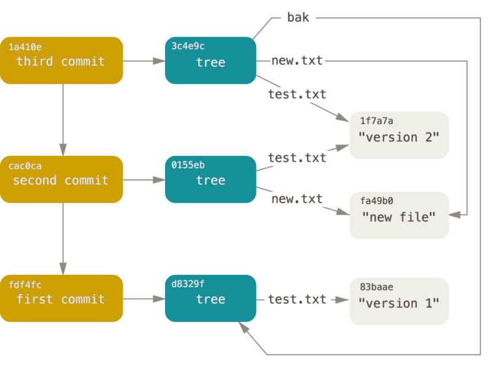

# Les tripes de Git

<!-- toc -->

Vous êtes peut-être arrivé à ce chapitre en en sautant certains autres
ou après avoir parcouru tout le reste du livre. Dans tous les cas, c’est
ici que le fonctionnement interne et la mise en œuvre de Git sont
abordés. Pour nous, leur apprentissage a été fondamental pour comprendre
à quel point Git est utile et puissant, mais d’autres soutiennent que
cela peut être source de confusion et peut être trop complexe pour les
débutants. Nous en avons donc fait le dernier chapitre de ce livre pour
que vous puissiez le lire tôt ou tard lors de votre apprentissage. Nous
vous laissons le choix.

Maintenant que vous êtes ici, commençons. Tout d’abord, si ce n’est pas
encore clair, Git est fondamentalement un système de fichiers adressable
par contenu avec l’interface utilisateur d’un VCS au-dessus. Vous en
apprendrez plus sur ce que cela signifie dans quelques instants.

Aux premiers jours de Git (surtout avant la version 1.5), l’interface
utilisateur était beaucoup plus complexe, car elle était centrée sur le
système de fichiers plutôt que sur l’aspect VCS. Ces dernières années,
l’interface utilisateur a été peaufinée jusqu’à devenir aussi cohérente
et facile à utiliser que n’importe quel autre système. Pour beaucoup,
l’image du Git des débuts avec son interface utilisateur complexe et
difficile à apprendre est toujours présente.

La couche système de fichiers adressable par contenu est vraiment
géniale et nous l’aborderons dans ce chapitre. Ensuite, vous apprendrez
les mécanismes de transfert ainsi que les tâches que vous serez amené à
accomplir pour maintenir un dépôt.

## Plomberie et porcelaine

Ce livre couvre l’utilisation de Git avec une trentaine de verbes comme
`checkout`, `branch`, `remote`…​ Mais, puisque Git était initialement
une boîte à outils (*toolkit*) pour VCS, plutôt qu’un VCS complet et
convivial, il dispose de tout un ensemble d’actions pour les tâches bas
niveau qui étaient conçues pour être liées dans le style UNIX ou
appelées depuis des scripts. Ces commandes sont dites commandes de
« plomberie » (*plumbing*) et les autres, plus conviviales sont appelées
« la porcelaine » (*porcelain*).

Les neuf premiers chapitres du livre concernent presque exclusivement
les commandes de porcelaine. Par contre, dans ce chapitre, vous serez
principalement confronté aux commandes de plomberie bas niveau, car
elles vous donnent accès au fonctionnement interne de Git et aident à
montrer comment et pourquoi Git fonctionne comme il le fait. Beaucoup de
ces commandes ne sont pas faites pour être utilisées à la main sur une
ligne de commande, mais sont plutôt utilisées comme briques de base pour
écrire de nouveaux outils et scripts personnalisés.

Quand vous exécutez `git init` dans un nouveau répertoire ou un
répertoire existant, Git crée un répertoire `.git` qui contient presque
tout ce que Git stocke et manipule. Si vous voulez sauvegarder ou cloner
votre dépôt, copier ce seul répertoire suffirait presque. Ce chapitre
traite principalement de ce que contient ce répertoire. Voici à quoi il
ressemble :

``` highlight
$ ls -F1
HEAD
config*
description
hooks/
info/
objects/
refs/
```

Vous y verrez sans doute d’autres fichiers, mais ceci est un dépôt qui
vient d’être créé avec `git init` et c’est ce que vous verrez par
défaut. Le fichier `description` est utilisé uniquement par le programme
GitWeb, il ne faut donc pas s’en soucier. Le fichier `config` contient
les options de configuration spécifiques à votre projet et le répertoire
`info` contient un fichier d’exclusions listant les motifs que vous
souhaitez ignorer et que vous ne voulez pas mettre dans un fichier
`.gitignore`. Le répertoire `hooks` contient les scripts de procédures
automatiques côté client ou serveur, ils sont décrits en détail dans
[Crochets Git](#s_git_hooks).

Il reste quatre éléments importants : les fichiers `HEAD` et (pas encore
créé) `index`, ainsi que les répertoires `objects` et `refs`. Ce sont
les composants principaux d’un dépôt Git. Le répertoire `objects` stocke
le contenu de votre base de données, le répertoire `refs` stocke les
pointeurs vers les objets *commit* de ces données (branches), le fichier
`HEAD` pointe sur la branche qui est en cours dans votre répertoire de
travail et le fichier `index` est l’endroit où Git stocke les
informations sur la zone d’attente. Vous allez maintenant plonger en
détail dans chacune de ces sections et voir comment Git fonctionne.

## Les objets de Git

Git est un système de fichier adressables par contenu. Super ! Mais
qu’est-ce que ça veut dire ? Ça veut dire que le cœur de Git est une
simple base de paires clé/valeur. Vous pouvez y insérer n’importe quelle
sorte de données et il vous retournera une clé que vous pourrez utiliser
à n’importe quel moment pour récupérer ces données. Pour illustrer cela,
vous pouvez utiliser la commande de plomberie `hash-object`, qui prend
des données, les stocke dans votre répertoire `.git`, puis retourne la
clé sous laquelle les données sont stockées. Tout d’abord, créez un
nouveau dépôt Git et vérifiez que rien ne se trouve dans le répertoire
`objects` :

``` highlight
$ git init test
Initialized empty Git repository in /tmp/test/.git/
$ cd test
$ find .git/objects
.git/objects
.git/objects/info
.git/objects/pack
$ find .git/objects -type f
```

Git a initialisé le répertoire `objects` et y a créé les
sous-répertoires `pack` et `info`, mais ils ne contiennent pas de
fichier régulier. Maintenant, stockez du texte dans votre base de
données Git :

``` highlight
$ echo 'test content' | git hash-object -w --stdin
d670460b4b4aece5915caf5c68d12f560a9fe3e4
```

L’option `-w` spécifie à `hash-object` de stocker l’objet, sinon la
commande répondrait seulement quelle serait la clé. `--stdin` spécifie à
la commande de lire le contenu depuis l’entrée standard, sinon
`hash-object` s’attend à trouver un chemin vers un fichier. La sortie de
la commande est une empreinte de 40 caractères. C’est l’empreinte SHA-1
‒ une somme de contrôle du contenu du fichier que vous stockez plus un
en-tête, que vous apprendrez sous peu. Voyez maintenant comment Git a
stocké vos données :

``` highlight
$ find .git/objects -type f
.git/objects/d6/70460b4b4aece5915caf5c68d12f560a9fe3e4
```

Vous pouvez voir un fichier dans le répertoire `objects`. C’est comme
cela que Git stocke initialement du contenu ‒ un fichier par contenu,
nommé d’après la somme de contrôle SHA-1 du contenu et de son en-tête.
Le sous-répertoire est nommé d’après les 2 premiers caractères de
l’empreinte et le fichier d’après les 38 caractères restants.

Vous pouvez récupérer le contenu avec la commande `cat-file`. Cette
commande est un peu le couteau suisse pour l’inspection des objets Git.
Lui passer l’option `-p` ordonne à la commande `cat-file` de déterminer
le type de contenu et de vous l’afficher joliment :

``` highlight
$ git cat-file -p d670460b4b4aece5915caf5c68d12f560a9fe3e4
test content
```

Vous pouvez maintenant ajouter du contenu à Git et le récupérer à
nouveau. Vous pouvez faire de même avec le contenu de fichiers. Par
exemple, vous pouvez mettre en œuvre une gestion de version simple d’un
fichier. D’abord, créez un nouveau fichier et enregistrez son contenu
dans la base de données :

``` highlight
$ echo 'version 1' > test.txt
$ git hash-object -w test.txt
83baae61804e65cc73a7201a7252750c76066a30
```

Puis, modifiez le contenu du fichier et enregistrez-le à nouveau :

``` highlight
$ echo 'version 2' > test.txt
$ git hash-object -w test.txt
1f7a7a472abf3dd9643fd615f6da379c4acb3e3a
```

Votre base de données contient les 2 versions du fichier, ainsi que le
premier contenu que vous avez stocké ici :

``` highlight
$ find .git/objects -type f
.git/objects/1f/7a7a472abf3dd9643fd615f6da379c4acb3e3a
.git/objects/83/baae61804e65cc73a7201a7252750c76066a30
.git/objects/d6/70460b4b4aece5915caf5c68d12f560a9fe3e4
```

Vous pouvez maintenant restaurer le fichier à sa première version :

``` highlight
$ git cat-file -p 83baae61804e65cc73a7201a7252750c76066a30 > test.txt
$ cat test.txt
version 1
```

ou à sa seconde version :

``` highlight
$ git cat-file -p 1f7a7a472abf3dd9643fd615f6da379c4acb3e3a > test.txt
$ cat test.txt
version 2
```

Mais se rappeler de la clé SHA-1 de chaque version de votre fichier
n’est pas pratique. En plus, vous ne stockez pas le nom du fichier dans
votre système ‒ seulement le contenu. Ce type d’objet est appelé un blob
(*Binary Large OBject*, soit en français : Gros Objet Binaire). Git peut
vous donner le type d’objet de n’importe quel objet Git, étant donné sa
clé SHA-1, avec `cat-file -t` :

``` highlight
$ git cat-file -t 1f7a7a472abf3dd9643fd615f6da379c4acb3e3a
blob
```

### Les objets arbres

Le prochain type que nous allons étudier est l’arbre (*tree*) qui résout
le problème de stockage du nom du fichier et vous permet d’enregistrer
un groupe de fichiers ensemble. Git stocke du contenu de la même
manière, mais plus simplement, qu’un système de fichier UNIX. Tout le
contenu est stocké comme des objets de type arbre ou blob : un arbre
correspondant à un répertoire UNIX et un blob correspond à peu près aux
inodes ou au contenu d’un fichier. Un unique arbre contient une ou
plusieurs entrées, chacune étant l’empreinte SHA-1 d’un blob ou d’un
sous-arbre (*sub-tree*) avec ses droits d’accès (*mode*), son type et
son nom de fichier associés. L’arbre le plus récent d’un projet pourrait
ressembler, par exemple, à ceci :

``` highlight
$ git cat-file -p master^{tree}
100644 blob a906cb2a4a904a152e80877d4088654daad0c859      README
100644 blob 8f94139338f9404f26296befa88755fc2598c289      Rakefile
040000 tree 99f1a6d12cb4b6f19c8655fca46c3ecf317074e0      lib
```

La syntaxe `master^{tree}` signifie l’objet arbre qui est pointé par le
dernier *commit* de la branche `master`. Remarquez que le
sous-répertoire `lib` n’est pas un blob, mais un pointeur vers un autre
arbre :

``` highlight
$ git cat-file -p 99f1a6d12cb4b6f19c8655fca46c3ecf317074e0
100644 blob 47c6340d6459e05787f644c2447d2595f5d3a54b      simplegit.rb
```

Conceptuellement, les données que Git stocke ressemblent ceci :


Figure 149. Une version simple du modèle de données Git.

Vous pouvez facilement créer votre propre arbre. Git crée habituellement
un arbre à partir de l’état de la zone d’attente ou index et écrit une
série d’objets arbre à partir de là. Donc, pour créer un objet arbre,
vous devez d’abord mettre en place un index en mettant quelques fichiers
en attente. Pour créer un index contenant une entrée, la première
version de votre fichier `test.txt` par exemple, utilisons la commande
de plomberie `update-index`. Vous pouvez utiliser cette commande pour
ajouter artificiellement une version plus ancienne à une nouvelle zone
d’attente. Vous devez utiliser les options `--add` car le fichier
n’existe pas encore dans votre zone d’attente (vous n’avez même pas
encore mis en place une zone d’attente) et `--cacheinfo` car le fichier
que vous ajoutez n’est pas dans votre répertoire, mais dans la base de
données. Vous pouvez ensuite préciser le mode, SHA-1 et le nom de
fichier :

``` highlight
$ git update-index --add --cacheinfo 100644 \
  83baae61804e65cc73a7201a7252750c76066a30 test.txt
```

Dans ce cas, vous précisez le mode `100644`, qui signifie que c’est un
fichier normal. Les alternatives sont `100755`, qui signifie que c’est
un exécutable, et `120000`, qui précise que c’est un lien symbolique. Le
concept de « mode » a été repris des mode UNIX, mais est beaucoup moins
flexible : ces trois modes sont les seuls valides pour Git, pour les
fichiers (blobs) dans Git (bien que d’autres modes soient utilisés pour
les répertoires et sous-modules).

Vous pouvez maintenant utiliser la commande `write-tree` pour écrire la
zone d’attente dans un objet arbre. L’option `-w` est inutile (appeler
`write-tree` crée automatiquement un objet arbre à partir de l’état de
l’index si cet arbre n’existe pas) :

``` highlight
$ git write-tree
d8329fc1cc938780ffdd9f94e0d364e0ea74f579
$ git cat-file -p d8329fc1cc938780ffdd9f94e0d364e0ea74f579
100644 blob 83baae61804e65cc73a7201a7252750c76066a30      test.txt
```

Vous pouvez également vérifier que c’est un objet arbre :

``` highlight
$ git cat-file -t d8329fc1cc938780ffdd9f94e0d364e0ea74f579
tree
```

Vous allez créer maintenant un nouvel arbre avec la seconde version de
`test.txt` et aussi un nouveau fichier :

``` highlight
$ echo 'new file' > new.txt
$ git update-index test.txt
$ git update-index --add new.txt
```

Votre zone d’attente contient maintenant la nouvelle version de
`test.txt` ainsi que le nouveau fichier `new.txt`. Enregistrez cet arbre
(c’est-à-dire enregistrez l’état de la zone d’attente ou index dans un
objet arbre) et voyez à quoi il ressemble :

``` highlight
$ git write-tree
0155eb4229851634a0f03eb265b69f5a2d56f341
$ git cat-file -p 0155eb4229851634a0f03eb265b69f5a2d56f341
100644 blob fa49b077972391ad58037050f2a75f74e3671e92      new.txt
100644 blob 1f7a7a472abf3dd9643fd615f6da379c4acb3e3a      test.txt
```

Remarquez que cet arbre contient des entrées pour les deux fichiers et
que l’empreinte SHA-1 de `test.txt` est l’empreinte de la « version 2 »
de tout à l’heure (`1f7a7a`). Pour le plaisir, ajoutez le premier arbre
à celui-ci, en tant que sous-répertoire. Vous pouvez récupérer un arbre
de votre zone d’attente en exécutant `read-tree`. Dans ce cas, vous
pouvez récupérer un arbre existant dans votre zone d’attente comme étant
un sous-arbre en utilisant l’option `--prefix` de `read-tree` :

``` highlight
$ git read-tree --prefix=bak d8329fc1cc938780ffdd9f94e0d364e0ea74f579
$ git write-tree
3c4e9cd789d88d8d89c1073707c3585e41b0e614
$ git cat-file -p 3c4e9cd789d88d8d89c1073707c3585e41b0e614
040000 tree d8329fc1cc938780ffdd9f94e0d364e0ea74f579      bak
100644 blob fa49b077972391ad58037050f2a75f74e3671e92      new.txt
100644 blob 1f7a7a472abf3dd9643fd615f6da379c4acb3e3a      test.txt
```

Si vous créiez un répertoire de travail à partir du nouvel arbre que
vous venez d’enregistrer, vous auriez deux fichiers à la racine du
répertoire de travail, ainsi qu’un sous-répertoire appelé `bak` qui
contiendrait la première version du fichier `test.txt`. Vous pouvez vous
représenter les données que Git utilise pour ces structures comme ceci :


Figure 150. Structure du contenu de vos données Git actuelles.

### Les objets *commit*

Vous avez trois arbres qui définissent différents instantanés du projet
que vous suivez, mais le problème précédent persiste : vous devez vous
souvenir des valeurs des trois empreintes SHA-1 pour accéder aux
instantanés. Vous n’avez pas non plus d’information sur qui a enregistré
les instantanés, quand et pourquoi. Ce sont les informations
élémentaires qu’un objet *commit* stocke pour vous.

Pour créer un objet *commit*, il suffit d’exécuter `commit-tree` et de
préciser l’empreinte SHA-1 d’un seul arbre et quels objets *commit*,
s’il y en a, le précèdent directement. Commencez avec le premier arbre
que vous avez créé :

``` highlight
$ echo 'first commit' | git commit-tree d8329f
fdf4fc3344e67ab068f836878b6c4951e3b15f3d
```

Vous obtiendrez une valeur de hashage différente à cause d’un moment de
création et d’une information d’auteur différents. Remplacez les valeurs
de hashage de *commit* et d’étiquette par vos propres valeurs de somme
de contrôle plus loin dans ce chapitre. Vous pouvez voir votre nouvel
objet *commit* avec `cat-file` :

``` highlight
$ git cat-file -p fdf4fc3
tree d8329fc1cc938780ffdd9f94e0d364e0ea74f579
author Scott Chacon <schacon@gmail.com> 1243040974 -0700
committer Scott Chacon <schacon@gmail.com> 1243040974 -0700

first commit
```

Le format d’un objet *commit* est simple : il contient l’arbre racine de
l’instantané du projet à ce moment, les informations sur l’auteur et le
validateur (qui utilisent vos variables de configuration `user.name` et
`user.email` et un horodatage); une ligne vide et le message de
validation.

Ensuite, vous enregistrez les deux autres objets *commit*, chacun
référençant le *commit* dont il est issu :

``` highlight
$ echo 'second commit' | git commit-tree 0155eb -p fdf4fc3
cac0cab538b970a37ea1e769cbbde608743bc96d
$ echo 'third commit'  | git commit-tree 3c4e9c -p cac0cab
1a410efbd13591db07496601ebc7a059dd55cfe9
```

Chacun des trois objets *commit* pointe sur un des trois arbres
d’instantané que vous avez créés. Curieusement, vous disposez maintenant
d’un historique Git complet que vous pouvez visualiser avec la commande
`git log`, si vous la lancez sur le SHA-1 du dernier *commit* :

``` highlight
$ git log --stat 1a410e
commit 1a410efbd13591db07496601ebc7a059dd55cfe9
Author: Scott Chacon <schacon@gmail.com>
Date:   Fri May 22 18:15:24 2009 -0700

    third commit

 bak/test.txt | 1 +
 1 file changed, 1 insertion(+)

commit cac0cab538b970a37ea1e769cbbde608743bc96d
Author: Scott Chacon <schacon@gmail.com>
Date:   Fri May 22 18:14:29 2009 -0700

    second commit

 new.txt  | 1 +
 test.txt | 2 +-
 2 files changed, 2 insertions(+), 1 deletion(-)

commit fdf4fc3344e67ab068f836878b6c4951e3b15f3d
Author: Scott Chacon <schacon@gmail.com>
Date:   Fri May 22 18:09:34 2009 -0700

    first commit

 test.txt | 1 +
 1 file changed, 1 insertion(+)
```

Fantastique. Vous venez d’effectuer les opérations bas niveau pour
construire un historique Git sans avoir utilisé une seule des commandes
de haut niveau. C’est l’essence de ce que fait Git quand vous exécutez
les commandes `git add` et `git commit`. Il stocke les blobs
correspondant aux fichiers modifiés, met à jour l’index, écrit les
arbres et ajoute les objets *commit* qui référencent les arbres racines
venant juste avant eux. Ces trois objets principaux (le blob, l’arbre et
le *commit*) sont initialement stockés dans des fichiers séparés du
répertoire `.git/objects`. Voici tous les objets contenus dans le
répertoire exemple, commentés d’après leur contenu :

``` highlight
$ find .git/objects -type f
.git/objects/01/55eb4229851634a0f03eb265b69f5a2d56f341 # tree 2
.git/objects/1a/410efbd13591db07496601ebc7a059dd55cfe9 # commit 3
.git/objects/1f/7a7a472abf3dd9643fd615f6da379c4acb3e3a # test.txt v2
.git/objects/3c/4e9cd789d88d8d89c1073707c3585e41b0e614 # tree 3
.git/objects/83/baae61804e65cc73a7201a7252750c76066a30 # test.txt v1
.git/objects/ca/c0cab538b970a37ea1e769cbbde608743bc96d # commit 2
.git/objects/d6/70460b4b4aece5915caf5c68d12f560a9fe3e4 # 'test content'
.git/objects/d8/329fc1cc938780ffdd9f94e0d364e0ea74f579 # tree 1
.git/objects/fa/49b077972391ad58037050f2a75f74e3671e92 # new.txt
.git/objects/fd/f4fc3344e67ab068f836878b6c4951e3b15f3d # commit 1
```

Si vous suivez les pointeurs internes de ces objets, vous obtenez un
graphe comme celui-ci :



Figure 151. Tous les objets de votre répertoire Git.

### Stockage des objets

Nous avons parlé plus tôt de l’en-tête présent avec le contenu. Prenons
un moment pour étudier la façon dont Git stocke les objets. On verra
comment stocker interactivement un objet blob (ici, la chaîne "what is
up, doc?") avec le langage Ruby.

Vous pouvez démarrer Ruby en mode interactif avec la commande `irb` :

``` highlight
$ irb
>> content = "what is up, doc?"
> "what is up, doc?"
```

Git construit un en-tête qui commence avec le type de l’objet, ici un
blob. Ensuite, il ajoute un espace suivi de taille du contenu et enfin
un octet nul :

``` highlight
>> header = "blob #{content.length}\0"
> "blob 16\u0000"
```

Git concatène l’en-tête avec le contenu original et calcule l’empreinte
SHA-1 du nouveau contenu. En Ruby, vous pouvez calculer l’empreinte
SHA-1 d’une chaîne en incluant la bibliothèque « digest/SHA-1 » via la
commande `require`, puis en appelant `Digest::SHA1.hexdigest()` sur la
chaîne :

``` highlight
>> store = header + content
> "blob 16\u0000what is up, doc?"
>> require 'digest/sha1'
> true
>> sha1 = Digest::SHA1.hexdigest(store)
> "bd9dbf5aae1a3862dd1526723246b20206e5fc37"
```

Git compresse le nouveau contenu avec zlib, ce que vous pouvez faire
avec la bibliothèque zlib de Ruby. D’abord, vous devez inclure la
bibliothèque et ensuite exécuter `Zlib::Deflate.deflate()` sur le
contenu :

``` highlight
>> require 'zlib'
> true
>> zlib_content = Zlib::Deflate.deflate(store)
> "x\x9CK\xCA\xC9OR04c(\xCFH,Q\xC8,V(-\xD0QH\xC9O\xB6\a\x00_\x1C\a\x9D"
```

Finalement, vous enregistrerez le contenu compressé dans un objet sur le
disque. Vous déterminerez le chemin de l’objet que vous voulez
enregistrer (les deux premiers caractères de l’empreinte SHA-1 formeront
le nom du sous-répertoire et les 38 derniers formeront le nom du fichier
dans ce répertoire). En Ruby, on peut utiliser la fonction
`FileUtils.mkdir_p()` pour créer un sous-répertoire s’il n’existe pas.
Ensuite, ouvrez le fichier avec `File.open()` et enregistrez le contenu
compressé en appelant la fonction `write()` sur la référence du
fichier :

``` highlight
>> path = '.git/objects/' + sha1[0,2] + '/' + sha1[2,38]
> ".git/objects/bd/9dbf5aae1a3862dd1526723246b20206e5fc37"
>> require 'fileutils'
> true
>> FileUtils.mkdir_p(File.dirname(path))
> ".git/objects/bd"
>> File.open(path, 'w') { |f| f.write zlib_content }
> 32
```

C’est tout ! Vous venez juste de créer un objet blob valide. Tout les
objets Git sont stockés de la même façon, mais avec des types
différents : l’en-tête commencera par « commit » ou « tree » au lieu de
la chaîne « blob ». De plus, alors que le contenu d’un blob peut être à
peu près n’importe quoi, le contenu d’un *commit* ou d’un arbre est
formaté de façon très précise.

## Références Git

On peut exécuter quelque chose comme `git log 1a410e` pour visualiser
tout l’historique, mais il faut se souvenir que `1a410e` est le dernier
*commit* afin de parcourir l’historique et trouver tous ces objets. Vous
avez besoin d’un fichier dans lequel vous pouvez stocker l’empreinte
SHA-1 sous un nom simple afin d’utiliser ce pointeur plutôt que
l’empreinte SHA-1 elle-même.

Git appelle ces pointeurs des « références », ou « refs ». On trouve les
fichiers contenant des empreintes SHA-1 dans le répertoire `git/refs`.
Dans le projet actuel, ce répertoire ne contient aucun fichier, mais
possède une structure simple :

``` highlight
$ find .git/refs
.git/refs
.git/refs/heads
.git/refs/tags
$ find .git/refs -type f
```

Pour créer une nouvelle référence servant à se souvenir du dernier
*commit*, vous pouvez simplement faire ceci :

``` highlight
$ echo "1a410efbd13591db07496601ebc7a059dd55cfe9" > .git/refs/heads/master
```

Vous pouvez maintenant utiliser la référence principale que vous venez
de créer à la place de l’empreinte SHA-1 dans vos commandes Git :

``` highlight
$ git log --pretty=oneline  master
1a410efbd13591db07496601ebc7a059dd55cfe9 third commit
cac0cab538b970a37ea1e769cbbde608743bc96d second commit
fdf4fc3344e67ab068f836878b6c4951e3b15f3d first commit
```

Il n’est pas conseillé d’éditer directement les fichiers des références.
Git propose une manière sûre de mettre à jour une référence, c’est la
commande `update-ref` :

``` highlight
$ git update-ref refs/heads/master 1a410efbd13591db07496601ebc7a059dd55cfe9
```

C’est simplement ce qu’est une branche dans Git : un simple pointeur ou
référence sur le dernier état d’une suite de travaux. Pour créer une
branche à partir du deuxième *commit*, vous pouvez faire ceci :

``` highlight
$ git update-ref refs/heads/test cac0ca
```

Cette branche contiendra seulement le travail effectué jusqu’à ce
*commit* :

``` highlight
$ git log --pretty=oneline test
cac0cab538b970a37ea1e769cbbde608743bc96d second commit
fdf4fc3344e67ab068f836878b6c4951e3b15f3d first commit
```

La base de donnée Git ressemble maintenant à quelque chose comme ceci :


Figure 152. Le répertoire d’objets de Git avec les références de
branches incluses.

Quand vous exécutez une commande comme `git branch (nomdebranche)`, Git
exécute simplement la commande `update-ref` pour ajouter l’empreinte
SHA-1 du dernier *commit* de la branche sur laquelle vous êtes quelle
que soit la nouvelle référence que vous voulez créer.

### La branche HEAD

On peut se poser la question : « Comment Git peut avoir connaissance de
l’empreinte SHA-1 du dernier *commit* quand on exécute
`git branch (branchname)` ? » La réponse est dans le fichier HEAD (qui
veut dire tête en français, soit, ici, l’état courant).

Le fichier HEAD est une référence symbolique à la branche courante. Par
référence symbolique, j’entends que contrairement à une référence
normale, elle ne contient pas une empreinte SHA-1, mais plutôt un
pointeur vers une autre référence. Si vous regardez ce fichier, vous
devriez voir quelque chose comme ceci :

``` highlight
$ cat .git/HEAD
ref: refs/heads/master
```

Si vous exécutez `git checkout test`, Git met à jour ce fichier, qui
ressemblera à ceci :

``` highlight
$ cat .git/HEAD
ref: refs/heads/test
```

Quand vous exécutez `git commit`, il crée l’objet *commit* en spécifiant
le parent de cet objet *commit* quelle que soit l’empreinte SHA-1
pointée par la référence de HEAD.

On peut éditer manuellement ce fichier, mais encore une fois, il existe
une commande plus sûre pour le faire : `symbolic-ref`. Vous pouvez lire
le contenu de votre fichier HEAD avec cette commande :

``` highlight
$ git symbolic-ref HEAD
refs/heads/master
```

Vous pouvez aussi définir la valeur de HEAD :

``` highlight
$ git symbolic-ref HEAD refs/heads/test
$ cat .git/HEAD
ref: refs/heads/test
```

Vous ne pouvez pas définir une référence symbolique à une valeur non
contenu dans refs :

``` highlight
$ git symbolic-ref HEAD test
fatal: Refusing to point HEAD outside of refs/
```

### Étiquettes

Nous venons de parcourir les trois types d’objets utilisés par Git, mais
il en existe un quatrième. L’objet étiquette (*tag* en anglais)
ressemble beaucoup à un objet *commit*. Il contient un étiqueteur, une
date, un message et un pointeur. La principale différence est que
l’étiquette pointe en général vers un *commit* plutôt qu’un arbre. C’est
comme une référence à une branche, mais elle ne bouge jamais : elle
pointe toujours vers le même *commit*, lui donnant un nom plus
sympathique.

Comme présenté au [Les bases de Git](#ch02-git-basics), il existe deux
types d’étiquettes : annotée et légère. Vous pouvez créer une étiquette
légère comme ceci :

``` highlight
$ git update-ref refs/tags/v1.0 cac0cab538b970a37ea1e769cbbde608743bc96d
```

C’est tout ce qu’est une étiquette légère : une référence qui n’est
jamais modifiée. Une étiquette annotée est plus complexe. Quand on crée
une étiquette annotée, Git crée un objet étiquette, puis enregistre une
référence qui pointe vers lui plutôt que directement vers le *commit*.
Vous pouvez voir ceci en créant une étiquette annotée (`-a` spécifie que
c’est une étiquette annotée) :

``` highlight
$ git tag -a v1.1 1a410efbd13591db07496601ebc7a059dd55cfe9 -m 'test tag'
```

Voici l’empreinte SHA-1 de l’objet créé :

``` highlight
$ cat .git/refs/tags/v1.1
9585191f37f7b0fb9444f35a9bf50de191beadc2
```

Maintenant, exécutez la commande `cat-file` sur cette empreinte SHA-1 :

``` highlight
$ git cat-file -p 9585191f37f7b0fb9444f35a9bf50de191beadc2
object 1a410efbd13591db07496601ebc7a059dd55cfe9
type commit
tag v1.1
tagger Scott Chacon <schacon@gmail.com> Sat May 23 16:48:58 2009 -0700

test tag
```

Remarquez que le contenu de l’objet pointe vers l’empreinte SHA-1 du
*commit* que vous avez étiqueté. Remarquez qu’il n’est pas nécessaire
qu’il pointe vers un *commit*. On peut étiqueter n’importe quel objet.
Par exemple, dans le code source de Git, le mainteneur a ajouté sa clé
publique GPG dans un blob et a étiqueté ce blob. Vous pouvez voir la clé
publique en exécutant ceci sur un clone du dépôt Git :

``` highlight
$ git cat-file blob junio-gpg-pub
```

Le noyau Linux contient aussi une étiquette ne pointant pas vers un
*commit* : la première étiquette créée pointe vers l’arbre initial lors
de l’importation du code source.

### Références distantes

Le troisième type de références que l’on étudiera sont les références
distantes (*remotes*). Si l’on ajoute une référence distante et que l’on
pousse des objets vers elle, Git stocke la valeur que vous avez poussée
en dernier vers cette référence pour chaque branche dans le répertoire
`refs/remotes`. Vous pouvez par exemple ajouter une référence distante
nommée `origin` et y pousser votre branche `master` :

``` highlight
$ git remote add origin git@github.com:schacon/simplegit-progit.git
$ git push origin master
Counting objects: 11, done.
Compressing objects: 100% (5/5), done.
Writing objects: 100% (7/7), 716 bytes, done.
Total 7 (delta 2), reused 4 (delta 1)
To git@github.com:schacon/simplegit-progit.git
  a11bef0..ca82a6d  master -> master
```

Ensuite, vous pouvez voir l’état de la branche `master` dans la
référence distante `origin` la dernière fois que vous avez communiqué
avec le serveur en regardant le fichier `refs/remotes/origin/master` :

``` highlight
$ cat .git/refs/remotes/origin/master
ca82a6dff817ec66f44342007202690a93763949
```

Les références distantes diffèrent des branches (références
`refs/heads`) principalement parce qu’on ne peut y accéder qu’en lecture
seule. Vous pouvez éxécuter `git checkout` sur l’une d’entre elles, mais
Git ne fera jamais pointer HEAD sur l’une d’elles, donc vous ne pourrez
jamais en mettre une à jour en utilisant une commande `commit`. Git les
gère comme des marque-pages du dernier état connu de vers quoi ces
branches pointent sur le serveur.

## Fichiers groupés

Revenons à la base de donnée d’objets de notre dépôt Git de test. Pour
l’instant, elle contient 11 objets : 4 blobs, 3 arbres, 3 *commits* et 1
étiquette :

``` highlight
$ find .git/objects -type f
.git/objects/01/55eb4229851634a0f03eb265b69f5a2d56f341 # tree 2
.git/objects/1a/410efbd13591db07496601ebc7a059dd55cfe9 # commit 3
.git/objects/1f/7a7a472abf3dd9643fd615f6da379c4acb3e3a # test.txt v2
.git/objects/3c/4e9cd789d88d8d89c1073707c3585e41b0e614 # tree 3
.git/objects/83/baae61804e65cc73a7201a7252750c76066a30 # test.txt v1
.git/objects/95/85191f37f7b0fb9444f35a9bf50de191beadc2 # tag
.git/objects/ca/c0cab538b970a37ea1e769cbbde608743bc96d # commit 2
.git/objects/d6/70460b4b4aece5915caf5c68d12f560a9fe3e4 # 'test content'
.git/objects/d8/329fc1cc938780ffdd9f94e0d364e0ea74f579 # tree 1
.git/objects/fa/49b077972391ad58037050f2a75f74e3671e92 # new.txt
.git/objects/fd/f4fc3344e67ab068f836878b6c4951e3b15f3d # commit 1
```

Git compresse le contenu de ces fichiers avec zlib et on ne stocke pas
grand chose ; au final, tous ces fichiers occupent seulement 925 octets.
Ajoutons de plus gros contenu au dépôt pour montrer une fonctionnalité
intéressante de Git. Pour la démonstration, nous allons ajouter le
fichier `repo.rb` de la bibliothèque Grit. Il représente environ 22 ko
de code source :

``` highlight
$ curl https://raw.githubusercontent.com/mojombo/grit/master/lib/grit/repo.rb > repo.rb
$ git checkout master
$ git add repo.rb
$ git commit -m 'added repo.rb'
[master 484a592] added repo.rb
 3 files changed, 709 insertions(+), 2 deletions(-)
 delete mode 100644 bak/test.txt
 create mode 100644 repo.rb
 rewrite test.txt (100%)
```

Si vous observez l’arbre qui en résulte, vous verrez l’empreinte SHA-1
du blob contenant le fichier `repo.rb` :

``` highlight
$ git cat-file -p master^{tree}
100644 blob fa49b077972391ad58037050f2a75f74e3671e92      new.txt
100644 blob 033b4468fa6b2a9547a70d88d1bbe8bf3f9ed0d5      repo.rb
100644 blob e3f094f522629ae358806b17daf78246c27c007b      test.txt
```

Vous pouvez vérifier la taille de l’objet sur disque à l’aide de
`git cat-file` :

``` highlight
$ git cat-file -s 033b4468fa6b2a9547a70d88d1bbe8bf3f9ed0d5
22044
```

Maintenant, modifiez légèrement le fichier et voyez ce qui arrive :

``` highlight
$ echo '# testing' >> repo.rb
$ git commit -am 'modified repo.rb a bit'
[master 2431da6] modified repo.rb a bit
 1 file changed, 1 insertion(+)
```

Regardez l’arbre créé par ce *commit* et vous verrez quelque chose
d’intéressant :

``` highlight
$ git cat-file -p master^{tree}
100644 blob fa49b077972391ad58037050f2a75f74e3671e92      new.txt
100644 blob b042a60ef7dff760008df33cee372b945b6e884e      repo.rb
100644 blob e3f094f522629ae358806b17daf78246c27c007b      test.txt
```

Ce blob est un blob différent. Bien que l’on ait ajouté une seule ligne
à la fin d’un fichier en faisant 400, Git enregistre ce nouveau contenu
dans un objet totalement différent :

``` highlight
$ git cat-file -s b042a60ef7dff760008df33cee372b945b6e884e
22054
```

Il y a donc deux objets de 22 ko quasiment identiques sur le disque. Ne
serait-ce pas charmant si Git pouvait n’enregistrer qu’un objet en
entier, le deuxième n’étant qu’un delta (une différence) avec le
premier ?

Il se trouve que c’est possible. Le format initial dans lequel Git
enregistre les objets sur le disque est appelé le format brut (*loose
object*). De temps en temps, Git compacte plusieurs de ces objets en un
seul fichier binaire appelé *packfile* (fichier groupé), afin
d’économiser de l’espace et d’être plus efficace. Git effectue cette
opération quand il y a trop d’objets au format brut, ou si l’on exécute
manuellement la commande `git gc`, ou encore quand on pousse vers un
serveur distant. Pour voir cela en action, vous pouvez demander
manuellement à Git de compacter les objets en exécutant la commande
`git gc` :

``` highlight
$ git gc
Counting objects: 18, done.
Delta compression using up to 8 threads.
Compressing objects: 100% (14/14), done.
Writing objects: 100% (18/18), done.
Total 18 (delta 3), reused 0 (delta 0)
```

Si l’on jette un œil dans le répertoire des objets, on constatera que la
plupart des objets ne sont plus là et qu’un couple de fichiers est
apparu :

``` highlight
$ find .git/objects -type f
.git/objects/bd/9dbf5aae1a3862dd1526723246b20206e5fc37
.git/objects/d6/70460b4b4aece5915caf5c68d12f560a9fe3e4
.git/objects/info/packs
.git/objects/pack/pack-978e03944f5c581011e6998cd0e9e30000905586.idx
.git/objects/pack/pack-978e03944f5c581011e6998cd0e9e30000905586.pack
```

Les objets restant sont des blobs qui ne sont pointés par aucun
*commit*. Dans notre cas, il s’agit des blobs « what is up, doc? » et
« test content » créés plus tôt comme exemple. Puisqu’ils n’ont été
ajoutés à aucun *commit*, ils sont considérés en suspend et ne sont pas
compactés dans le nouveau fichier groupé.

Les autres fichiers sont le nouveau fichier groupé et un index. Le
fichier groupé est un fichier unique rassemblant le contenu de tous les
objets venant d’être supprimés du système de fichier. L’index est un
fichier contenant les emplacements dans le fichier groupé, pour que l’on
puisse accéder rapidement à un objet particulier. Ce qui est vraiment
bien, c’est que les objets occupaient environ 15 ko d’espace disque
avant `gc` et que le nouveau fichier groupé en occupe seulement 7. On a
réduit l’occupation du disque de ½ en regroupant les objets.

Comment Git réalise-t-il cela ? Quand Git compacte des objets, il
recherche les fichiers qui ont des noms et des tailles similaires, puis
enregistre seulement les deltas entre une version du fichier et la
suivante. On peut regarder à l’intérieur du fichier groupé et voir
l’espace économisé par Git. La commande de plomberie `git verify-pack`
vous permet de voir ce qui a été compacté :

``` highlight
$ git verify-pack -v .git/objects/pack/pack-978e03944f5c581011e6998cd0e9e30000905586.idx
2431da676938450a4d72e260db3bf7b0f587bbc1 commit 223 155 12
69bcdaff5328278ab1c0812ce0e07fa7d26a96d7 commit 214 152 167
80d02664cb23ed55b226516648c7ad5d0a3deb90 commit 214 145 319
43168a18b7613d1281e5560855a83eb8fde3d687 commit 213 146 464
092917823486a802e94d727c820a9024e14a1fc2 commit 214 146 610
702470739ce72005e2edff522fde85d52a65df9b commit 165 118 756
d368d0ac0678cbe6cce505be58126d3526706e54 tag    130 122 874
fe879577cb8cffcdf25441725141e310dd7d239b tree   136 136 996
d8329fc1cc938780ffdd9f94e0d364e0ea74f579 tree   36 46 1132
deef2e1b793907545e50a2ea2ddb5ba6c58c4506 tree   136 136 1178
d982c7cb2c2a972ee391a85da481fc1f9127a01d tree   6 17 1314 1 \
  deef2e1b793907545e50a2ea2ddb5ba6c58c4506
3c4e9cd789d88d8d89c1073707c3585e41b0e614 tree   8 19 1331 1 \
  deef2e1b793907545e50a2ea2ddb5ba6c58c4506
0155eb4229851634a0f03eb265b69f5a2d56f341 tree   71 76 1350
83baae61804e65cc73a7201a7252750c76066a30 blob   10 19 1426
fa49b077972391ad58037050f2a75f74e3671e92 blob   9 18 1445
b042a60ef7dff760008df33cee372b945b6e884e blob   22054 5799 1463
033b4468fa6b2a9547a70d88d1bbe8bf3f9ed0d5 blob   9 20 7262 1 \
  b042a60ef7dff760008df33cee372b945b6e884e
1f7a7a472abf3dd9643fd615f6da379c4acb3e3a blob   10 19 7282
non delta: 15 objects
chain length = 1: 3 objects
.git/objects/pack/pack-978e03944f5c581011e6998cd0e9e30000905586.pack: ok
```

Ici, le blob `033b4`, qui, si on se souvient bien, était la première
version du fichier `repo.rb`, référence le blob `b042a`, qui est la
seconde version du fichier. La troisième colonne de l’affichage est la
taille de l’objet dans le fichier compact et on peut voir que `b042a`
occupe 22 ko dans le fichier, mais que `033b4` occupe seulement 9
octets. Ce qui est aussi intéressant est que la seconde version du
fichier est celle qui est enregistrée telle quelle, tandis que la
version originale est enregistrée sous forme d’un delta. La raison en
est que vous aurez sans doute besoin d’accéder rapidement aux versions
les plus récentes du fichier.

Une chose intéressante à propos de ceci est que l’on peut recompacter à
tout moment. Git recompacte votre base de donnée occasionnellement, en
essayant d’économiser de la place. Vous pouvez aussi recompacter à la
main, en exécutant la commande `git gc` vous-même.

## La *refspec*

Tout au long de ce livre, nous avons utilisé des associations simples
entre les branches distantes et les références locales. Elles peuvent
être plus complexes. Supposons que vous ajoutiez un dépôt distant comme
ceci :

``` highlight
$ git remote add origin https://github.com/schacon/simplegit-progit
```

Cela ajoute une section au fichier `.git/config`, contenant le nom du
dépôt distant (`origin`), l’URL de ce dépôt et la *refspec* pour la
récupération :

``` highlight
[remote "origin"]
    url = https://github.com/schacon/simplegit-progit
    fetch = +refs/heads/*:refs/remotes/origin/*
```

Le format de la *refspec* est un `+` facultatif, suivi de `<src>:<dst>`,
où `<src>` est le motif des références du côté distant et `<dst>` est
l’emplacement local où les références seront enregistrées. Le `+`
précise à Git de mettre à jour la référence même si ce n’est pas une
avance rapide.

Dans le cas par défaut, qui est celui d’un enregistrement automatique
par la commande `git remote add origin`, Git récupère toutes les
références de `refs/heads/` sur le serveur et les enregistre localement
dans `refs/remotes/origin/`. Ainsi, s’il y a une branche `master` sur le
serveur, vous pouvez accéder localement à l’historique de cette branche
via :

``` highlight
$ git log origin/master
$ git log remotes/origin/master
$ git log refs/remotes/origin/master
```

Ces syntaxes sont toutes équivalentes, car Git les développe en
`refs/remotes/origin/master`.

Si vous préférez que Git récupère seulement la branche `master` et non
chacune des branches du serveur distant, vous pouvez remplacer la ligne
fetch par :

``` highlight
fetch = +refs/heads/master:refs/remotes/origin/master
```

C’est la *refspec* par défaut de `git fetch` pour ce dépôt distant. Si
l’on veut effectuer une action particulière une seule fois, la *refspec*
peut aussi être précisée en ligne de commande. Pour tirer la branche
`master` du dépôt distant vers la branche locale `origin/mymaster`, vous
pouvez exécuter :

``` highlight
$ git fetch origin master:refs/remotes/origin/mymaster
```

Vous pouvez indiquer plusieurs *refspecs*. En ligne de commande, vous
pouvez tirer plusieurs branches de cette façon :

``` highlight
$ git fetch origin master:refs/remotes/origin/mymaster \
     topic:refs/remotes/origin/topic
From git@github.com:schacon/simplegit
 ! [rejected]        master     -> origin/mymaster  (non fast forward)
 * [new branch]      topic      -> origin/topic
```

Dans ce cas, la récupération (*pull*) de la branche `master` a été
refusée car ce n’était pas une avance rapide. On peut surcharger ce
comportement en précisant un `+` devant la *refspec*.

On peut aussi indiquer plusieurs *refspecs* pour la récupération, dans
le fichier de configuration. Si vous voulez toujours récupérer les
branches `master` et `experiment`, ajoutez ces deux lignes :

``` highlight
[remote "origin"]
    url = https://github.com/schacon/simplegit-progit
    fetch = +refs/heads/master:refs/remotes/origin/master
    fetch = +refs/heads/experiment:refs/remotes/origin/experiment
```

Vous ne pouvez pas utiliser des jokers partiels, ce qui suit est donc
invalide :

``` highlight
fetch = +refs/heads/qa*:refs/remotes/origin/qa*
```

On peut toutefois utiliser des espaces de noms (*namespaces*) ou des
répertoires pour accomplir cela. S’il existe une équipe qualité (QA) qui
publie une série de branches et que l’on veut la branche `master`, les
branches de l’équipe qualité et rien d’autre, on peut utiliser la
configuration suivante :

``` highlight
[remote "origin"]
    url = https://github.com/schacon/simplegit-progit
    fetch = +refs/heads/master:refs/remotes/origin/master
    fetch = +refs/heads/qa/*:refs/remotes/origin/qa/*
```

Si vous utilisez des processus complexes impliquant une équipe qualité,
des développeurs et des intégrateurs qui publient des branches et qui
collaborent sur des branches distantes, vous pouvez facilement utiliser
des espaces de noms de cette façon.

### Pousser des *refspecs*

Il est pratique de pouvoir récupérer des références issues d’espace de
nom de cette façon, mais comment l’équipe qualité insère-t-elle ces
branches dans l’espace de nom `qa/` en premier lieu ? On peut accomplir
cela en utilisant les spécifications de références pour la publication.

Si l’équipe qualité veut publier sa branche `master` vers `qa/master`
sur le serveur distant, elle peut exécuter :

``` highlight
$ git push origin master:refs/heads/qa/master
```

Si elle veut que Git le fasse automatiquement à chaque exécution de
`git push origin`, elle peut ajouter une entrée `push` au fichier de
configuration :

``` highlight
[remote "origin"]
    url = https://github.com/schacon/simplegit-progit
    fetch = +refs/heads/*:refs/remotes/origin/*
    push = refs/heads/master:refs/heads/qa/master
```

De même, cela fera que, par défaut, `git push origin` publiera la
branche locale `master` sur la branche distante `qa/master`.

### Supprimer des références

Vous pouvez aussi utiliser les *refspecs* pour supprimer des références
sur le serveur distant en exécutant une commande comme :

``` highlight
$ git push origin :topic
```

La *refspec* ressemble à `<src>:<dst>`, mais en laissant vide la partie
`<src>`, cela signifie une création de la branche à partir de rien et
donc sa suppression.

## Les protocoles de transfert

Git peut transférer des données entre deux dépôts de deux façons
principales : le protocole « stupide » et le protocole « intelligent ».

Cette section fait un tour d’horizon du fonctionnement de ces deux
protocoles.

### Le protocole stupide

Si vous mettez en place un dépôt à accéder en lecture seule sur HTTP,
c’est vraisemblablement le protocole stupide qui sera utilisé.

Ce protocole est dit « stupide », car il ne nécessite aucun code
spécifique à Git côté serveur durant le transfert ; le processus de
récupération est une série de requêtes GET, où le client devine la
structure du dépôt Git présent sur le serveur.

<table>
<colgroup>
<col style="width: 50%" />
<col style="width: 50%" />
</colgroup>
<tbody>
<tr class="odd">
<td><em></em></td>
<td><div class="paragraph">
<p>Le protocole stupide est rarement utilisé ces derniers temps. Il est difficile de le rendre sécurisé ou privé, et donc la plupart des hébergeurs Git (sur le <em>cloud</em> ou sur serveur dédié) refusent de l’utiliser. On conseille généralement d’utiliser le protocole intelligent, qui est décrit plus loin.</p>
</div></td>
</tr>
</tbody>
</table>

Suivons le processus `http-fetch` pour la bibliothèque simplegit :

``` highlight
$ git clone http://server/simplegit-progit.git
```

La première chose que fait cette commande est de récupérer le fichier
`info/refs`. Ce fichier est écrit par la commande `update-server-info`
et c’est pour cela qu’il faut activer le crochet `post-receive`, sinon
le transfert HTTP ne fonctionnera pas correctement :

``` highlight
> GET info/refs
ca82a6dff817ec66f44342007202690a93763949     refs/heads/master
```

On possède maintenant une liste des références distantes et empreintes
SHA-1. Ensuite, on regarde vers quoi pointe HEAD, pour savoir sur quelle
branche se placer quand on aura fini :

``` highlight
> GET HEAD
ref: refs/heads/master
```

On aura besoin de se placer sur la branche `master`, quand le processus
sera terminé. On est maintenant prêt à démarrer le processus de
parcours. Puisque votre point de départ est l’objet *commit* `ca82a6`
que vous avez vu dans le fichier `info/refs`, vous commencez par le
récupérer :

``` highlight
> GET objects/ca/82a6dff817ec66f44342007202690a93763949
(179 bytes of binary data)
```

Vous obtenez un objet, cet objet est dans le format brut sur le serveur
et vous l’avez récupéré à travers une requête HTTP GET statique. Vous
pouvez le décompresser avec zlib, ignorer l’en-tête et regarder le
contenu du *commit* :

``` highlight
$ git cat-file -p ca82a6dff817ec66f44342007202690a93763949
tree cfda3bf379e4f8dba8717dee55aab78aef7f4daf
parent 085bb3bcb608e1e8451d4b2432f8ecbe6306e7e7
author Scott Chacon <schacon@gmail.com> 1205815931 -0700
committer Scott Chacon <schacon@gmail.com> 1240030591 -0700

changed the version number
```

Puis, vous avez deux autres objets supplémentaires à récupérer :
`cfda3b` qui est l’arbre du contenu sur lequel pointe le *commit* que
nous venons de récupérer et `085bb3` qui est le *commit* parent :

``` highlight
> GET objects/08/5bb3bcb608e1e8451d4b2432f8ecbe6306e7e7
(179 bytes of data)
```

Cela vous donne le prochain objet *commit*. Récupérez l’objet arbre :

``` highlight
> GET objects/cf/da3bf379e4f8dba8717dee55aab78aef7f4daf
(404 - Not Found)
```

Oups, on dirait que l’objet arbre n’est pas au format brut sur le
serveur, vous obtenez donc une réponse 404. On peut en déduire certaines
raisons : l’objet peut être dans un dépôt suppléant ou il peut être dans
un fichier groupé de ce dépôt. Git vérifie la liste des dépôts
suppléants d’abord :

``` highlight
> GET objects/info/http-alternates
(empty file)
```

Si la réponse contenait une liste d’URL suppléantes, Git aurait cherché
les fichiers bruts et les fichiers groupés à ces emplacements, c’est un
mécanisme sympathique pour les projets qui ont dérivé d’un autre pour
partager les objets sur le disque. Cependant, puisqu’il n’y a pas de
suppléants listés dans ce cas, votre objet doit se trouver dans un
fichier groupé. Pour voir quels fichiers groupés sont disponibles sur le
serveur, vous avez besoin de récupérer le fichier `objects/info/packs`,
qui en contient la liste (générée également par `update-server-info`) :

``` highlight
> GET objects/info/packs
P pack-816a9b2334da9953e530f27bcac22082a9f5b835.pack
```

Il n’existe qu’un seul fichier groupé sur le serveur, votre objet se
trouve évidemment dedans, mais vous allez tout de même vérifier l’index
pour être sûr. C’est également utile lorsque vous avez plusieurs
fichiers groupés sur le serveur, vous pouvez donc voir quel fichier
groupé contient l’objet dont vous avez besoin :

``` highlight
> GET objects/pack/pack-816a9b2334da9953e530f27bcac22082a9f5b835.idx
(4k of binary data)
```

Maintenant que vous avez l’index du fichier groupé, vous pouvez vérifier
si votre objet est bien dedans car l’index liste les empreintes SHA-1
des objets contenus dans ce fichier groupé et des emplacements de ces
objets. Votre objet est là, allez donc récupérer le fichier groupé
complet :

``` highlight
> GET objects/pack/pack-816a9b2334da9953e530f27bcac22082a9f5b835.pack
(13k of binary data)
```

Vous avez votre objet arbre, vous continuez donc le chemin des
*commits*. Ils sont également tous contenus dans votre fichier groupé
que vous venez de télécharger, vous n’avez donc pas d’autres requêtes à
faire au serveur. Git récupère une copie de travail de votre branche
`master` qui été référencée par HEAD que vous avez téléchargé au début.

### Le protocole intelligent

Le protocole stupide est simple mais un peu inefficace, et il ne permet
pas l’écriture de données du client au serveur. Le protocole intelligent
est une méthode plus habituelle pour transférer des données, mais elle
nécessite l’exécution sur le serveur d’un processus qui connaît Git : il
peut lire les données locales et déterminer ce que le client a ou ce
dont il a besoin pour générer un fichier groupé personnalisé pour lui.
Il y a deux ensembles d’exécutables pour transférer les données : une
paire pour téléverser des données et une paire pour en télécharger.

#### Téléverser des données

Pour téléverser des données vers un exécutable distant, Git utilise les
exécutables `send-pack` et `receive-pack`. L’exécutable `send-pack`
tourne sur le client et se connecte à l’exécutable `receive-pack` du
côté serveur.

##### SSH

Par exemple, disons que vous exécutez `git push origin master` dans
votre projet et `origin` est défini comme une URL qui utilise le
protocole SSH. Git appelle l’exécutable `send-pack`, qui initialise une
connexion à travers SSH vers votre serveur. Il essaye d’exécuter une
commande sur le serveur distant via un appel SSH qui ressemble à :

``` highlight
$ ssh -x git@server "git-receive-pack 'simplegit-progit.git'"
00a5ca82a6dff817ec66f4437202690a93763949 refs/heads/master report-status \
    delete-refs side-band-64k quiet ofs-delta \
    agent=git/2:2.1.1+github-607-gfba4028 delete-refs
0000
```

La commande `git-receive-pack` répond immédiatement avec une ligne pour
chaque référence qu’elle connaît actuellement, dans ce cas, uniquement
la branche `master` et son empreinte SHA-1. La première ligne contient
également une liste des compétences du serveur (ici : `report-status`,
`delete-refs` et quelques autres, dont l’identifiant du client).

Chaque ligne commence avec une valeur hexadécimale sur 4 caractères,
spécifiant le reste de la longueur de la ligne. La première ligne, ici,
commence avec `00a5`, soit 165 en hexadécimal, ce qui signifie qu’il y a
165 octets restants sur cette ligne. La ligne d’après est `0000`,
signifiant que le serveur a fini de lister ses références.

Maintenant qu’il connait l’état du serveur, votre exécutable `send-pack`
détermine quels *commits* il a de plus que le serveur. L’exécutable
`send-pack` envoie alors à l’exécutable `receive-pack` les informations
concernant chaque référence que cette commande `push` va mettre à jour.
Par exemple, si vous mettez à jour la branche `master` et ajoutez la
branche `experiment`, la réponse de `send-pack` ressemblera à quelque
chose comme :

``` highlight
0076ca82a6dff817ec66f44342007202690a93763949 15027957951b64cf874c3557a0f3547bd83b3ff6 \
    refs/heads/master report-status
006c0000000000000000000000000000000000000000 cdfdb42577e2506715f8cfeacdbabc092bf63e8d \
    refs/heads/experiment
0000
```

Git envoie une ligne pour chaque référence que l’on met à jour avec
l’ancien SHA-1, le nouveau SHA-1 et la référence en train d’être mise à
jour. La première ligne contient également les compétences du client. La
valeur SHA-1 remplie de *0* signifie qu’il n’y avait rien à cet endroit
avant, car vous êtes en train d’ajouter la référence `experiment`. Si
vous étiez en train de supprimer une référence, vous verriez l’opposé :
que des *0* du côté droit.

Puis, le client téléverse un fichier groupé de tous les objets que le
serveur n’a pas encore.

Finalement, le serveur répond avec une indication de succès (ou
d’échec) :

``` highlight
000eunpack ok
```

##### HTTP(S)

Le processus est quasiment le même avec HTTP, à une différence près lors
de l’établissement de la liaison (*handshaking*). La connection est
amorcée avec cette requête :

``` highlight
> GET http://server/simplegit-progit.git/info/refs?service=git-receive-pack
001f# service=git-receive-pack
00ab6c5f0e45abd7832bf23074a333f739977c9e8188 refs/heads/master \
    report-status delete-refs side-band-64k quiet ofs-delta \
    agent=git/2:2.1.1~vmg-bitmaps-bugaloo-608-g116744e
0000
```

Ceci est la fin du premier échange client-serveur. Le client fait alors
une nouvelle requête, qui est cette fois un `POST`, avec les données
fournies par `git-upload-pack`.

``` highlight
> POST http://server/simplegit-progit.git/git-receive/pack
```

La requête `POST` contient la sortie de `send-pack` et le fichier
groupé. Enfin, le serveur indique le succès ou l’échec dans sa réponse
HTTP.

#### Téléchargement des données

Lorsque vous téléchargez des données, les exécutables `fetch-pack` et
`upload-pack` entrent en jeu. Le client démarre un processus
`fetch-pack` qui se connecte à un processus `upload-pack` du côté
serveur pour négocier les données qui seront téléchargées.

##### SSH

Si vous téléchargez par SSH, `fetch-pack` fait quelque chose comme ceci
:

``` highlight
$ ssh -x git@server "git-upload-pack 'simplegit-progit.git'"
```

Une fois `fetch-pack` connecté, `upload-pack` lui répond quelque chose
du style :

``` highlight
00dfca82a6dff817ec66f44342007202690a93763949 HEAD multi_ack thin-pack \
    side-band side-band-64k ofs-delta shallow no-progress include-tag \
    multi_ack_detailed symref=HEAD:refs/heads/master \
    agent=git/2:2.1.1+github-607-gfba4028
003fca82a6dff817ec66f44342007202690a93763949 refs/heads/master
0000
```

Ceci est très proche de la réponse de `receive-pack` mais les
compétences sont différentes. En plus, il envoie ce qui est pointé par
HEAD (`symref=HEAD:refs/heads/master`), afin que le client sache ce
qu’il doit récupérer dans le cas d’un clone.

À ce moment, `fetch-pack` regarde les objets qu’il a et répond avec la
liste des objets dont il a besoin en envoyant « want » (vouloir) suivi
du SHA-1 qu’il veut. Il envoie tous les objets qu’il a déjà avec
« have » suivi du SHA-1. À la fin de la liste, il écrit « done » (fait)
pour inciter l’exécutable `upload-pack` à commencer à envoyer le fichier
groupé des données demandées :

``` highlight
003cwant ca82a6dff817ec66f44342007202690a93763949 ofs-delta
0032have 085bb3bcb608e1e8451d4b2432f8ecbe6306e7e7
0009done
0000
```

##### HTTP(S)

L’établissement de la liaison pour une opération de téléchargement
nécessite deux requêtes HTTP. La première est un `GET` vers le même
point que dans le protocole stupide :

``` highlight
> GET $GIT_URL/info/refs?service=git-upload-pack
001e# service=git-upload-pack
00e7ca82a6dff817ec66f44342007202690a93763949 HEAD multi_ack thin-pack \
    side-band side-band-64k ofs-delta shallow no-progress include-tag \
    multi_ack_detailed no-done symref=HEAD:refs/heads/master \
    agent=git/2:2.1.1+github-607-gfba4028
003fca82a6dff817ec66f44342007202690a93763949 refs/heads/master
0000
```

Ceci ressemble beaucoup à un appel à `git-upload-pack` par une
connection SSH, mais le deuxième échange est fait dans une requête
séparée :

``` highlight
> POST $GIT_URL/git-upload-pack HTTP/1.0
0032want 0a53e9ddeaddad63ad106860237bbf53411d11a7
0032have 441b40d833fdfa93eb2908e52742248faf0ee993
0000
```

Une fois de plus, ce format est le même que plus haut. La réponse à
cette requête indique le succès ou l’échec, et contient le fichier
groupé.

### Résumé sur les protocoles

Cette section contient un survol basique des protocoles de transfert.
Les protocoles contiennent de nombreuses autres fonctionalités, comme
les compétences `multi_ack` ou `side-band`, mais leur étude est hors du
sujet de ce livre. Nous avons essayé de vous donner une idée générale
des échanges entre client et serveur. Si vous souhaitez en connaître
davantage, vous devrez probablement jeter un œil sur le code source de
Git.

## Maintenance et récupération de données

Parfois, vous aurez besoin de faire un peu de ménage : rendre un dépôt
plus compact, nettoyer les dépôts importés, ou récupérer du travail
perdu. Cette section couvrira certains de ces scénarios.

### Maintenance

De temps en temps, Git exécute automatiquement une commande appelée
« auto gc ». La plupart du temps, cette commande ne fait rien.
Cependant, s’il y a trop d’objets bruts (des objets qui ne sont pas dans
des fichiers groupés), ou trop de fichiers groupés, Git lance une
commande `git gc` à part entière. « gc » est l’abréviation de « garbage
collect » (ramasse-miettes) et la commande fait plusieurs choses : elle
rassemble plusieurs objets bruts et les place dans des fichiers groupés,
elle rassemble des fichiers groupés en un gros fichier groupé et elle
supprime des objets qui ne sont plus accessibles depuis aucun *commit*
et qui sont vieux de plusieurs mois.

Vous pouvez exécuter `auto gc` manuellement :

``` highlight
$ git gc --auto
```

Encore une fois, cela ne fait généralement rien. Vous devez avoir
environ 7 000 objets bruts ou plus de 50 fichiers groupés pour que Git
appelle une vraie commande `gc`. Vous pouvez modifier ces limites avec
les propriétés de configuration `gc.auto` et `gc.autoPackLimit`,
respectivement.

`gc` regroupera aussi vos références dans un seul fichier. Supposons que
votre dépôt contienne les branches et étiquettes suivantes :

``` highlight
$ find .git/refs -type f
.git/refs/heads/experiment
.git/refs/heads/master
.git/refs/tags/v1.0
.git/refs/tags/v1.1
```

Si vous exécutez `git gc`, vous n’aurez plus ces fichiers dans votre
répertoire `refs`. Git les déplacera pour plus d’efficacité dans un
fichier nommé `.git/packed-refs` qui ressemble à ceci :

``` highlight
$ cat .git/packed-refs
# pack-refs with: peeled fully-peeled
cac0cab538b970a37ea1e769cbbde608743bc96d refs/heads/experiment
ab1afef80fac8e34258ff41fc1b867c702daa24b refs/heads/master
cac0cab538b970a37ea1e769cbbde608743bc96d refs/tags/v1.0
9585191f37f7b0fb9444f35a9bf50de191beadc2 refs/tags/v1.1
^1a410efbd13591db07496601ebc7a059dd55cfe9
```

Si vous mettez à jour une référence, Git ne modifiera pas ce fichier,
mais enregistrera plutôt un nouveau fichier dans `refs/heads`. Pour
obtenir l’empreinte SHA-1 appropriée pour une référence donnée, Git
cherche d’abord cette référence dans le répertoire `refs`, puis dans le
fichier `packed-refs` si non trouvée. Si vous ne pouvez pas trouver une
référence dans votre répertoire `refs`, elle est probablement dans votre
fichier `packed-refs`.

Remarquez la dernière ligne du fichier, celle commençant par `^`. Cela
signifie que l’étiquette directement au-dessus est une étiquette annotée
et que cette ligne est le *commit* que l’étiquette annotée référence.

### Récupération de données

À un moment quelconque de votre vie avec Git, vous pouvez
accidentellement perdre un *commit*. Généralement, cela arrive parce que
vous avez forcé la suppression d’une branche contenant du travail et il
se trouve que vous vouliez cette branche finalement ; ou vous avez
réinitialisé une branche avec suppression, en abandonnant des *commits*
dont vous vouliez des informations. Supposons que cela arrive, comment
pouvez-vous récupérer vos *commits* ?

Voici un exemple qui réinitialise la branche `master` avec suppression
dans votre dépôt de test vers un ancien *commit* et qui récupère les
*commits* perdus. Premièrement, vérifions dans quel état est votre dépôt
en ce moment :

``` highlight
$ git log --pretty=oneline
ab1afef80fac8e34258ff41fc1b867c702daa24b modified repo a bit
484a59275031909e19aadb7c92262719cfcdf19a added repo.rb
1a410efbd13591db07496601ebc7a059dd55cfe9 third commit
cac0cab538b970a37ea1e769cbbde608743bc96d second commit
fdf4fc3344e67ab068f836878b6c4951e3b15f3d first commit
```

Maintenant, déplaçons la branche `master` vers le *commit* du milieu :

``` highlight
$ git reset --hard 1a410efbd13591db07496601ebc7a059dd55cfe9
HEAD is now at 1a410ef third commit
$ git log --pretty=oneline
1a410efbd13591db07496601ebc7a059dd55cfe9 third commit
cac0cab538b970a37ea1e769cbbde608743bc96d second commit
fdf4fc3344e67ab068f836878b6c4951e3b15f3d first commit
```

Vous avez effectivement perdu les deux *commits* du haut, vous n’avez
pas de branche depuis laquelle ces *commits* seraient accessibles. Vous
avez besoin de trouver le SHA du dernier *commit* et d’ajouter une
branche s’y référant. Le problème est de trouver ce SHA, ce n’est pas
comme si vous l’aviez mémorisé, hein ?

Souvent, la manière la plus rapide est d’utiliser l’outil `git reflog`.
Pendant que vous travaillez, Git enregistre l’emplacement de votre HEAD
chaque fois que vous le changez. À chaque *commit* ou commutation de
branche, le journal des références (*reflog*) est mis à jour. Le journal
des références est aussi mis à jour par la commande `git update-ref`, ce
qui est une autre raison de l’utiliser plutôt que de simplement écrire
votre valeur SHA dans vos fichiers de références, comme mentionné dans
la section [Références Git](#s_git_refs) plus haut dans ce chapitre.
Vous pouvez voir où vous étiez à n’importe quel moment en exécutant
`git reflog` :

``` highlight
$ git reflog
1a410ef HEAD@{0}: reset: moving to 1a410ef
ab1afef HEAD@{1}: commit: modified repo.rb a bit
484a592 HEAD@{2}: commit: added repo.rb
```

Ici, nous pouvons voir deux *commits* que nous avons récupérés,
cependant, il n’y a pas plus d’information ici. Pour voir, les mêmes
informations d’une manière plus utile, nous pouvons exécuter
`git log -g`, qui nous donnera une sortie normalisée pour votre journal
de références :

``` highlight
$ git log -g
commit 1a410efbd13591db07496601ebc7a059dd55cfe9
Reflog: HEAD@{0} (Scott Chacon <schacon@gmail.com>)
Reflog message: updating HEAD
Author: Scott Chacon <schacon@gmail.com>
Date:   Fri May 22 18:22:37 2009 -0700

        third commit

commit ab1afef80fac8e34258ff41fc1b867c702daa24b
Reflog: HEAD@{1} (Scott Chacon <schacon@gmail.com>)
Reflog message: updating HEAD
Author: Scott Chacon <schacon@gmail.com>
Date:   Fri May 22 18:15:24 2009 -0700

       modified repo.rb a bit
```

On dirait que le *commit* du bas est celui que vous avez perdu, vous
pouvez donc le récupérer en créant une nouvelle branche sur ce *commit*.
Par exemple, vous créez une branche nommée `recover-branch` sur ce
*commit* (ab1afef):

``` highlight
$ git branch recover-branch ab1afef
$ git log --pretty=oneline recover-branch
ab1afef80fac8e34258ff41fc1b867c702daa24b modified repo a bit
484a59275031909e19aadb7c92262719cfcdf19a added repo.rb
1a410efbd13591db07496601ebc7a059dd55cfe9 third commit
cac0cab538b970a37ea1e769cbbde608743bc96d second commit
fdf4fc3344e67ab068f836878b6c4951e3b15f3d first commit
```

Cool. Maintenant vous avez une nouvelle branche appelée `recover-branch`
à l’emplacement où votre branche `master` se trouvait, rendant les deux
premiers *commits* à nouveau accessibles. Pour poursuivre, nous
supposerons que vos pertes ne sont pas dans le journal des références
pour une raison quelconque. On peut simuler cela en supprimant
`recover-branch` et le journal des références. Maintenant, les deux
premiers *commits* ne sont plus accessibles :

``` highlight
$ git branch -D recover-branch
$ rm -Rf .git/logs/
```

Comme les données du journal de référence sont sauvegardées dans le
répertoire `.git/logs/`, vous n’avez effectivement plus de journal de
références. Comment pouvez-vous récupérer ces *commits* maintenant ? Une
manière de faire est d’utiliser l’outil `git fsck`, qui vérifie
l’intégrité de votre base de données. Si vous l’exécutez avec l’option
`--full`, il vous montre tous les objets qui ne sont pas référencés par
d’autres objets :

``` highlight
$ git fsck --full
Checking object directories: 100% (256/256), done.
Checking objects: 100% (18/18), done.
dangling blob d670460b4b4aece5915caf5c68d12f560a9fe3e4
dangling commit ab1afef80fac8e34258ff41fc1b867c702daa24b
dangling tree aea790b9a58f6cf6f2804eeac9f0abbe9631e4c9
dangling blob 7108f7ecb345ee9d0084193f147cdad4d2998293
```

Dans ce cas, vous pouvez voir votre *commit* manquant après « dangling
commit ». Vous pouvez le restaurer de la même manière que précédemment,
en créant une branche qui référence cette empreinte SHA-1.

### Suppression d’objets

Il y a beaucoup de choses dans Git qui sont géniales, mais une
fonctionnalité qui peut poser problème est le fait que `git clone`
télécharge l’historique entier du projet, incluant chaque version de
chaque fichier. C’est très bien lorsque le tout est du code source,
parce que Git est hautement optimisé pour compresser les données
efficacement. Cependant, si quelqu’un à un moment donné de l’historique
de votre projet a ajouté un énorme fichier, chaque clone sera forcé de
télécharger cet énorme fichier, même s’il a été supprimé du projet dans
le *commit* suivant. Puisqu’il est accessible depuis l’historique, il
sera toujours là.

Cela peut être un énorme problème, lorsque vous convertissez un dépôt
Subversion ou Perforce en un dépôt Git. Comme vous ne téléchargez pas
l’historique entier dans ces systèmes, ce genre d’ajout n’a que peu de
conséquences. Si vous avez importé depuis un autre système ou que votre
dépôt est beaucoup plus gros que ce qu’il devrait être, voici comment
vous pouvez trouver et supprimer des gros objets.

**Soyez prévenu : cette technique détruit votre historique de
*commit*.** Elle réécrit chaque objet *commit* depuis le premier objet
arbre que vous modifiez pour supprimer une référence d’un gros fichier.
Si vous faites cela immédiatement après un import, avant que quiconque
n’ait eu le temps de commencer à travailler sur ce *commit*, tout va
bien. Sinon, vous devez alerter tous les contributeurs qu’ils doivent
rebaser leur travail sur vos nouveaux *commits*.

Pour la démonstration, nous allons ajouter un gros fichier dans votre
dépôt de test, le supprimer dans le *commit* suivant, le trouver et le
supprimer de manière permanente du dépôt. Premièrement, ajoutons un gros
objet à votre historique :

``` highlight
$ curl https://www.kernel.org/pub/software/scm/git/git-2.1.0.tar.gz > git.tgz
$ git add git.tgz
$ git commit -m 'add git tarball'
[master 7b30847] add git tarball
 1 file changed, 0 insertions(+), 0 deletions(-)
 create mode 100644 git.tgz
```

Oups, vous ne vouliez pas ajouter une énorme archive à votre projet. Il
vaut mieux s’en débarrasser :

``` highlight
$ git rm git.tgz
rm 'git.tgz'
$ git commit -m 'oops - removed large tarball'
[master dadf725] oops - removed large tarball
 1 file changed, 0 insertions(+), 0 deletions(-)
 delete mode 100644 git.tgz
```

Maintenant, faites un `gc` sur votre base de données, pour voir combien
d’espace disque vous utilisez :

``` highlight
$ git gc
Counting objects: 17, done.
Delta compression using up to 8 threads.
Compressing objects: 100% (13/13), done.
Writing objects: 100% (17/17), done.
Total 17 (delta 1), reused 10 (delta 0)
```

Vous pouvez exécuter la commande `count-objects` pour voir rapidement
combien d’espace disque vous utilisez :

``` highlight
$ git count-objects -v
count: 7
size: 32
in-pack: 17
packs: 1
size-pack: 4868
prune-packable: 0
garbage: 0
size-garbage: 0
```

L’entrée `size-pack` est la taille de vos fichiers groupés en
kilo-octet, vous utilisez donc presque 5 Mo. Avant votre dernier
*commit*, vous utilisiez environ 2 ko ; clairement, supprimer le fichier
avec le *commit* précédent ne l’a pas enlevé de votre historique. À
chaque fois que quelqu’un clonera votre dépôt, il aura à cloner les 5 Mo
pour récupérer votre tout petit projet, parce que vous avez
accidentellement rajouté un gros fichier. Débarrassons-nous en.

Premièrement, vous devez le trouver. Dans ce cas, vous savez déjà de
quel fichier il s’agit. Mais supposons que vous ne le sachiez pas,
comment identifieriez-vous quel(s) fichier(s) prennent trop de place ?
Si vous exécutez `git gc`, tous les objets sont dans des fichiers
groupés ; vous pouvez identifier les gros objets en utilisant une autre
commande de plomberie appelée `git verify-pack` et en triant sur le
troisième champ de la sortie qui est la taille des fichiers. Vous pouvez
également le faire suivre à la commande `tail` car vous ne vous
intéressez qu’aux fichiers les plus gros :

``` highlight
$ git verify-pack -v .git/objects/pack/pack-29…69.idx \
  | sort -k 3 -n \
  | tail -3
dadf7258d699da2c8d89b09ef6670edb7d5f91b4 commit 229 159 12
033b4468fa6b2a9547a70d88d1bbe8bf3f9ed0d5 blob   22044 5792 4977696
82c99a3e86bb1267b236a4b6eff7868d97489af1 blob   4975916 4976258 1438
```

Le gros objet est à la fin : 5 Mio. Pour trouver quel fichier c’est,
vous allez utiliser la commande `rev-list`, que vous avez utilisée
brièvement dans [Application d’une politique de format du message de
validation](#s_enforcing_commit_message_format). Si vous mettez l’option
`--objects` à `rev-list`, elle listera tous les SHA des *commits* et des
blobs avec le chemin du fichier associé. Vous pouvez utiliser cette
commande pour trouver le nom de votre blob :

``` highlight
$ git rev-list --objects --all | grep 82c99a3
82c99a3e86bb1267b236a4b6eff7868d97489af1 git.tgz
```

Maintenant, vous voulez supprimer ce fichier de toutes les arborescences
passées. Vous pouvez facilement voir quels *commits* ont modifié ce
fichier :

``` highlight
$ git log --oneline --branches -- git.tgz
dadf725 oops - removed large tarball
7b30847 add git tarball
```

Vous devez réécrire tous les *commits* en descendant depuis `7b30847`
pour supprimer totalement ce fichier de votre historique Git. Pour cela,
utilisez `filter-branch`, que vous avez utilisée dans le chapitre
[Réécrire l’historique](#s_rewriting_history) :

``` highlight
$ git filter-branch --index-filter \
  'git rm --ignore-unmatch --cached git.tgz' -- 7b30847^..
Rewrite 7b30847d080183a1ab7d18fb202473b3096e9f34 (1/2)rm 'git.tgz'
Rewrite dadf7258d699da2c8d89b09ef6670edb7d5f91b4 (2/2)
Ref 'refs/heads/master' was rewritten
```

L’option `--index-filter` est similaire à l’option `--tree-filter`
utilisée dans le chapitre [Réécrire l’historique](#s_rewriting_history),
sauf qu’au lieu de modifier les fichiers sur le disque, vous modifiez
votre index.

Plutôt que de supprimer un fichier spécifique avec une commande comme
`rm file`, vous devez le supprimer avec `git rm --cached` ; vous devez
le supprimer de l’index, pas du disque. La raison de faire cela de cette
manière est la rapidité, car Git n’ayant pas besoin de récupérer chaque
révision sur disque avant votre filtre, la procédure peut être beaucoup,
beaucoup plus rapide. Vous pouvez faire la même chose avec
`--tree-filter` si vous voulez. L’option `--ignore-unmatch` de `git rm`
lui dit que ce n’est pas une erreur si le motif que vous voulez
supprimer n’existe pas. Finalement, vous demandez à `filter-branch` de
réécrire votre historique seulement depuis le parent du *commit*
`7b30847`, car vous savez que c’est de là que le problème a commencé.
Sinon, il aurait démarré du début et serait plus long inutilement.

Votre historique ne contient plus de référence à ce fichier. Cependant,
votre journal de révision et un nouvel ensemble de références que Git a
ajouté lors de votre `filter-branch` dans `.git/refs/original` en
contiennent encore, vous devez donc les supprimer puis regrouper votre
base de données. Vous devez vous débarrasser de tout ce qui fait
référence à ces vieux *commits* avant de regrouper :

``` highlight
$ rm -Rf .git/refs/original
$ rm -Rf .git/logs/
$ git gc
Counting objects: 15, done.
Delta compression using up to 8 threads.
Compressing objects: 100% (11/11), done.
Writing objects: 100% (15/15), done.
Total 15 (delta 1), reused 12 (delta 0)
```

Voyons combien d’espace vous avez récupéré :

``` highlight
$ git count-objects -v
count: 11
size: 4904
in-pack: 15
packs: 1
size-pack: 8
prune-packable: 0
garbage: 0
size-garbage: 0
```

La taille du dépôt regroupé est retombée à 8 ko, ce qui est beaucoup
mieux que 5 Mo. Vous pouvez voir dans la valeur « size » que votre gros
objet est toujours dans vos objets bruts, il n’est donc pas parti ; mais
il ne sera plus transféré lors d’une poussée vers un serveur ou un
clone, ce qui est l’important dans l’histoire. Si vous le voulez
réellement, vous pouvez supprimer complètement l’objet en exécutant
`git prune` avec l’option `--expire` :

``` highlight
$ git prune --expire now
$ git count-objects -v
count: 0
size: 0
in-pack: 15
packs: 1
size-pack: 8
prune-packable: 0
garbage: 0
size-garbage: 0
```

## Les variables d’environnement

Git s’exécute toujours dans un shell `bash`, et utilise un certain
nombre de variables d’environnement pour savoir comment se comporter. Il
est parfois pratique de savoir lesquelles, et la façon de les utiliser
pour que Git se comporte comme vous le souhaitez. Ceci n’est pas une
liste exhaustive de toutes les variables d’environnement que Git
utilise, mais nous allons voir les plus utiles.

### Comportement général

Certains aspects du comportement général de Git en tant que programme
dépend de variables d’environnement.

**`GIT_EXEC_PATH`** détermine l’endroit où Git va chercher ses
sous-programmes (comme `git-commit`, `git-diff`, et d’autres). Vous
pouvez vérifier le réglage actuel en lançant `git --exec-path`.

**`HOME`** n’est pas en général considérée comme modifiable (trop
d’autres choses en dépendent), mais c’est l’endroit où Git va chercher
le fichier de configuration général (*global*). Si vous voulez une
installation de Git vraiment portable, complète du point de vue de la
configuration générale, vous pouvez surcharger `HOME` dans le profil
(*profile*).

**`PREFIX`** est l’équivalent pour la configuration au niveau du
système. Git va chercher le fichier `$PREFIX/etc/gitconfig`.

**`GIT_CONFIG_NOSYSTEM`**, si elle est définie, invalide l’utilisation
du fichier de configuration au niveau du système. Cette variable est
utile si la configuration système interfère avec vos commandes et que
vous n’avez pas les privilèges pour la changer ou la supprimer.

**`GIT_PAGER`** contrôle le programme que vous utilisez pour afficher
les résultats sur plusieurs pages à la ligne de commande. Si elle n’est
pas définie, Git utilisera `PAGER` à la place.

**`GIT_EDITOR`** est l’éditeur lancé par Git quand l’utilisateur doit
taper du texte (un message de *commit* par exemple). Si elle n’est pas
définie, Git utilisera `EDITOR`.

### Les emplacements du dépôt

Git utilise plusieurs variables d’environnement pour déterminer comment
interagir avec le dépôt courant.

**`GIT_DIR`** est l’emplacement du répertoire `.git`. S’il n’est pas
spécifié, Git remonte l’arbre des répertoires jusqu’à ce qu’il arrive à
`~` ou bien `/`, en cherchant un répertoire `.git` à chaque étape.

**`GIT_CEILING_DIRECTORIES`** contrôle le comportement de Git pendant la
recherche d’un répertoire `.git`. Si vous êtes sur des répertoires qui
se chargent lentement (par exemple sur une bande magnétique ou à travers
une connexion réseau lente), vous pouvez souhaiter que Git s’arrête plus
tôt qu’il ne le ferait habituellemnt, surtout si Git est appelé à la
construction de votre appel shell (*prompt*).

**`GIT_WORK_TREE`** est l’emplacement de la racine du répertoire de
travail pour un dépôt non nu. Si cette variable n’est pas spécifiée,
c’est le répertoire parent de `$GIT_DIR` qui est utilisé.

**`GIT_INDEX_FILE`** est le chemin du fichier d’index (uniquement pour
les dépôts non nus).

**`GIT_OBJECT_DIRECTORY`** peut être utilisé pour spécifier
l’emplacement du répertoire qui se trouve habituellement à
`.git/objects`.

**`GIT_ALTERNATE_OBJECT_DIRECTORIES`** est une liste séparée par des
« : » (formattée comme ceci : `/rep/un:/rep/deux:…`) qui dit à Git où
trouver les objets s’ils ne sont pas dans `GIT_OBJECT_DIRECTORY`. S’il
vous arrive d’avoir beaucoup de projets avec des gros fichiers ayant
exactement le même contenu, cette variable peut vous éviter d’en garder
trop de copies.

### *Pathspecs*

Une "*pathspec*" fait référence à la façon dont on spécifie les chemins
dans Git, y compris l’utilisation des jokers. Ils sont utilisés dans le
fichier `.gitignore`, mais également à la ligne de commande
(`git add *.c`).

**`GIT_GLOB_PATHSPECS` et `GIT_NOGLOB_PATHSPECS`** contrôlent le
comportement par défaut des jokers dans les *pathspecs*. Si
`GIT_GLOB_PATHSPECS` vaut 1, les caractères jokers agissent comme des
jokers (ce qui est le comportement par défaut) ; si
`GIT_NOGLOB_PATHSPECS` vaut 1, les caractères jokers ne correspondent
qu’à eux-même, ce qui veut dire que quelque chose comme `*.c` ne
correspondrait qu’à un fichier *nommé* « \*.c », et non pas tout fichier
dont le nom se termine par `.c`. Vous pouvez surcharger ce comportement
pour certains cas en faisant commencer la *pathspec* par `:(glob)` pour
utiliser le joker, ou bien `:(literal)` pour une correspondance stricte,
comme dans `:(glob)*.c`.

**`GIT_LITERAL_PATHSPECS`** empêche ces deux comportements ; aucun joker
ne fonctionnera, et les préfixes de surcharge seront également
inopérants.

**`GIT_ICASE_PATHSPECS`** rend toutes les *pathspecs* insensibles à la
casse.

### Création de *commits*

La création finale d’un objet Git *commit* est habituellement faite par
`git-commit-tree`, qui utilise les variables d’environnement suivantes
comme première source d’information, se repliant sur les valeurs de
configuration seulement si celles-ci ne sont pas présentes :

**`GIT_AUTHOR_NAME`** est le nom lisible par un humain dans le champ
« Auteur » (*author*).

**`GIT_AUTHOR_EMAIL`** est l’adresse de courriel pour le champ
« Auteur ».

**`GIT_AUTHOR_DATE`** est l’horodatage utilisé pourle champ « Auteur ».

**`GIT_COMMITTER_NAME`** définit le nom humain pour le champ
« Validateur » (*commiter*).

**`GIT_COMMITTER_EMAIL`** est l’adresse de courriel pour le champ
« Validateur ».

**`GIT_COMMITTER_DATE`** est utilisé pour l’horodatage dans le champ
« Validateur ».

**`EMAIL`** est l’adresse de courriel de repli pour le cas où la valeur
de configuration `user.email` n’est pas définie. Si *celle-ci* n’est pas
définie, Git se replie sur les noms d’utilisateur système et d’hôte.

### Travail sur le réseau

Git utilise la bibliothèque `curl` pour effectuer des opérations sur
HTTP, ainsi **`GIT_CURL_VERBOSE`** demande à Git d’émettre tous les
messages générés par cette bibliothèque. C’est similaire à `curl -v` en
ligne de commande.

**`GIT_SSL_NO_VERIFY`** demande à Git de ne pas vérifier les certificats
SSL. Cela peut être parfois nécessaire si vous utilisez des certificats
auto-signés pour servir des dépôts Git sur HTTPS, ou si vous êtes au
milieu de l’installation d’un serveur Git mais n’avez pas encore
installé un certificat complet.

Si le taux de données d’une opération HTTP est plus basse que
**`GIT_HTTP_LOW_SPEED_LIMIT`** octets par seconde pendant plus longtemps
que **`GIT_HTTP_LOW_SPEED_TIME`** secondes, Git annulera cette
opération. Ces valeurs surchargent les valeurs de configuration
`http.lowSpeedLimit` et `http.lowSpeedTime`.

**`GIT_HTTP_USER_AGENT`** définit la chaîne d’agent utilisateur utilisée
par Git quand il communique sur HTTP. La valeur par défaut est quelque
chose comme `git/2.0.0`.

### Visualisation des différences et Fusion

**`GIT_DIFF_OPTS`** est un terme un peu inapproprié. Les seules valeurs
valides sont `-u<n>` ou `--unified=<n>`, qui contrôlent le nombre de
lignes de contexte affichées dans une commande `git diff`.

**`GIT_EXTERNAL_DIFF`** est utilisée comme une surcharge de la valeur de
configuration `diff.external`. Si elle est définie, Git invoquera ce
programme quand `git diff` sera invoquée.

**`GIT_DIFF_PATH_COUNTER`** et **`GIT_DIFF_PATH_TOTAL`** sont utiles à
l’intérieur du programme spécifié par `GIT_EXTERNAL_DIFF` ou
`diff.external`. Le premier represente le fichier de la série dont on
est en train de visualiser les différences (en commençant par 1), et le
dernier est le nombre total de fichiers dans le lot.

**`GIT_MERGE_VERBOSITY`** contrôle la sortie pour la stratégie de fusion
récursive. Les valeurs admises sont les suivantes :

-   0 ne sort rien, sauf éventuellement un seul message d’erreur.

-   1 ne montre que les conflits.

-   2 montre aussi les modifications de fichier.

-   3 montre quand les fichiers sont sautés parce qu’ils n’ont pas
    changé.

-   4 montre tous les chemins qui sont en train d’être traités.

-   5 et au-delà montrent des informations détaillées de débogage.

La valeur par défaut est 2.

### Débogage

Vous voulez *vraiment* savoir de quoi Git est capable ? Git comprend un
ensemble de traces assez complet, et tout ce que vous avez à faire est
de les activer. Les valeurs possibles de ces variables sont les
suivantes :

-   « true », « 1 » ou « 2 » – la catégorie de trace est écrite sur la
    sortie d’erreur standard (stderr).

-   Un chemin absolu commençant par `/` – la sortie de trace sera écrite
    dans ce fichier.

**`GIT_TRACE`** contrôle les traces générales, qui ne rentrent dans
aucune catégorie spécifique. Cela inclut le développement des alias et
la délégation aux autres sous-programmes.

``` highlight
$ GIT_TRACE=true git lga
20:12:49.877982 git.c:554               trace: exec: 'git-lga'
20:12:49.878369 run-command.c:341       trace: run_command: 'git-lga'
20:12:49.879529 git.c:282               trace: alias expansion: lga => 'log' '--graph' '--pretty=oneline' '--abbrev-commit' '--decorate' '--all'
20:12:49.879885 git.c:349               trace: built-in: git 'log' '--graph' '--pretty=oneline' '--abbrev-commit' '--decorate' '--all'
20:12:49.899217 run-command.c:341       trace: run_command: 'less'
20:12:49.899675 run-command.c:192       trace: exec: 'less'
```

**`GIT_TRACE_PACK_ACCESS`** contrôle le traçage d’accès aux fichiers
groupés. Le premier champ est le fichier groupé auquel on est en train
d’accéder, le second est le décalage dans ce fichier :

``` highlight
$ GIT_TRACE_PACK_ACCESS=true git status
20:10:12.081397 sha1_file.c:2088        .git/objects/pack/pack-c3fa...291e.pack 12
20:10:12.081886 sha1_file.c:2088        .git/objects/pack/pack-c3fa...291e.pack 34662
20:10:12.082115 sha1_file.c:2088        .git/objects/pack/pack-c3fa...291e.pack 35175
# […]
20:10:12.087398 sha1_file.c:2088        .git/objects/pack/pack-e80e...e3d2.pack 56914983
20:10:12.087419 sha1_file.c:2088        .git/objects/pack/pack-e80e...e3d2.pack 14303666
On branch master
Your branch is up-to-date with 'origin/master'.
nothing to commit, working directory clean
```

**`GIT_TRACE_PACKET`** permet le traçage au niveau paquet pour les
opérations sur le réseau.

``` highlight
$ GIT_TRACE_PACKET=true git ls-remote origin
20:15:14.867043 pkt-line.c:46           packet:          git< # service=git-upload-pack
20:15:14.867071 pkt-line.c:46           packet:          git< 0000
20:15:14.867079 pkt-line.c:46           packet:          git< 97b8860c071898d9e162678ea1035a8ced2f8b1f HEAD\0multi_ack thin-pack side-band side-band-64k ofs-delta shallow no-progress include-tag multi_ack_detailed no-done symref=HEAD:refs/heads/master agent=git/2.0.4
20:15:14.867088 pkt-line.c:46           packet:          git< 0f20ae29889d61f2e93ae00fd34f1cdb53285702 refs/heads/ab/add-interactive-show-diff-func-name
20:15:14.867094 pkt-line.c:46           packet:          git< 36dc827bc9d17f80ed4f326de21247a5d1341fbc refs/heads/ah/doc-gitk-config
# […]
```

**`GIT_TRACE_PERFORMANCE`** contrôle la journalisation d’information de
performance. La sortie montre combien de temps prend chaque invocation
particulère de Git.

``` highlight
$ GIT_TRACE_PERFORMANCE=true git gc
20:18:19.499676 trace.c:414             performance: 0.374835000 s: git command: 'git' 'pack-refs' '--all' '--prune'
20:18:19.845585 trace.c:414             performance: 0.343020000 s: git command: 'git' 'reflog' 'expire' '--all'
Counting objects: 170994, done.
Delta compression using up to 8 threads.
Compressing objects: 100% (43413/43413), done.
Writing objects: 100% (170994/170994), done.
Total 170994 (delta 126176), reused 170524 (delta 125706)
20:18:23.567927 trace.c:414             performance: 3.715349000 s: git command: 'git' 'pack-objects' '--keep-true-parents' '--honor-pack-keep' '--non-empty' '--all' '--reflog' '--unpack-unreachable=2.weeks.ago' '--local' '--delta-base-offset' '.git/objects/pack/.tmp-49190-pack'
20:18:23.584728 trace.c:414             performance: 0.000910000 s: git command: 'git' 'prune-packed'
20:18:23.605218 trace.c:414             performance: 0.017972000 s: git command: 'git' 'update-server-info'
20:18:23.606342 trace.c:414             performance: 3.756312000 s: git command: 'git' 'repack' '-d' '-l' '-A' '--unpack-unreachable=2.weeks.ago'
Checking connectivity: 170994, done.
20:18:25.225424 trace.c:414             performance: 1.616423000 s: git command: 'git' 'prune' '--expire' '2.weeks.ago'
20:18:25.232403 trace.c:414             performance: 0.001051000 s: git command: 'git' 'rerere' 'gc'
20:18:25.233159 trace.c:414             performance: 6.112217000 s: git command: 'git' 'gc'
```

**`GIT_TRACE_SETUP`** montre des informations sur ce que Git découvre
sur le dépôt et l’environnement avec lequel il interagit.

``` highlight
$ GIT_TRACE_SETUP=true git status
20:19:47.086765 trace.c:315             setup: git_dir: .git
20:19:47.087184 trace.c:316             setup: worktree: /Users/ben/src/git
20:19:47.087191 trace.c:317             setup: cwd: /Users/ben/src/git
20:19:47.087194 trace.c:318             setup: prefix: (null)
On branch master
Your branch is up-to-date with 'origin/master'.
nothing to commit, working directory clean
```

### Divers

**`GIT_SSH`**, si spécifié, est un programme qui est invoqué à la place
de `ssh` quand Git essaie de se connecter à un hôte SSH. Il est invoqué
comme `$GIT_SSH [username@]host [-p <port>] <command>`. Notez que ce
n’est pas le moyen le plus facile de personnaliser la façon dont ssh est
invoqué ; il ne prendra pas en compte des paramètres supplémentaires en
ligne de commande, donc vous devriez écrire un script l’enveloppant et
faire pointer `GIT_SSH` dessus. Il est sans doute plus facile d’utiliser
le fichier `~/.ssh/config` pour cela.

**`GIT_ASKPASS`** est une surcharge pour la valeur de configuration
`core.askpass`. C’est le programme invoqué lorsque Git à besoin de
demander ses identifiants à l’utilisateur, qui peut s’attendre à un
texte comme argument en ligne de commande, et qui devrait retourner la
réponse sur la sortie standard (`stdout`). (Consultez [Stockage des
identifiants](#s_credential_caching) pour plus d’information sur ce
sous-système.)

**`GIT_NAMESPACE`** contrôle l’accès des références cloisonnées dans des
espaces de nom, et est équivalent à l’option `--namespace`. C’est
surtout utile côté serveur, où vous pourriez vouloir stocker plusieurs
bifurcations (*forks*) d’un seul dépôt dans un seul dépôt, en gardant
seulement les références séparées.

**`GIT_FLUSH`** peut être utilisée pour forcer Git à utiliser des
entrées/sorties non mises en mémoire tampon (*buffer*) quand il écrit
progressivement dans la sortie standard. Une valeur de 1 fait que Git
évacue (*flush*) plus souvent, une valeur de 0 fait que la sortie est
mise en mémoire tampon. La valeur par défaut (si la variable n’est pas
définie) est à choisir selon un plan approprié de mise en mémoire tampon
en fonction de l’activité et du mode de sortie.

**`GIT_REFLOG_ACTION`** vous permet de spécifier le texte descriptif
écrit dans le `reflog`. Voici un exemple :

``` highlight
$ GIT_REFLOG_ACTION="my action" git commit --allow-empty -m 'my message'
[master 9e3d55a] my message
$ git reflog -1
9e3d55a HEAD@{0}: my action: my message
```

## Résumé

Vous devriez avoir une assez bonne compréhension de ce que Git fait en
arrière-plan et, jusqu’à un certain niveau, comment il est implémenté.
Ce chapitre a parcouru plusieurs commandes de plomberie, qui sont à un
niveau plus bas et plus simple que les commandes de porcelaine que vous
avez vues dans le reste du livre. Comprendre comment Git travaille à bas
niveau devrait vous aider à comprendre pourquoi il fait ce qu’il fait et
à créer vos propres outils et scripts pour vous permettre de travailler
comme vous l’entendez.

Git, en tant que système de fichiers adressable par contenu, est un
outil puissant que vous pouvez utiliser pour des fonctionnalités au-delà
d’un système de contrôle de version. Nous espérons que vous pourrez
utiliser votre connaissance nouvellement acquise des tripes de Git pour
implémenter votre propre super application avec cette technologie et que
vous vous sentirez plus à l’aise pour utiliser Git de manière plus
poussée.
