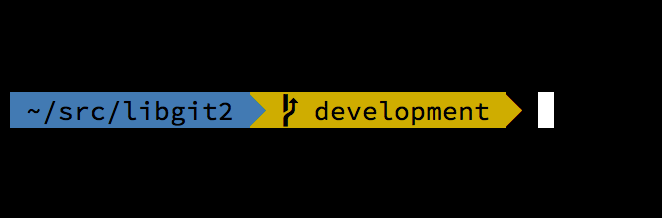

# Git dans d’autres environnements

<!-- toc -->

Si vous avez lu le livre dans son intégralité, vous avez appris beaucoup
sur son utilisation à partir de la ligne de commande. Vous pouvez
travailler avec des fichiers locaux, connecter vos dépôts avec d’autres
à travers un réseau et travailler efficacement avec d’autres personnes.
Mais l’histoire ne s’arrête pas ici ; Git est habituellement utilisé
comme sous-partie d’un écosystème plus grand et le terminal n’est pas
toujours le meilleur moyen d’interagir dans ce cadre. Nous allons
maintenant jeter un œil à certains des autres types d’environnements où
Git s’avère utile ainsi que la manière dont d’autres applications (dont
la vôtre) intègrent Git.

## Interfaces graphiques

L’environnement natif de Git est le terminal. Les nouvelles
fonctionnalités y apparaissent en premier et c’est seulement à la ligne
de commande que vous disposez de tout le pouvoir de Git. Mais le texte
pur n’est pas toujours le meilleur choix pour toutes les tâches ;
quelques fois, une représentation visuelle est préférable et certains
utilisateurs sont beaucoup plus à l’aise avec une interface
pointer-cliquer.

Il est important de noter que différentes interfaces sont adaptées à
différents modes de travail. Certains clients n’exposent qu’une partie
soigneusement choisie des fonctionnalités de Git, pour supporter une
façon spécifique de travailler que l’auteur considère efficace. Vu sous
cet angle, aucun outil ne peut être qualifié de « meilleur » qu’un
autre, il est simplement plus adapté à l’utilisation désirée. Il faut
remarquer aussi qu’il n’y rien que ces outils graphiques ne fassent que
l’interface en ligne de commande ne puisse faire ; la ligne de commande
reste l’interface qui vous donne le plus de puissance et de contrôle sur
vos dépôts.

### `gitk` et `git-gui`

Quand vous installez Git, vous obtenez aussi ses outils visuels, `gitk`
et `git-gui`.

`gitk` est l’outil de visualisation graphique d’historique. Voyez-le
comme une interface GUI puissante par-dessus `git log` et `git grep`.
C’est l’outil à utiliser lorsque vous essayez de trouver un événement
passé ou de visualiser l’historique de votre projet.

Gitk est plus facile à invoquer depuis la ligne de commande.
Positionnez-vous simplement dans le dépôt Git et tapez :

``` highlight
$ gitk [options de git log]
```

Gitk accepte de nombreuses options de ligne de commande, dont la plupart
sont passées directement à la commande `git log` sous-jacente. L’une des
plus intéressantes est probablement d’ajouter l’option `--all` qui
indique à gitk de montrer tous les *commits* joignables depuis
*n’importe quelle* référence, et pas seulement HEAD. L’interface de Gitk
ressemble à ceci :


Figure 153. Le visualisateur d’historique `gitk`.

Dans la partie supérieure, une zone ressemble à la sortie de
`git log --graph`. Chaque point représente un *commit*, les lignes
représentent les liens de parenté et les références apparaissent dans
des rectangles colorés. Le point jaune représente HEAD et le point rouge
représente les modifications qui ne sont pas validées. Dans la partie
basse, on visualise le *commit* sélectionné : les commentaires et le
*patch* sur la gauche et une vue en résumé sur la droite. Au milieu se
trouve un ensemble de composants graphiques utilisés pour rechercher
dans l’historique.

`git-gui`, par contre est un outil permettant de ciseler les *commits*.
Lui aussi est plus facile à invoquer en ligne de commande :

``` highlight
$ git gui
```

Et il ressemble à ceci :


Figure 154. L’outil d’aide à la validation `git-gui`.

Sur la gauche, il y a l’index ; les modifications non indexées sont en
haut, les modifications indexées en bas. Vous pouvez déplacer des
fichiers entiers entre les deux états en cliquant sur leurs icônes ou
vous pouvez sélectionner un fichier à visualiser en cliquant sur son
nom.

La vue diff en haut à droite montre les modifications pour le fichier
sélectionné. Vous pouvez indexer des sections individuelles (ou des
lignes individuelles) en cliquant-droit dans cette zone.

La zone de message et d’action est en bas à droite. Tapez votre message
dans la boîte à texte et cliquez « Commiter » pour réaliser une action
similaire à `git commit`. Vous pouvez aussi choisir de corriger le
*commit* précédent en sélectionnant le bouton radio « Corriger dernier
commit », ce qui met à jour la zone « Modifs. indexées » avec le contenu
du dernier *commit*. Ensuite, vous pouvez simplement indexer ou
désindexer certaines modifications, modifier le message de validation et
cliquer à nouveau sur le bouton « Commiter » pour remplacer l’ancien
*commit* par le nouveau.

`gitk` et `git-gui` sont des exemples d’outils orientés tâche. Chacun
est taillé pour un objectif spécifique (visualiser l’historique et créer
des *commits*, respectivement) en omettant certaines fonctionnalités
non-nécessaires à cette tâche.

### GitHub pour Mac et Windows

GitHub a créé deux clients Git orientés flux de travail : un pour
Windows et un pour Mac. Ces clients sont un bon exemple d’outils
orientés flux de travail — plutôt que d’exposer *toutes* les
fonctionnalités de Git, ils se focalisent sur un sous-ensemble
sélectionné de fonctions couramment utilisées qui s’accordent. Ils
ressemblent à ceci :


Figure 155. GitHub pour Mac.


Figure 156. GitHub pour Windows.

Ils sont pensés pour se ressembler et fonctionner de la même manière,
donc nous les traiterons comme un seul produit dans ce chapitre. Nous
n’allons pas explorer en profondeur ces outils (ils ont leur propre
documentation), mais un tour rapide de la vue « changes » (qui est celle
sur laquelle vous passerez le plus de temps) montre que tout est en
ordre.

-   Sur la gauche, il y a la liste des dépôts que le client suit ; vous
    pouvez ajouter un dépôt (soit en le clonant, soit en l’attachant
    localement) en cliquant sur l’icône « + » en haut de la zone.

-   Au centre, il y a la zone d’entrée de *commit* qui vous permet
    d’entrer un message de validation et de sélectionner les fichiers
    qui devraient être inclus. Sous Windows, l’historique de validation
    est affiché directement en dessous ; sous Mac, c’est un onglet
    séparé.

-   À droite, il y a une vue de diff qui montre ce qui a changé dans
    votre répertoire de travail ou les modifications qui ont été
    incluses dans le *commit* sélectionné.

-   La dernière chose à noter est le bouton « Sync » en haut à droite
    qui est le moyen principal d’interagir via le réseau.

<table>
<colgroup>
<col style="width: 50%" />
<col style="width: 50%" />
</colgroup>
<tbody>
<tr class="odd">
<td><em></em></td>
<td><div class="paragraph">
<p>Vous n’avez pas besoin d’un compte GitHub pour utiliser ces outils. Bien qu’ils soient pensés pour mettre en lumière le service et la méthode de travail de GitHub, ils fonctionneront parfaitement avec n’importe quel dépôt et dialogueront sans problème avec n’importe quel serveur Git.</p>
</div></td>
</tr>
</tbody>
</table>

#### Installation

GitHub pour Windows peut être téléchargé depuis
<a href="https://windows.github.com" class="bare">https://windows.github.com</a>
et GitHub pour Mac depuis
<a href="https://mac.github.com" class="bare">https://mac.github.com</a>.
Quand les applications sont lancées pour la première fois, elles vous
guident à travers le paramétrage initial de Git, tel que la
configuration de votre nom et de votre adresse de courriel, et toutes
deux définissent un paramétrage par défaut sans danger concernant
différentes options de configuration telles que les caches
d’identification et le comportement pour les fins de ligne.

Les deux applications sont « permanentes » — les mises à jour sont
téléchargées et appliquées en tâche de fond pendant que l’application
est ouverte. Elles incluent une version autonome de Git, ce qui signifie
que vous n’aurez probablement pas à vous soucier de le mettre à jour.
Sous Windows, le client inclut un raccourci pour lancer Powershell avec
Posh-git, dont nous parlerons plus loin.

L’étape suivante consiste à fournir à l’outil des dépôts avec lesquels
travailler. Le client vous affiche une liste de dépôts auxquels vous
avez accès sur GitHub et que vous pouvez cloner en une étape. Si vous
avez déjà un dépôt local, glissez son répertoire depuis le Finder ou
Windows Explorer dans la fenêtre de client GitHub et il sera inclus dans
la liste des dépôts.

#### Gestion recommandée du travail

Une fois installé et configuré, le client GitHub peut être utilisé pour
de nombreuses tâches usuelles. La manière de travailler avec cet outil
est quelques fois appelée le « *GitHub Flow* ». Nous traitons ceci plus
en détail dans [Processus GitHub](#s_github_flow), mais l’esprit général
est que a) vous validerez vos modifications dans une branche et b) vous
synchroniserez avec un dépôt distant assez régulièrement.

La gestion de branche est un des domaines pour lesquels les deux outils
divergent. Sous Mac, il y a un bouton en haut de la fenêtre pour créer
de nouvelles branches :


Figure 157. Le bouton « *Create Branch* » sous Mac.

Sous Windows, cela se fait en tapant le nom de la branche dans la zone
de saisie de bascule de branche :


Figure 158. Créer une branche sous Windows.

Une fois votre branche créée, ajouter des nouveaux *commits* est assez
simple. Faites des modifications dans votre répertoire de travail et
quand vous revenez dans la fenêtre du client GitHub, elle vous indiquera
quels fichiers ont changé. Entrez un message de validation, sélectionnez
les fichiers que vous souhaitez inclure et cliquez sur le bouton
« Commit » (ctrl-entrée ou ⌘-entrée).

La manière principale d’interagir avec les autres dépôts à travers le
réseau passe par la fonctionnalité « Sync ». Git dispose d’opérations
différentes pour pousser, récupérer, fusionner et rebaser, mais les
clients GitHub les réduisent en une seule fonctionnalité à plusieurs
étapes. Voici ce qui se passe quand vous cliquez sur le bouton
« *Sync* » :

1.  `git pull --rebase`. Si cela échoue à cause d’un conflit de fusion,
    revenir à `git pull --no-rebase`.

2.  `git push`.

C’est la séquence la plus habituelle pour les commandes de réseau quand
vous travaillez dans ce mode, donc les réduire à une seule commande fait
gagner du temps.

#### Résumé

Ces outils sont très adaptés au mode de travail pour lequel ils sont
pensés. Les développeurs, mais aussi les non-développeurs peuvent
collaborer sur un projet en peu de temps et un grand nombre des
meilleures pratiques pour ce genre de flux de travail sont saisies dans
les outils. Cependant, si votre gestion du développement est différente
ou si vous voulez plus de contrôle sur comment et quand les opérations
de réseau sont réalisées, nous vous recommandons d’utiliser un autre
client ou la ligne de commande.

### Autres GUIs

Il existe un certain nombre d’autres clients Git graphiques et ils
s’étendent depuis les outils très spécialisés, à fonction unique
jusqu’aux applications qui cherchent à exposer tout ce que Git peut
faire. Le site officiel Git présente une liste sélectionnée des clients
les plus populaires sur
<a href="http://git-scm.com/downloads/guis" class="bare">http://git-scm.com/downloads/guis</a>.
Une liste plus longue est disponible sur le site du wiki Git sur
<a href="https://git.wiki.kernel.org/index.php/Interfaces,_frontends,_and_tools#Graphical_Interfaces" class="bare">https://git.wiki.kernel.org/index.php/Interfaces,_frontends,_and_tools#Graphical_Interfaces</a>.

## Git dans Visual Studio

À partir de Visual Studio 2013 Update 1, les utilisateurs Visual Studio
disposent d’un client Git directement intégré dans leur environnement de
développement. Visual Studio a proposé la fonctionnalité d’intégration
de gestion de source depuis un certain temps, mais celle-ci était
principalement orientée vers les systèmes centralisés avec verrouillage
de fichier, et Git ne correspondait pas à ce mode d’opération. Le
support de Git dans Visual Studio 2013 a été séparé de l’ancienne
fonctionnalité et cela aboutit à une bien meilleure intégration entre
Studio et Git.

Pour localiser cette fonctionnalité, ouvrez une solution contrôlée par
Git (ou lancez juste `git init` dans une solution existante) et
sélectionnez *View* &gt; *Team Explorer* depuis le menu. Vous voyez la
perspective « *Connect* » qui ressemble à ceci :


Figure 159. Connexion à un dépôt Git depuis *Team Explorer*.

Visual Studio se souvient de tous les projets gérés par Git que vous
avez ouverts et ceux-ci sont disponibles dans la liste du bas. Si vous
ne voyez pas celui que vous souhaitez, cliquez sur le lien « Ajouter »
et tapez le chemin vers le répertoire de travail. Double-cliquer sur un
dépôt Git local vous ouvre la perspective *Accueil* qui ressemble à [La
vue « Accueil » pour un dépôt Git dans Visual Studio.](#vs_home) C’est
le concentrateur de toutes les actions Git ; quand vous *écrivez* du
code, vous passerez probablement la majorité de votre temps dans la vue
« Modifications » mais quand viendra le temps de tirer les modifications
de vos équipiers, vous utiliserez les vues « Unsynced Commits » et
« Branches ».


Figure 160. La vue « Accueil » pour un dépôt Git dans Visual Studio.

Visual Studio propose une interface utilisateur orientée tâche puissante
pour Git. Il inclut une visualisation linéaire d’historique, une
visualisation de diff, des commandes distantes et de nombreuses autres
capacités. Pour une documentation complète sur cette fonctionnalité (qui
ne tiendrait pas ici), rendez-vous sur
<a href="http://msdn.microsoft.com/en-us/library/hh850437.aspx" class="bare">http://msdn.microsoft.com/en-us/library/hh850437.aspx</a>.

## Git dans Eclipse

Eclipse est livré avec un greffon appelé Egit qui fournit une interface
assez complète pour les opérations Git. On y accède en basculant vers la
Perspective Git (*Window &gt; Open Perspective &gt; Other…* et
sélectionner « Git »).


Figure 161. L’environnement EGit de Eclipse.

EGit possède une documentation fournie et de qualité que vous pouvez
trouver sous *Help &gt; Help Contents* puis en choisissant le nœud
« EGit Documentation » dans la liste de contenu.

## Git dans Bash

Si vous êtes un utilisateur de Bash, vous pouvez utiliser une des
fonctionnalités de l’invite pour rendre votre utilisation de Git plus
agréable. Git est fourni avec des greffons pour différentes invites,
mais ils ne sont pas activés par défaut.

Premièrement, vous devez vous procurer une copie du fichier
`contrib/completion/git-completion.bash` depuis le code source Git.
Copiez-le dans un endroit pratique, tel que votre répertoire personnel
et ajoutez ceci à votre fichier `.bashrc` :

``` highlight
. ~/git-completion.bash
```

Une fois cela fait, déplacez-vous dans un répertoire git et tapez :

``` highlight
$ git chec<tab>
```

…et Bash va achever automatiquement en `git checkout`. Cela fonctionne
avec toutes les sous-commandes de Git, le paramètres de la ligne de
commande et les noms de références quand c’est approprié.

C’est aussi utile pour modifier l’invite pour qu’elle affiche des
informations à propos du dépôt Git du répertoire courant. Elles peuvent
être aussi simples ou complexes que vous le souhaitez, mais il y a
généralement quelques informations clés qui intéressent tout le monde,
telles que la branche actuelle et l’état du répertoire de travail. Pour
ajouter celles-ci à votre invite, copiez juste le fichier
`contrib/completion/git-prompt.sh` depuis le dépôt source de Git dans
votre répertoire personnel, ajoutez quelque chose comme ceci à votre
`.bashrc` :

``` highlight
. ~/git-prompt.sh
export GIT_PS1_SHOWDIRTYSTATE=1
export PS1='\w$(__git_ps1 " (%s)")\$ '
```

Le symbole `\w` signifie affiche le répertoire de travail courant, `\$`
affiche la partie `$` de l’invite et `__git_ps1 " (%s)"` appelle la
fonction fournie par `git-prompt.sh` avec un argument de formatage Ainsi
votre invite bash ressemblera à ceci quand vous êtes quelque part dans
un projet géré par Git :


Figure 162. Invite `bash` personnalisée.

Ces deux scripts ont une documentation ; jetez un œil au contenu de
`git-completion.bash` et `git-prompt.sh` pour plus d’information.

## Git dans Zsh

Git est aussi livré avec une bibliothèque d’achèvement sur tabulation
pour Zsh. Copiez simplement `contrib/completion/git-completion.zsh` dans
votre répertoire personnel et sourcez-le depuis votre `.zshrc`.
L’interface de Zsh est un peu plus puissante que celle de Bash :

``` highlight
$ git che<tab>
check-attr        -- display gitattributes information
check-ref-format  -- ensure that a reference name is well formed
checkout          -- checkout branch or paths to working tree
checkout-index    -- copy files from index to working directory
cherry            -- find commits not merged upstream
cherry-pick       -- apply changes introduced by some existing commits
```

Les achèvements possibles ne sont pas seulement listés ; ils sont
complétés par des descriptions utiles et vous pouvez naviguer
graphiquement dans la liste en répétant tab de manière répétée. Ceci
fonctionne avec les commandes Git, les arguments et les noms des choses
dans le dépôt (telles que les références et les serveurs distants),
ainsi que les noms de fichiers et les autres choses que Zsh sait
achever.

Zsh peut être assez compatible avec Bash en ce qui concerne la
personnalisation de l’invite, mais elle vous permet d’avoir aussi une
partie droite de l’invite. Pour inclure le nom de la branche sur la
partie droite, ajoutez ces lignes à votre fichier `~/.zshrc` :

``` highlight
setopt prompt_subst
. ~/git-prompt.sh
export RPROMPT=$'$(__git_ps1 "%s")'
```

Cela aboutit à un affichage de la branche actuelle sur le côté droit de
la fenêtre de terminal quand votre invite est dans un répertoire Git, ce
qui ressemble à ceci :


Figure 163. L’invite `zsh` personnalisée.

Zsh est assez puissant pour qu’il existe des extensions complètes pour
le rendre encore meilleur. Une d’entre elles s’appelle "oh-my-zsh" et on
peut la trouver sur
<a href="https://github.com/robbyrussell/oh-my-zsh" class="bare">https://github.com/robbyrussell/oh-my-zsh</a>.
Le système de greffons de oh-my-zsh est doté d’un achèvement sur
tabulation pour git puissant et dispose d’une série de thèmes d’invites,
dont de nombreux affichent l’information de gestion de version. [Un
exemple d’un thème oh-my-zsh.](#oh_my_zsh_git) n’est qu’un exemple de ce
qui peut être fait avec ce système.



Figure 164. Un exemple d’un thème oh-my-zsh.

## Git dans Powershell

Le terminal de ligne de commande ancestral sous Windows (`cmd.exe`)
n’est pas vraiment capable de fournir une expérience de Git
personnalisée, mais si vous utilisez Powershell, vous avez de la chance.
Cela marche aussi si vous utilisez PowerShell sous une plateforme non
Windows comme Debian. Un paquetage appelé Posh-Git
(<a href="https://github.com/dahlbyk/posh-git" class="bare">https://github.com/dahlbyk/posh-git</a>)
fournit un système de complétion automatique, ainsi qu’une invite
améliorée pour vous aider à rester informé de l’état de votre dépôt.
Elle ressemble à ceci :


Figure 165. Powershell avec Posh-git.

### Installation

#### Prérequis (Windows seulement)

Avant de pouvoir lancer des scripts PowerShell sur votre machine, vous
devez définir votre ExecutionPolicy locale à RemoteSigned (en gros tout
sauf Undefined et Restricted). Si vous choisissez AllSigned au lieu de
RemoteSigned, même les scripts locaux (les vôtres) devront être signés
numériquement pour pouvoir être exécutés. Avec RemoteSigned, seuls les
scripts ayant le "ZoneIdentifier" défini à Internet (téléchargés depuis
le web) devront être signés, pas les autres. Si vous êtes un
administrateur et que vous voulez la définir pour tous les utilisateurs
de cette machine, utilisez "-Scope LocalMachine". Si vous êtes un
utilisateur normal sans les privilèges administrateur, vous pouvez
utiliser "-Scope CurrentUser" pour ne la définir que pour vous.

Plus d’informations sur les portées (*Scopes*) PowerShell :
<a href="https://docs.microsoft.com/fr-fr/powershell/module/microsoft.powershell.core/about/about_scopes" class="bare">https://docs.microsoft.com/fr-fr/powershell/module/microsoft.powershell.core/about/about_scopes</a>.

Plus d’informations sur la politique d’exécution (*ExecutionPolicy*)
PowerShell :
<a href="https://docs.microsoft.com/fr-fr/powershell/module/microsoft.powershell.security/set-executionpolicy" class="bare">https://docs.microsoft.com/fr-fr/powershell/module/microsoft.powershell.security/set-executionpolicy</a>.

``` highlight
> Set-ExecutionPolicy -Scope LocalMachine -ExecutionPolicy RemoteSigned -Force
```

##### PowerShell Gallery

Si vous avez au moins PowerShell 4 ou Powershell 5 avec
PackageManagement installé, vous pouvez utiliser le gestionnaire de
paquets pour obtenir Posh-Git.

Plus d’informations sur PowerShell Gallery :
<a href="https://docs.microsoft.com/fr-fr/powershell/gallery/overview" class="bare">https://docs.microsoft.com/fr-fr/powershell/gallery/overview</a>.

``` highlight
> Set-PSRepository -Name PSGallery -InstallationPolicy Trusted
> Update-Module PowerShellGet -Force
> Install-Module Posh-Git -Scope AllUsers
```

Si vous voulez installer Posh-Git seulement pour l’utilisateur courant
et non globalement, utilisez "-Scope CurrentUser" à la place. Si la
deuxième commande échoue avec une erreur comme
`Module 'PowershellGet' was not installed by using Install-Module`, vous
devrez d’abord lancer une autre commande :

``` highlight
> Install-Module PowerShellGet -Force -SkipPublisherCheck
```

Maintenant vous pouvez y retourner et recommencer. Cela arrive parce que
les modules qui viennent avec Windows PowerShell sont signés avec un
certificat de publication différent.

##### Mise à jour du terminal PowerShell

Pour inclure les informations git dans le terminal, posh-git doit être
importé. Pour faire cela automatiquement, incluez l’instruction d’import
dans votre script $profile. Ce script est exécuté chaque fois que vous
ouvrez un nouveau terminal PowerShell. Gardez en tête qu’il y a de
multiples scripts $profile. Par exemple, un pour le terminal et un autre
séparé pour l’environnement de script intégré (ISE, *Integrated
Scripting Environment*).

``` highlight
> New-Item -Name $(Split-Path -Path $profile) -ItemType Directory -Force
> 'Import-Module Posh-Git' | Out-File -Append -Encoding default -FilePath $profile
```

##### Depuis les sources

Téléchargez une version Posh-Git depuis
<a href="https://github.com/dahlbyk/posh-git" class="bare">https://github.com/dahlbyk/posh-git</a>
et décompressez-la dans le dossier `WindowsPowerShell`. Puis ouvrez un
terminal PowerShell en tant qu’administrateur et saisissez ceci :

``` highlight
> cd ~\Documents\WindowsPowerShell\Module\posh-git
> .\install.ps1
```

Cela ajoutera la bonne ligne à votre fichier `profile.ps1` et posh-git
sera actif la prochaine fois que vous ouvrirez votre terminal.

## Résumé

Vous avez appris à utiliser la puissance de Git depuis les outils que
vous utilisez habituellement, ainsi qu’à accéder aux dépôts Git depuis
vos propres programmes.
